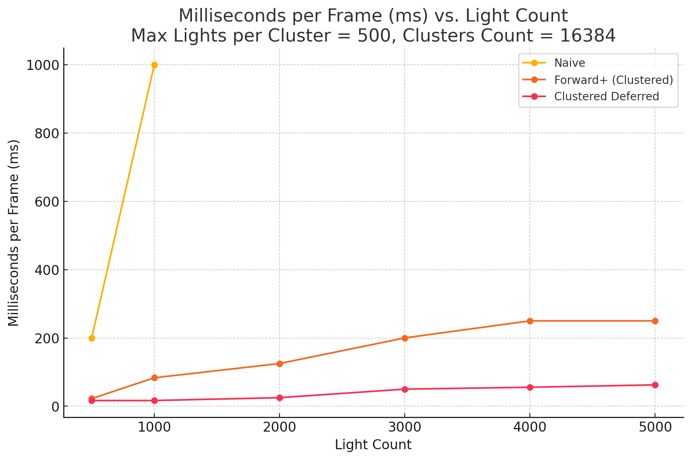
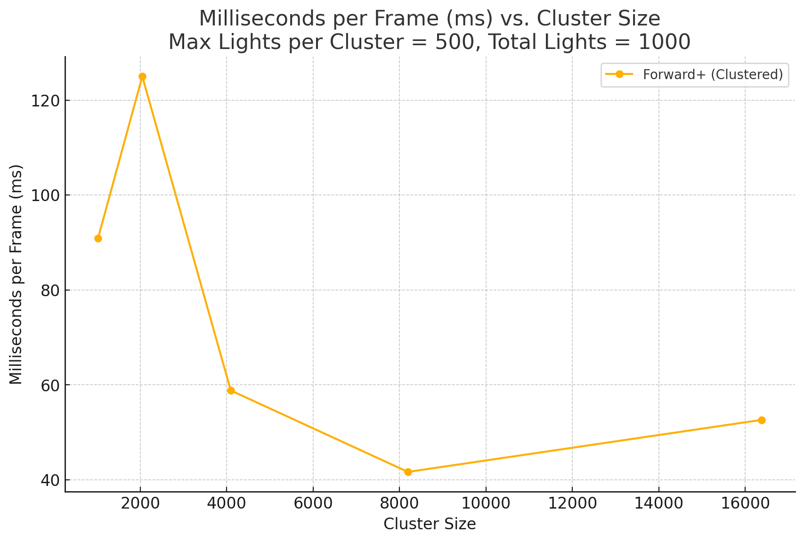

# Reference Starting Point: WebGL Forward+ and Clustered Deferred Shading
======================

**University of Pennsylvania, CIS 565: GPU Programming and Architecture, Project 4**

* Maya Huizar
* Tested on: **Google Chrome 222.2** on Windows 22, i7-2222 @ 2.22GHz 22GB, GTX 222 222MB (Moore 2222 Lab)

### Live Demo

### Demo Video/GIF

### Part 1: Implement the Different Rendering Methods 

To start off, the naive renderer is missing a camera view projection matrix buffer, and your job is to fill in the missing parts. This will expose you to various parts of the codebase and will hopefully help you understand the general layout of the WebGPU rendering pipeline.

#### 1) Naive (+35)

1.1) Create and Write to the Buffer
- Created the buffer in `camera.ts` and wrote the view projection matrix to it.
- Uploaded the buffer to the GPU.
- Look for comments containing `TODO-1.1` for details.

1.2) Use the Buffer in a Bind Group and a Render Pass
- Integrated the buffer into the naive renderer's layouts and pipeline.
- Look for comments containing `TODO-1.2` for details.

1.3) Update the Shaders Accordingly
- Updated the naive renderer shaders to use the new buffer.
- Look for comments containing `TODO-1.3` for details.

#### 2) Forward+ (+50)

- Built a data structure to track how many lights are in each cluster and their indices.
- Rendered each fragment using only the lights that overlap its cluster.
- Look for comments containing `TODO-2` for details.

When adding new buffers, especially if they contain new structs, their alignment might be different than what you expect. Be sure to check your structs' alignment using [this online calculator](https://webgpufundamentals.org/webgpu/lessons/resources/wgsl-offset-computer.html#) and match the memory layout on the host.

#### 3) Clustered Deferred (+15)

- Reused the clustering logic from Forward+.
- Stored vertex attributes in a G-buffer.
- Read from the G-buffer in a separate fullscreen pass to produce final output.
- Look for comments containing `TODO-3` for details.

## Performance Analysis

This assignment has a considerable amount of performance analysis compared to implementation work. Complete the implementation early to leave time for analysis!

### Milliseconds per Frame vs. Light Count

**Settings**:
- Max Lights per Cluster: 500
- Clusters Count: 16,384

This graph compares the performance of Naive, Forward+ (Clustered), and Clustered Deferred shading methods across different light counts. Render times are measured in milliseconds per frame (ms). As the number of lights increases, Forward+ and Clustered Deferred show significant performance advantages over the naive approach.

### Milliseconds per Frame vs. Cluster Size

**Settings**:
- Max Lights per Cluster: 500
- Total Lights: 1,000

This graph explores how cluster size impacts the performance of the Forward+ (Clustered) method. Varying the cluster size helps to identify optimal configurations for different rendering scenarios. Render times are provided in milliseconds per frame (ms), showing the balance between granularity and performance.

### Benefits, Trade-offs, and Optimization Insights

**Is one of them faster?**
- Forward+ (Clustered) generally performs better for moderate to high light counts, offering a good balance of performance and scalability.
- Clustered Deferred excels with complex scenes containing many lights, efficiently managing shading tasks through the G-buffer.

**Trade-offs**
- **Forward+**: Effective for dynamic lighting, but can incur overhead with high light counts and poorly distributed clusters.
- **Clustered Deferred**: Reduces redundant calculations but requires more memory, which may impact performance in bandwidth-constrained scenarios.

**Optimization Notes**
- Ensure no unnecessary copies of large structs/arrays in shaders. Use pointers in WGSL to manage this.
- Chrome's profiling tools are valuable for detecting bottlenecks in TypeScript and WGSL code.

## Credits

- [Vite](https://vitejs.dev/)
- [loaders.gl](https://loaders.gl/)
- [dat.GUI](https://github.com/dataarts/dat.gui)
- [stats.js](https://github.com/mrdoob/stats.js)
- [wgpu-matrix](https://github.com/greggman/wgpu-matrix)