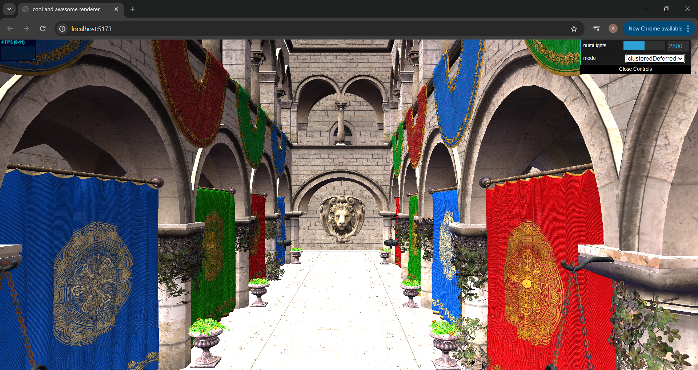
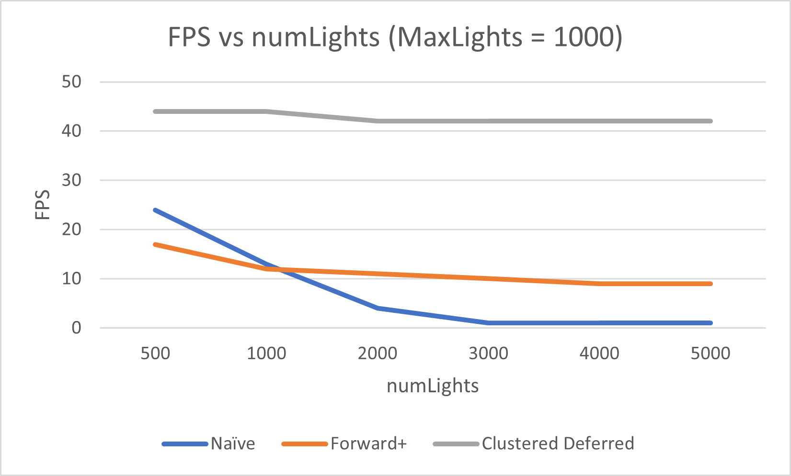

WebGL Forward+ and Clustered Deferred Shading
======================

**University of Pennsylvania, CIS 565: GPU Programming and Architecture, Project 4**

* ADITHYA RAJEEV
  * [LinkedIn](https://www.linkedin.com/in/adithyar262/)
* Tested on: Windows 11, i7 13th Gen @ 2.40GHz 16GB, GeForce RTX 4050 8GB (Personal)

## Screenshots

### Forward Plus (2500 Lights)

### Deferred Clustering (2500 Lights)

## Live Website

[https://adithyar262.github.io/Project4-WebGPU-Forward-Plus-and-Clustered-Deferred)](https://adithyar262.github.io/Project4-WebGPU-Forward-Plus-and-Clustered-Deferred)

## Demo Video/GIF

### Forward Plus Rendering

<video src="images/ForwardPlusVideo.mp4" controls>
  Your browser does not support the video tag.
</video>

### Clustered Deferred Rendering

<video src="images/DeferredClusteredVideo.mp4" controls>
  Your browser does not support the video tag.
</video>

## Overview

This project implements and compares three rendering techniques in WebGPU: Naive Forward Rendering, Forward+ Rendering, and Clustered Deferred Rendering. Each method is optimized for different scenarios, offering a comprehensive comparison of modern real-time rendering approaches.

## Rendering Methods Overview

### 1. Naive Forward Rendering

Naive Forward Rendering is the simplest approach to real-time rendering. In this method:

- Each object is rendered sequentially.
- For each fragment, all lights in the scene are calculated.
- Simple to implement but becomes inefficient with many lights or complex scenes.
- Performance degrades linearly with the number of lights.

### 2. Forward+ Rendering

Forward+ Rendering, also known as Tiled Forward Rendering, improves upon the naive approach:

- The screen is divided into a grid of tiles.
- A light culling pass determines which lights affect each tile.
- During rendering, only the lights relevant to a tile are considered for each fragment.
- Significantly more efficient than naive forward rendering for scenes with many lights.
- Maintains the advantages of forward rendering while reducing per-fragment light calculations.

### 3. Clustered Deferred Rendering

Clustered Deferred Rendering is an advanced technique that separates the rendering process into multiple passes:

- Geometry Pass: Renders scene geometry into a G-buffer, storing material properties and depth information.
- Light Culling Pass: Similar to Forward+, but extends the 2D tile grid into 3D clusters.
- Lighting Pass: Calculates final pixel colors using the G-buffer and only the lights affecting each cluster.
- Highly efficient for scenes with many lights and complex geometry.
- Allows for efficient handling of a large number of lights without significant performance degradation.
- Can struggle with certain effects like transparency and anti-aliasing.

## Features Implemented

* **glTF Scene Loading:**  Loads and renders 3D models in the glTF format.
* **Camera Control:**  Provides interactive camera controls to navigate the scene.
* **Light Movement Compute Shader:**  Animates lights in the scene using a compute shader.
* **Naive Forward Renderer:**  A basic forward rendering implementation.
* **Forward+ Renderer:** A more advanced forward rendering technique that utilizes light clustering to improve performance.
* **Clustered Deferred Renderer:** A deferred rendering approach that leverages a G-buffer and light clustering.
* **G-buffer Optimization:**  Optimizes the G-buffer in the Clustered Deferred renderer to minimize texture usage and per-pixel data size.

## Performance Analysis

### Comparison of Rendering Techniques

1. **Speed Comparison**:
   Clustered Deferred Rendering was the fastest, followed by Forward+, and then Naive Forward Rendering.

2. **Workload Efficiency**:
   - Clustered Deferred excels in scenes with complex geometry and many lights.
   - Forward+ performs well with a moderate number of lights and dynamic scenes.
   - Naive Forward is suitable for simple scenes with few lights.

3. **Benefits and Tradeoffs**:
   - Clustered Deferred:
     - Benefits: Excellent for many lights, separates geometry and lighting.
     - Tradeoffs: Higher memory usage, potential issues with transparency.
   - Forward+:
     - Benefits: Good balance of performance and flexibility.
     - Tradeoffs: More complex implementation than naive forward.
   - Naive Forward:
     - Benefits: Simple implementation, works well for basic scenes.
     - Tradeoffs: Performance degrades rapidly with many lights.

4. **Performance Differences**:
   - Clustered Deferred's speed comes from its efficient light culling and separation of passes.
   - Forward+ improves upon naive forward by reducing per-fragment light calculations.
   - Naive Forward's performance suffers due to redundant light calculations for each fragment.

### Performance Graphs

### Comparison of Rendering Methods

* **Deferred Rendering (Fastest):**  By rendering the scene's geometry only once to generate the G-buffer, and then performing lighting calculations separately, deferred rendering minimizes redundant computations, especially with a high number of lights.
* **Forward+ Rendering (Intermediate):**  Light clustering in Forward+ significantly reduces the number of lights evaluated per fragment, leading to better performance than Naive Forward, particularly in scenes with many lights.
* **Naive Forward Rendering (Slowest):**  This method evaluates every light for each fragment, resulting in substantial overhead as the number of lights increases.

### Factors Influencing Performance

* **Number of Lights:**  As the number of lights increases, the performance gap between the rendering methods widens significantly. Naive Forward rendering suffers the most, while Deferred and Forward+ demonstrate better scalability.
* **Scene Complexity:**  In scenes with dense geometry, Deferred rendering may face increased overhead due to the cost of filling the G-buffer.
* **Hardware:**  GPU capabilities play a crucial role in determining the relative performance of the rendering techniques.

### Benefits and Trade-offs

| Rendering Method | Benefits | Trade-offs |
|---|---|---|
| Deferred Rendering | Efficient for many lights, Decouples geometry and lighting | Higher memory usage (G-buffer), Difficulty with transparent objects |
| Forward+ Rendering | Improved performance over Naive Forward, Lower memory usage than Deferred | Clustering overhead, Limited to a maximum number of lights per cluster |
| Naive Forward Rendering | Simple to implement | Poor performance with many lights |

### G-buffer Optimization

To enhance the performance of the Clustered Deferred renderer, I implemented an optimized G-buffer structure. The optimization focused on reducing the number of textures and minimizing the per-pixel data size. Our implementation achieved the following:

- **Single Color Output Image**: I consolidated the G-buffer into a single color output image, reducing the number of render targets and simplifying the rendering process.

- **Compact Data Storage**: Each pixel in the G-buffer now stores additional data within a single vec4f, efficiently packing multiple attributes into a single vector.

- **Encoding Technique**: I employed an encoding technique to compress multiple material properties (such as normal, roughness, and metallic values) into the available channels of the vec4f.

- **Decoding in Lighting Pass**: The lighting pass was updated to correctly decode the packed information from the G-buffer, ensuring accurate lighting calculations.

**Performance Improvement**:
- Before Optimization: 32 FPS
- After Optimization: 44 FPS

This optimization resulted in a significant 37.5% increase in frame rate, demonstrating the importance of efficient G-buffer design in deferred rendering pipelines.

### Credits

- [Vite](https://vitejs.dev/)
- [loaders.gl](https://loaders.gl/)
- [dat.GUI](https://github.com/dataarts/dat.gui)
- [stats.js](https://github.com/mrdoob/stats.js)
- [wgpu-matrix](https://github.com/greggman/wgpu-matrix)
