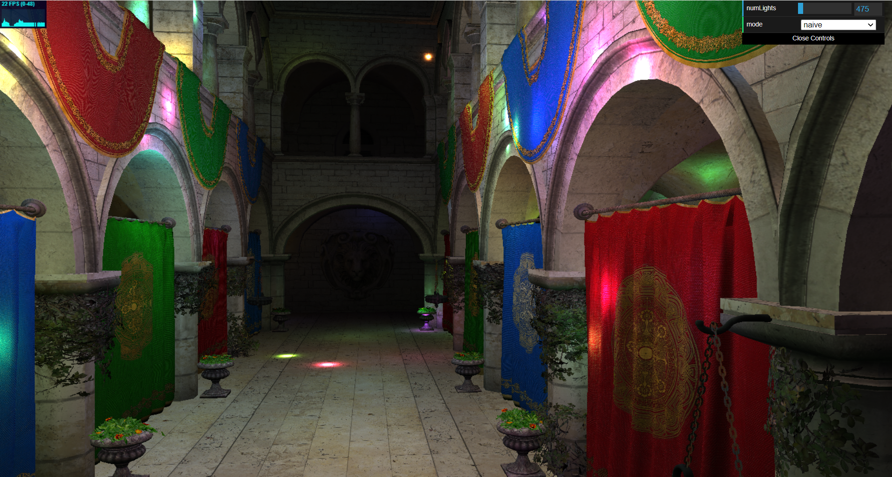
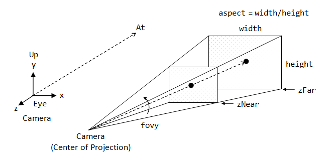
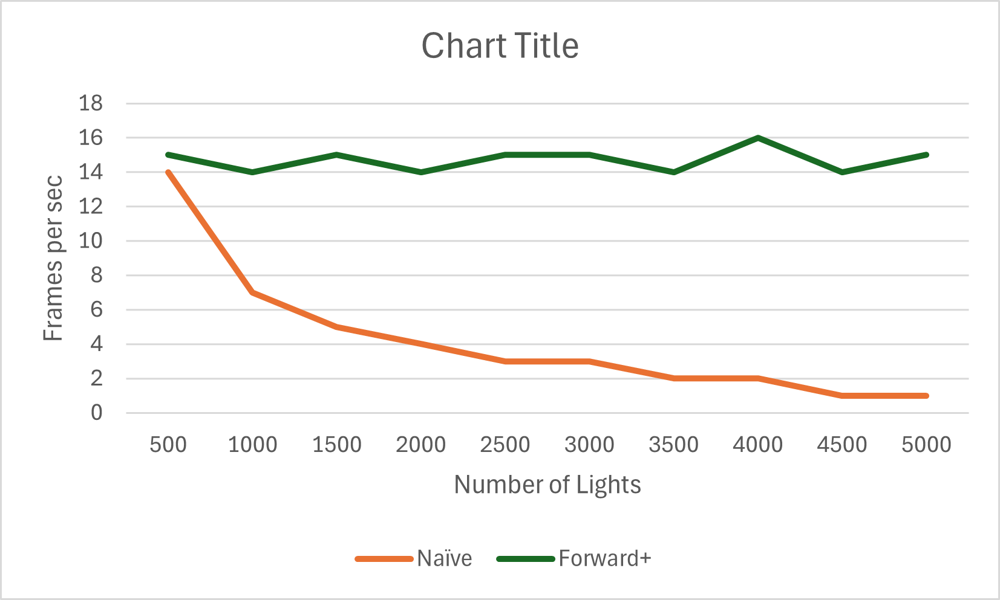
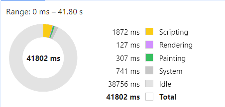
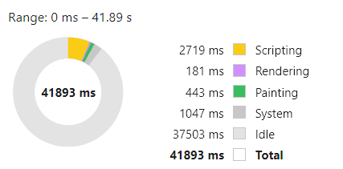
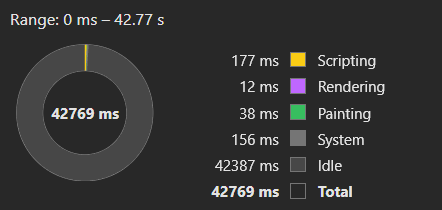
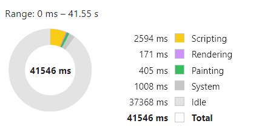

WebGL Forward+ and Clustered Deferred Shading
======================

**University of Pennsylvania, CIS 565: GPU Programming and Architecture, Project 4**

* Manvi Agarwal
  * [linkedIn](https://www.linkedin.com/in/manviagarwal27/)
* Tested on: Windows 11, AMD Ryzen 5 7640HS @ 4.30GHz 16GB, GeForce RTX 4060 8GB(personal)
  

## Table of Contents
  - Demo
  - Clustered Forward Rendering(Forward +)
  - Performance Analysis

## Demo

### Live Demo

[](http://manvi27.github.io/Project4-WebGPU-Forward-Plus-and-Clustered-Deferred)

### Demo Video/GIF


## Clustered Forward Rendering(Forward +)

In this project, I've implemented forward plus shading method using WebGPU. Forward plus shading is an efficient rendering method in 3D perspective scene. Apart from the traditional graphics pipeline, forward plus rendering involves light clustering. For light clustering, only the lights impacting a part in scene is used to compute fragment color in the fragment shading.

### Implementation

For clustering, the view frustum is split into multiple small clusters which are stored as a GPU buffer using AABB. The view frustum from camera perspective looks like



AABB is then used to detect the lights colliding with the cluster. AABB might have some overlapping in space but is a good approximation to start with. The structure used for the buffer is defined as follows:

```
struct Cluster {
    minBounds: vec3f,
    maxBounds: vec3f,
    numLights: u32,
    lightIndices: array<u32,${maxLightsInCluster}>
}

struct ClusterSet {
    numClusters: vec3<u32>,
    clusters: array<Cluster>
}

```
The buffer is used by a Compute shader which is computed along with the other graphics pipeline. The compute shader is added to the encoder used for passing the rendered using the following piece of code.

```
const computePass = encoder.beginComputePass();
computePass.setPipeline(this.lights.ClusterComputePipeline);
computePass.setBindGroup(0, this.lights.ClusterComputeBindGroup);

computePass.dispatchWorkgroups(Math.ceil(shaders.constants.tilesize[0] / shaders.constants.clusterWorkgroupSize[0]),
Math.ceil(shaders.constants.tilesize[1] / shaders.constants.clusterWorkgroupSize[1]),
Math.ceil(shaders.constants.tilesize[2] / shaders.constants.clusterWorkgroupSize[2]));
computePass.end();

```

## Performance Analysis

### Latency Comparison  

Advantage of Clustered Forward plus rendering against forward rendering can be seen as the number of lights interacting with scene increases. This is because the increase in time so as to run the compute shader is offet by the reduction in iteration loop time in the fragment shader in cluster forward shading.


 


## Runtime Analysis
Runtime analysis using [chrome profiling tool](https://developer.chrome.com/docs/devtools/performance) shows comparison of performance for different number of lights.


Naive shading with 500 lights    | Forward Plus shading with 500 lights
:-------------------------------:|:-----------------------------------:
        |  

Naive shading with 5000 lights    | Forward Plus shading with 5000 lights
:-------------------------------:|:-----------------------------------:
        |  


### Credits

- [Vite](https://vitejs.dev/)
- [loaders.gl](https://loaders.gl/)
- [dat.GUI](https://github.com/dataarts/dat.gui)
- [stats.js](https://github.com/mrdoob/stats.js)
- [wgpu-matrix](https://github.com/greggman/wgpu-matrix)
