WebGL Forward+ & Clustered Deferred Shading
======================

### Yuhan Liu

[LinkedIn](https://www.linkedin.com/in/yuhan-liu-), [Personal Website](https://liuyuhan.me/), [Twitter](https://x.com/yuhanl_?lang=en)

**Tested on: Google Chrome 132 (Canary), Windows 11 Pro, Ultra 7 155H @ 1.40 GHz 32GB, RTX 4060 8192MB (Personal Laptop)**

### Live Demo: [Click me!](http://TODO.github.io/Project4-WebGPU-Forward-Plus-and-Clustered-Deferred)

## Forward+ & Clustering Deferred Shading Summary

This project implements two rendering techniques: Forward+ Shading and Clustered Deferred Shading, using WebGPU. These techniques optimize the handling of large numbers of lights in a 3D scene, specifically in the Sponza Atrium model with hundreds of dynamic point lights. 

The Forward+ method divides the screen into a grid and assigns lights to clusters in a compute shader pass, while the Clustered Deferred method stores geometric data for each pixel in a G-buffer, allowing for efficient lighting calculations in a second pass. Both methods improve rendering performance by limiting the number of lights processed for each fragment. 

## Performance Analysis

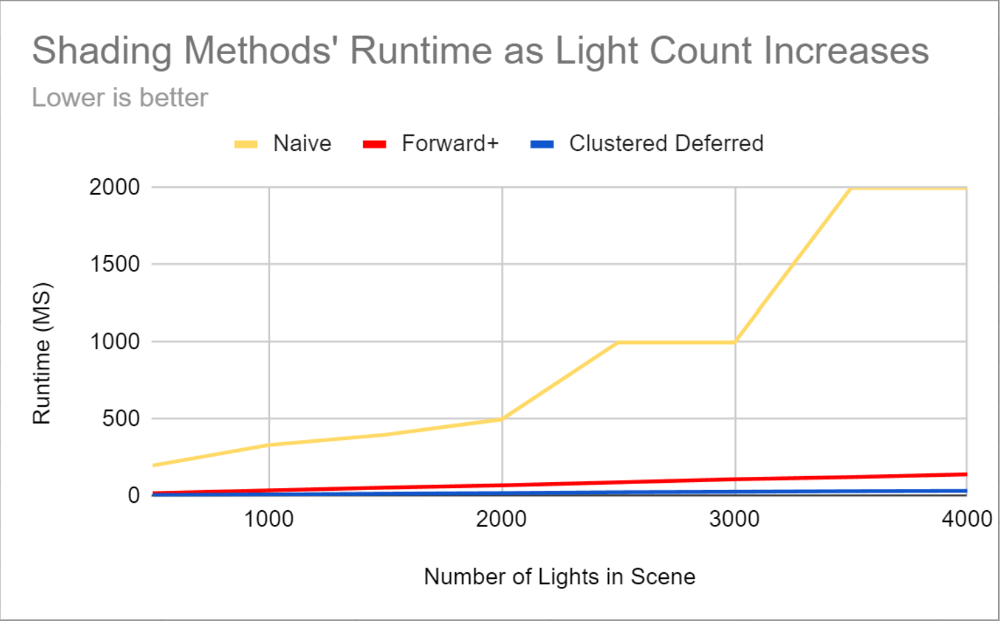 

*Runtime vs Light Count graph for all three shading approaches. Workgroup size: 16x16, Cluster Size: 16x16x16*

### Naive

The naive rendering approach is a simple, unoptimized method for handling lights in a scene. For every fragment, the lighting calculations are performed for each light, resulting in significant computational overhead, especially in scenes with a large number of lights. 

As seen in the above performance analysis, the runtime reflects the large growth in computational load as more lights are added into the scene. Clearly, this approach is inefficient for scenes with many lights, as it processes redundant lighting information for every pixel. 

Thus, we explore spatial optimization techniques below which reduces lighting calculations to points that actually influence a given region of the scene.

### Clustered Forward+

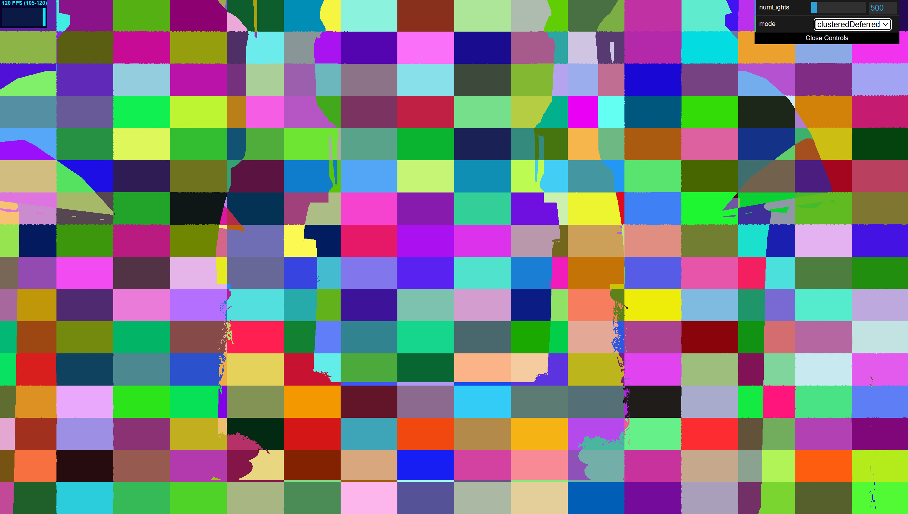

Forward+ shading is an optimized rendering technique designed to efficiently handle scenes with a large number of lights by dividing the screen into a grid of clusters. Each cluster corresponds to a region of the screen, and lights are assigned only to the clusters they influence. This way, instead of calculating lighting for every pixel from all lights, the Forward+ method restricts the light calculations to those lights that actually affect each cluster.

The above image shows the screen partitioned into said clusters. This debugging image was generated by assigning a random color to each cluster index in the fragment shader. 

This significantly reduces the number of lights processed per fragment, improving performance compared to the naive approach. As the light count increases, Forward+ maintains better performance by leveraging the spatial organization of lights, though some overhead is introduced as clusters become more populated. This provides faster rendering than the naive method, particularly for scenes with many dynamic lights.

According to the above performance graph, Forward+ is shown to be 10 times faster than naive rendering at 500 lights and maintains about 14 times better performance at 4000 lights. As expected, the runtime still increases as more lights are added because each cluster has more points to process. The best-case scenario occurs when the lights are evenly distributed across the screen, as each cluster only needs to process a few lights. Forward+ struggles when lights overlap in specific areas, as the overhead of managing those clusters increases. However, even in the worst case, Forward+ remains significantly faster than naive rendering.

### Clustered Deferred

| Position | Albedo | Normal |
| :------------------------------: |:------------------------------: | :------------------------------: |
| 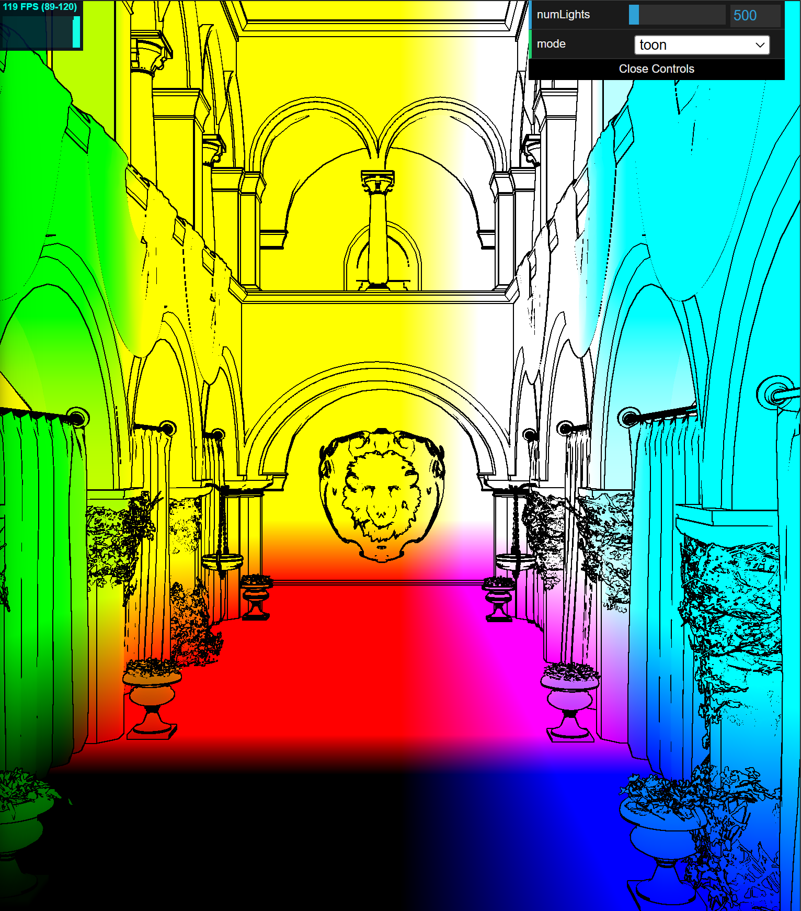| 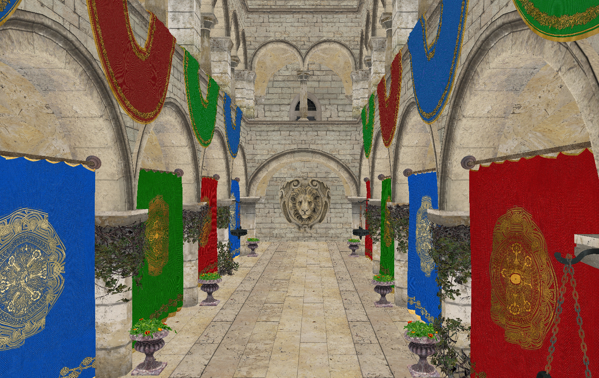  | 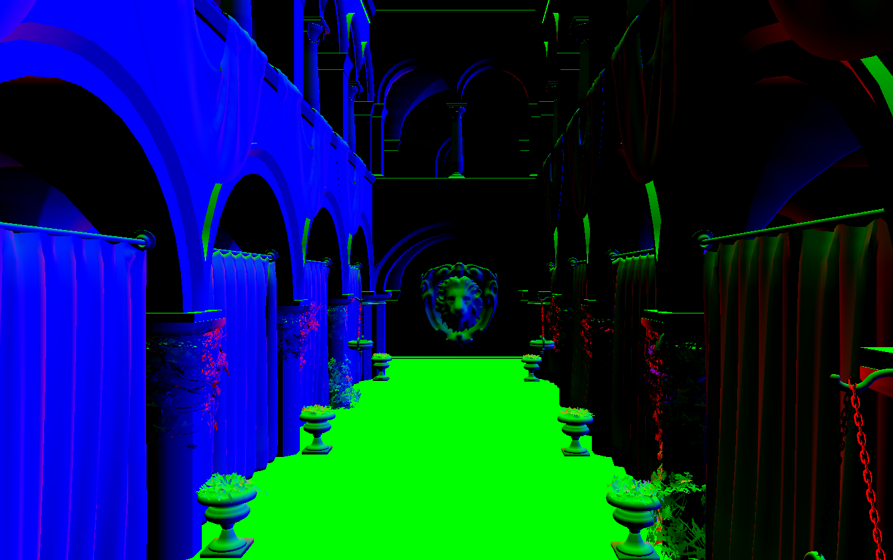  |
| Added outlines from toon shader for clarity |  Diffuse color from Sponza texture  |  Black normals are normal?  |

Clustered Deferred Shading is a rendering technique that separates the geometry and lighting passes to optimize light handling in complex scenes. In this implementation, scene information, the positions, normals, and diffuse colors, are stored in a G-buffer (geometry buffer). In a second pass, lighting calculations are performed using the stored data, but only for lights that affect the clusters containing the pixels. 

Performance improvements are significant, with Clustered Deferred Shading being 24 times faster than naive rendering at 500 lights and maintaining up to 56 times better performance at 4000 lights. Even though the runtime increases with more lights by introducing more computation, the increase is slower than that of Forward+ and naive. Like Forward+ rendering, the best-case scenario for Clustered Deferred Shading is when the lights are spread evenly across the scene, as clusters are small and few lights overlap. The worst-case scenario is when many lights converge in specific areas, increasing the number of lights per cluster, though even then, it outperforms both naive and Forward+ methods.

The above debug images show the contents of the G-Buffer: position, albedo, and normal. 

### Comparison: Forward+ vs. Deferred

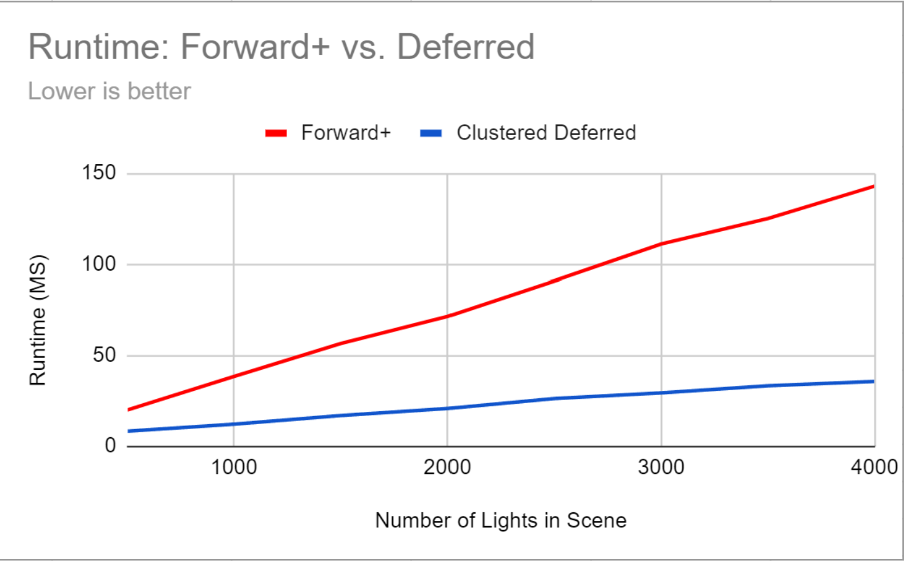

The above performance graph shows a clearer comparison of the runtimes for Foward+ and Deferred rendering. At small light counts and smaller cluster sizes, Forward+ Shading is comparable to Clustered Deferred Shading. As the light count grows, the gap in runtime grows as well, as Deferred rendering implements both the cluster spatial optimization and the G-buffer storage optimization. 

While Forward+ may struggle in situations where multiple lights overlap, creating crowded clusters, Deferred rendering eases this by separating the geometry pass from the lighting pass. In other words, Deferred rendering performs better when lights overlap in the same area. The storage optimization in Deferred rendering also makes it better for post-processing, which is why I built the toon shader (explained below) on top of the deferred implementation. 

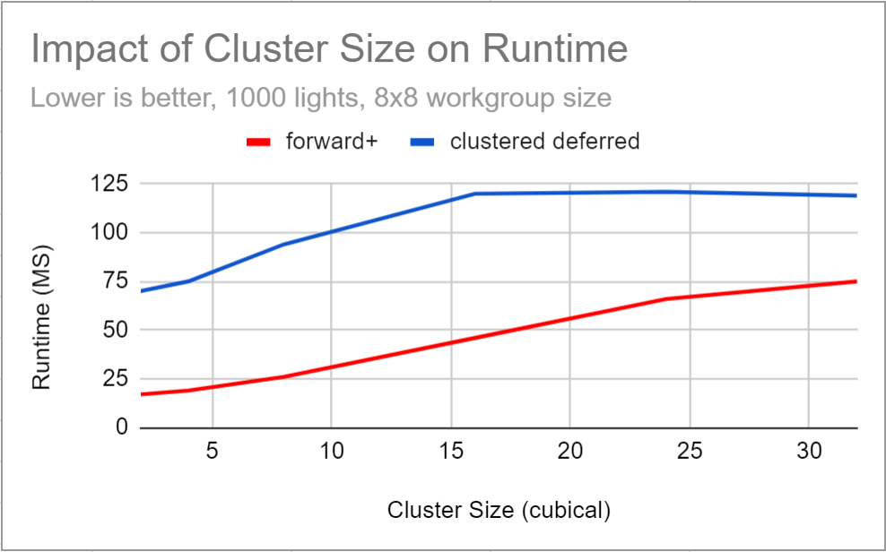

The above performance graph shows how cluster size in Forward+ and Clustered Deferred Shading affects runtime performance. Smaller cluster sizes lead to more precise light culling, allowing each fragment to process fewer lights and reducing redundant lighting calculations, resulting in faster performance. However, managing many small clusters introduces overhead, which can diminish performance gains if the clusters are too small. Larger cluster sizes, on the other hand, increases redundant calculations. While larger clusters reduce the overhead of managing numerous clusters, the increase in lights processed per fragment outweighs this benefit, especially in scenes with many overlapping lights. Thus, larger cluster sizes result in slower performance as the spatial efficiency decreases.

### Artsy Postprocess Shader

| Quantization of Albedo |  Quantization of Lights  |
| :------------------------------: |:------------------------------: |
| 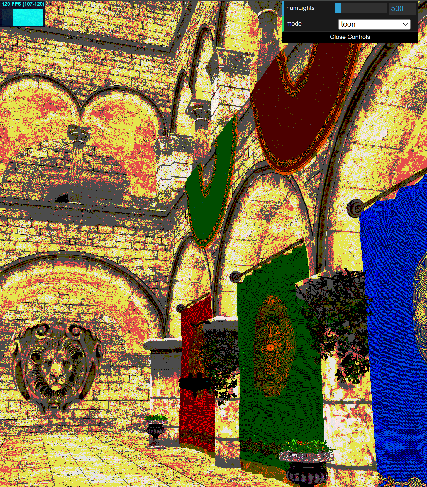                            | 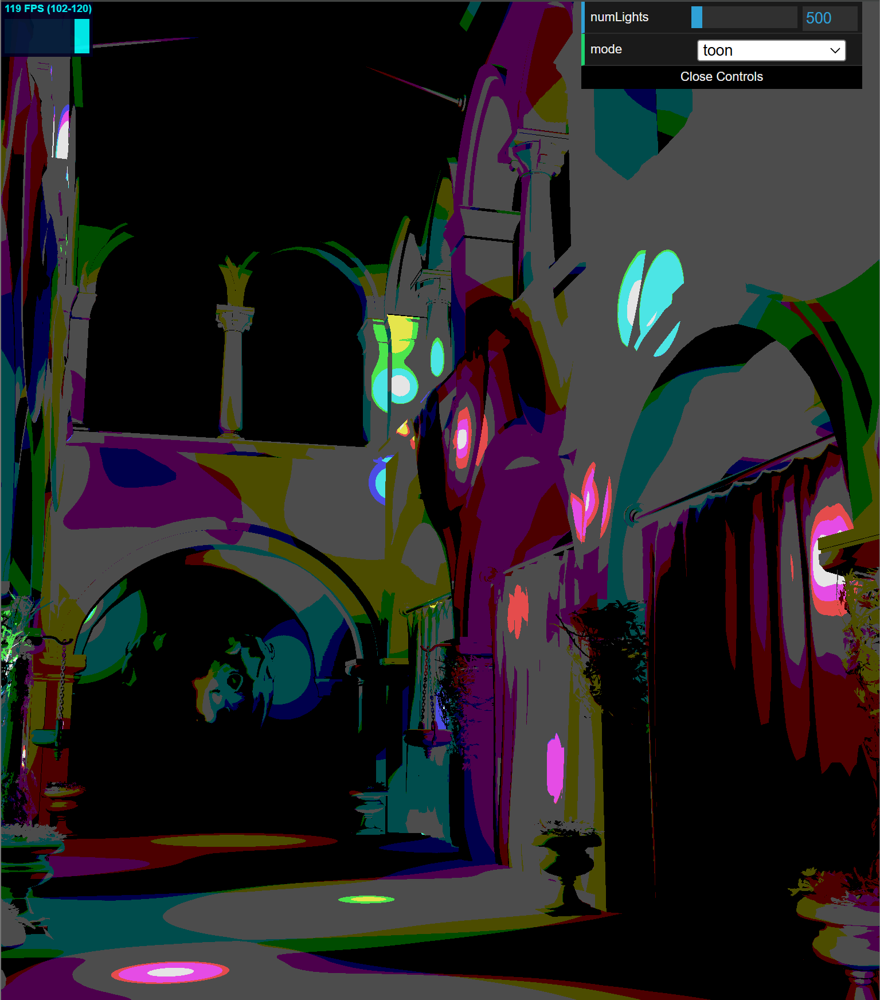                          |

This toon shader implements a cell-shading technique to produce an artwork-like rendering effect with smooth, simplified color bands and outlines. It works by quantizing both the diffuse color (above image, on the left) light intensity (above image, on the right) into discrete shades. The shader calculates the lighting contribution based on scene lights, then applies toon shading by mapping the light and diffuse colors into bands that limit the color range. To enhance the cartoon effect, an edge detection pass is implemented using the surface normals. The shader compares the normals of each pixel with its neighbors to identify areas of sharp change (edges) where black should be drawn. This combination of simplified shading and outlines gives the model a stylized, hand-drawn appearance.

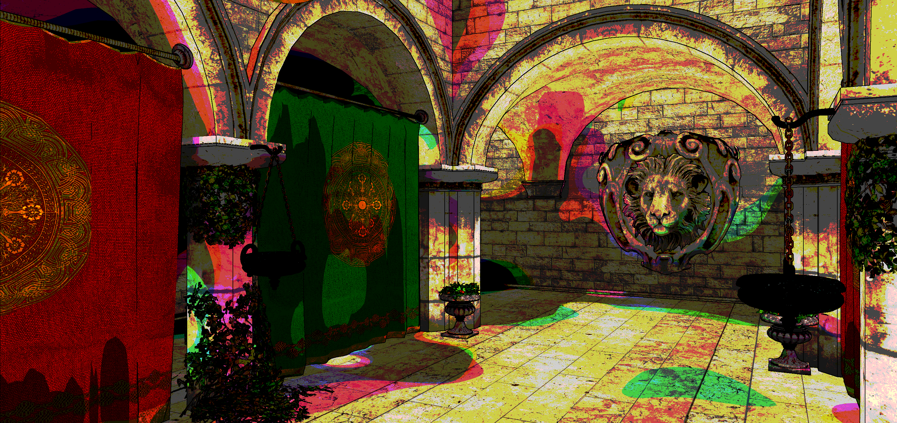

*Final result of artsy shader.*

I added this toon shader on top of the Clustered Deferred renderer, leveraging the full-screen fragment shader setup. The post-processing effect is done in a fragment shader for simplicity: the necessary information, namely normals and diffuse colors, were already present in G-buffer.

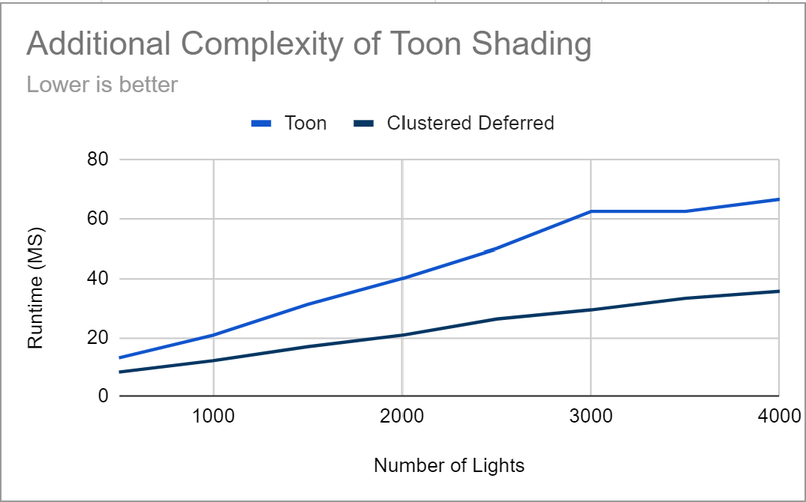

As seen in the performance graph, adding this toon shader to a deferred shading pipeline increases the runtime due to the extra processing required for quantizing colors and performing edge detection (checking each fragments neighbors). The performance impact scales with parameters such as the number of lights and the number of clusters. More lights increase the per-pixel lighting calculations, and a higher number of tiles increases the number of clusters that must be evaluated for lighting contributions. Additionally, edge detection requires sampling neighboring pixels, which adds memory access overhead. Offloading edge detection to a separate post-processing pass could potentially optimize this feature.

### Credits

- [Vite](https://vitejs.dev/)
- [loaders.gl](https://loaders.gl/)
- [dat.GUI](https://github.com/dataarts/dat.gui)
- [stats.js](https://github.com/mrdoob/stats.js)
- [wgpu-matrix](https://github.com/greggman/wgpu-matrix)
