## WebGPU Clustered Forward and Clustered Deferred Shading

||
|:--:|
|GIF demo of all features|

Author: Alan Lee ([LinkedIn](https://www.linkedin.com/in/soohyun-alan-lee/))

This project is a WebGPU based clustered forward and clustered deferred shader designed and implemented using typescript and WebGPU.

This rasterizer currently supports the following features with arbitrary number of light sources:
* Naive renderer
* Clustered forward renderer (light clustering)
* Clustered deferred renderer (light clustering + deferred shading)
* Clustered deferred toon-shaded renderer (light clustering + deferred shading + toon shading in fragment shader)
* Clustered deferred toon-computed renderer (light clustering + deferred shading + toon shading in compute shader)

You can directly experience the live demo at our website on [Github page](https://alan7996.github.io/Project4-WebGPU-Forward-Plus-and-Clustered-Deferred/). 

### Live Demo

Click on the image below to test our project on your own browser!

[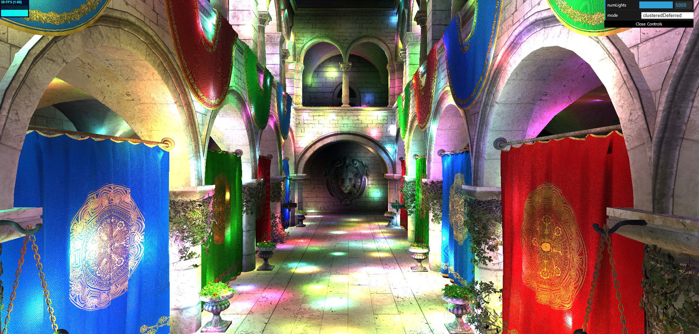](https://alan7996.github.io/Project4-WebGPU-Forward-Plus-and-Clustered-Deferred/)

## Contents

- `src/` contains all the TypeScript and WGSL code for this project. This contains several subdirectories:
  - `renderers/` defines the different renderers in which you will implement Forward+ and Clustered Deferred shading
  - `shaders/` contains the WGSL files that are interpreted as shader programs at runtime, as well as a `shaders.ts` file which preprocesses the shaders
  - `stage/` includes camera controls, scene loading, and lights, where you will implement the clustering compute shader
- `scenes/` contains the Sponza Atrium model used in the test scene

## Running the code

Follow these steps to install and view the project:
- Clone this repository
- Download and install [Node.js](https://nodejs.org/en/)
- Run `npm install` in the root directory of this project to download and install dependencies
- Run `npm run dev`, which will open the project in your browser
  - The project will automatically reload when you edit any of the files
  
## Analysis

* Tested on: **Google Chrome 129.0.6668.101 (64 bit)** on
  Windows 10, AMD Ryzen 5 5600X 6-Core Processor @ 3.70GHz, 32GB RAM, NVIDIA GeForce RTX 3070 Ti (Personal Computer)
* Number of clusters in (x, y, z) : (16, 16, 24)
* Workgroup size : (4, 4, 8)
* Number of lights : 5000
* maxNumLightsPerCluster: 1000

The raw data for both qualitative and quantitative observations were made using above testing setup. For the numerical measurements of the performance, please refer to `rawdata.xlsx` at the root of this repository. The render time for each frame was measured in the renderer's `draw` function by taking the difference between recorded timestamps before and after submitting the command encoder to our device queue.

The performance analysis was conducted using the Sponza Atrium model. We tested each configuration **three** times, each time recording render times for **hundred** frames, and averaged the results to reduce to performance effect of randomness in light source position and movement generations. We did not test with static light positions because the variance in averaged performance is too high compared to moving light sources that somewhat converges to a reasonable variance on expectation.

### Core Features

#### Naive Renderer

The naive renderer can be summarized as for each mesh returned by camera ray-scene intersection, we sum the light contribution to the intersection point from every light in the scene. As the number of lights increases, this naive approach slows down extremely and becomes unusable as a real-time renderer.

#### Light Clustering (Forward+)

Light clustering technique is demonstrated in our clustered forward renderer option. This technique optimizes the naive rendering pipeline by reducing the number of lights used in fragment shader.

|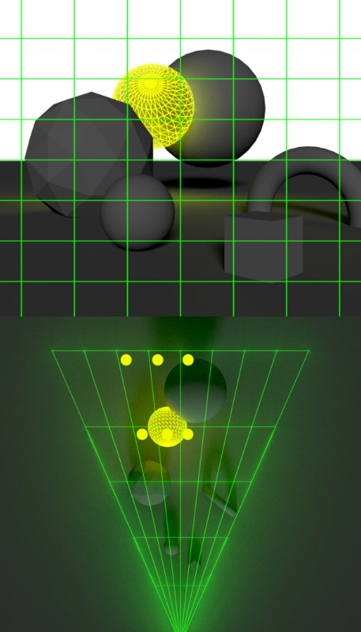|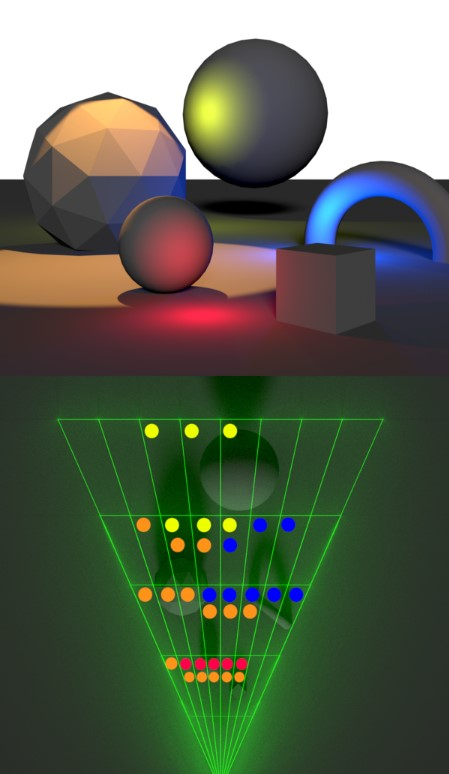|
|:--:|:--:|

Above diagrams demonstrate a top-down view of creating 3D volumes called "clusters" that store indices of light sources that has their sphere of influence intersect with the volumes. The division of clusters happen in normalized device coordinates, but the intersection check is performed in view space. This means that our clusters will be frustums in view space. The intersections between frustum clusters and spherical lights are approximated by constructing bounding boxes for the frustum clusters and performing box-sphere intersection tests instead.

This improves our algorithm from naive to be for each mesh returned by camera ray-scene intersection, we compute the index of the cluster enclosing the intersection point and sum the light contribution to the intersection point from only the lights belonging to this cluster.

#### Deferred Shading

Deferred shading technique is demonstrated in conjunction with light clustering in our clustered deferred renderer option. This technique further optimizes the light clustering pipeline by reducing the number of fragment shader calls that are unnecessary.

|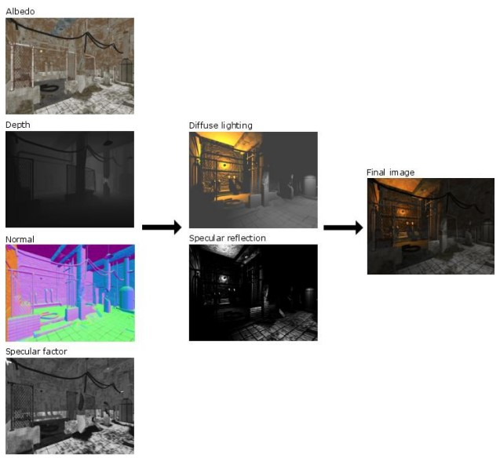|
|:--:|

We achieve by splitting our rendering pipeline into two passes. In our first pass, we constantly update our "G-buffer" that stores information about the nearest intersection we have per pixel. The information we store in this implementation are world position, material albedo, and surface normal. These information are then used in the second pass where we compute the light contribution to each of these stored intersection point using light clustering.

The advantage of this approach is that we reduce the number of calls to fragment shader, which is generally the most expensive component of the rendering pipeline. In previous renderer options, we loop through every material in the order there were created by the gltf scene descriptor. This means that in the worst case, geometry may have been stored in a back-to-front order, meaning we call fragment shader on every pixel that each model covers in screen space. Using G-buffer deferred shading reduces this to essentially one fragment shader call per pixel. The downside is that this basic version of deferred shading cannot deal with translucent materials, but this can be fixed by adding an additional buffer for alpha channel information and the order of materials.

#### Performance

|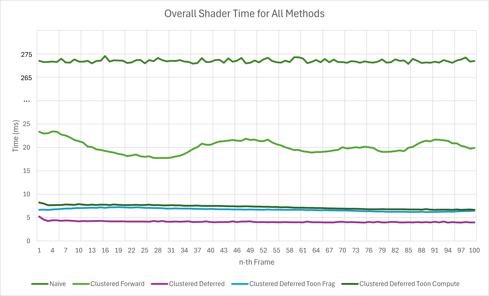|
|:--:|
|Overall Shader Runtime for All Methods (lower is better)|

We can observe from above graph for all methods that the overall performance difference between each algorithm is very clear. For a scene that naive struggles keeping up with real-time rendering, clustered forward and clustered deferred rendering techniques significantly improve the rendering times to easily achieve 30~60fps performance.

We see on average **92.6%** speedup using clustered forward technique, whereas we see on average **98.5%** speedup using clustered deferred technique. This means that the clustered deferred rendering is on average **5.03x** faster than the clustered forward rendering under our testing configuration. The reason for performance gain is obvious and goes back to the theory behind these methods. Clustered forward allows our fragment shaders to not have to iterate through every light source in the scene which greatly improves the time spent requesting for and reading from global memory about light sources. On top of this, clustered deferred allows us to not waste fragment shader resources shading objects that will be occluded later on. As we will see in the toon shader runtime breakdown graph later, fragment shader typically consumes most of the overall runtime. This leads to improving the number of times we need to call this fragment shader dramatically further accelerating our performance.

|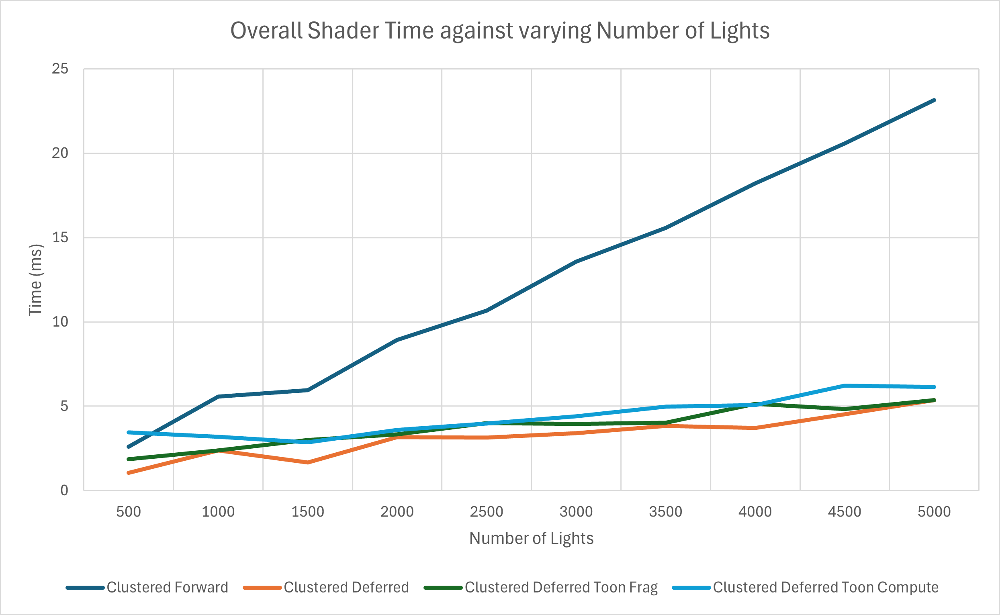|
|:--:|
|Overall Shader Time against varying Number of Lights for All Methods (shorter is better)|

We see that as we increase the number of lights, both clustered forward and variations of clustered deferred techniques scale linearly. However, the clustered forward method scales at a sharper (worse) rate than the clustered deferred methods. There is no point at which the clustered forward renderer performs better than the unmodified clustered deferred renderer. This means that the overhead of performing two render passes for clustered deferred renderer is *always* outweighed by the performance gain from saving fragment shader calls, unless in edge case scenarios where the number of lights is extremely small. 

This leads to the conclusion that with any non trivial scene with many light sources, it is always beneficial to use clustered deferred renderer over clustered forward renderer. That being said, we should also consider what the optimal cluster size is. The optimal cluster size is highly subjective to the screen resolution, distribution of light sources, and scene complexities. Therefore, for this analysis, we simplified the conditions to only try configurations with clustered deferred renderer and cluster size as multiples of set proportions (2x2x3), which was quantitatively decided to be effective in unincluded test measurements.

|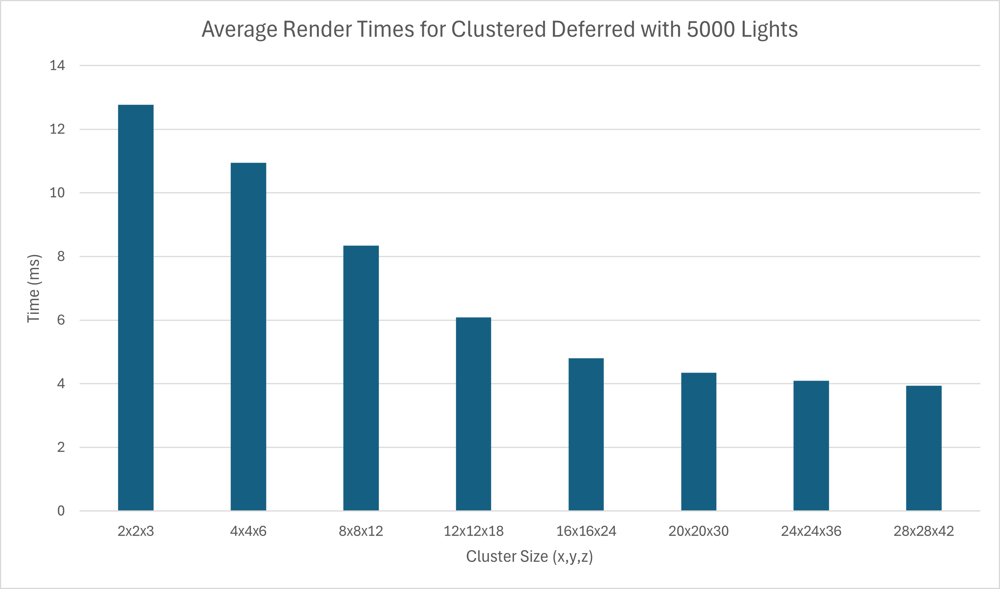|
|:--:|
|Averaged Render Time for Clustered Deferred with Varying Cluster Sizes (lower is better)|

We can clearly see that the more clusters we have, the faster our render becomes. We eventually get diminishing returns, but there is still a consistent improvement to be achieved. This performance gain however does come at a cost. With each additional cluster we introduce, according to our `ClusterSet` struct definition, we are using up `(16 + maxNumLightsPerCluster * 4)` bytes of memory. Since for our testing purposes we set the number of lights per cluster to 1000, this means we are using up almost 4 megabytes of memory per cluster. As we increase to cluster size of 28x28x42, this means we are using at worst case **126GB** of memory.

Now, thanks to modern technology and smart resource managements, we are not actually using 126GB of memory, but it is still nevertheless true that more clusters will necessarily use that much more memory. We should also consider that having more clusters also mean more workgroups. WebGPU compatible browsers can only have as many workgroups as the device's graphics card can support. In private testing, we found that on an integrated graphics card laptop, 16x16x24 was the limit before the browser reported maximum number of workgroups exceeded. Since 16x16x24 is the last major improvement in performance (greater than 1ms performance time reduction), it is reasonable to conclude that 16x16x24 is the optimal cluster configuration that achieves good performance while maintaining cross-device compatibility.

### Toon Shading

|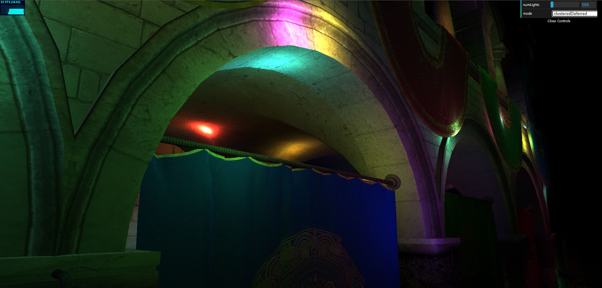|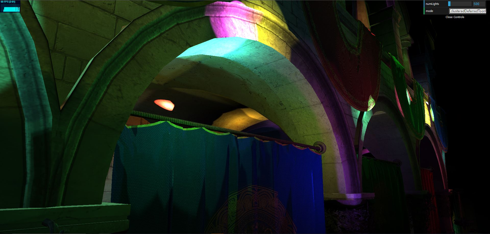|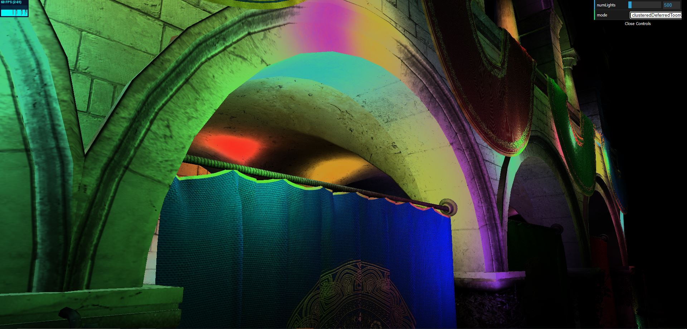|
|:--:|:--:|:--:|
|No toon shading|Toon shading as fragment shader|Toon shading as compute shader|

Toon shading, also known as cel shading, is a stylization post-processing that alters our usual n-dot-l light contribution model by applying a ramp to this light intensity. That is, at a point of ray-scene intersection, if the dot product between the vector from point to a light source and the surface normal at this point is greater than zero (i.e. the point is pointing towards the light source), we interpolate a light intensity value on a custom hermite curve with this dot product and scale our material albedo by the new intensity. This results in a varied levels of pastel-like solid color shading patterns (which can be tuned by the control points of our hermite curve) similar to that of a traditional cel shading animation technique.

Our implementation comes in two versions. The first version is a traditional toon shading implemented as part of the fragment shader in the second pass of clustered deferred renderer. The second version is an experimental toon shading implemented as a compute shader after the second pass of clustered deferred renderer. This second version with a compute shader reads each color in the framebuffer and applies a ramp to the norm of the color in the form of hermite spline. The control points of the hermite spline is tuned to produce visibly similar output instead of using identical parameters, because the first version applies ramp on the intensity of *each* light whereas the second version applies ramp on the accumulation from *all* light sources.

Although unused for testing purposes, there is also an `ambientLight` field in the fragment shader version that adds an ambient light contribution if needed.

|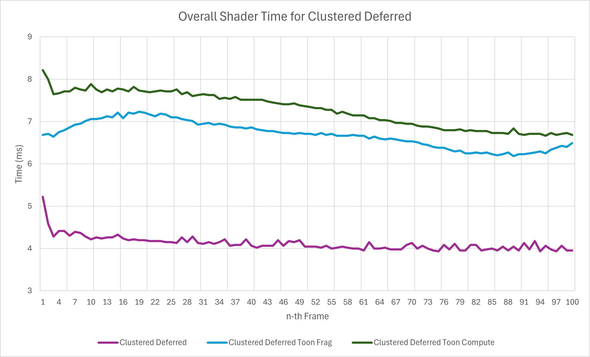|
|:--:|
|Overall Shader Runtime for Toon Shading Methods (lower is better)|

|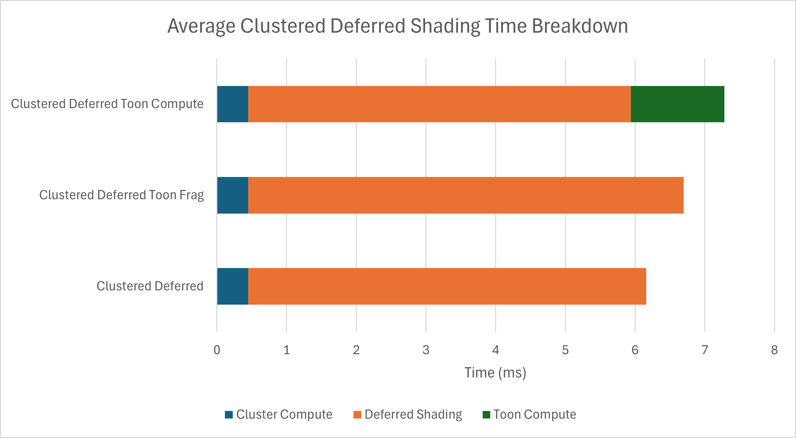|
|:--:|
|Average Shader Runtime Breakdown for Toon Shading Methods (shorter is better)|

Since both approaches add completely new steps to the existing procedure, it is shown as expected that both methods take longer than the unmodified clustered deferred rendering. It is however noteworthy that the combined average completion times of shader steps is shorter for the fragment shader approach than for the compute shader approach. Interestingly, we can also observe that the deferred shading stage for compute shader approach is shorter than even the unmodified version. We suspect that this is due to the compute shader stage taking over the job of writing to the canvas framebuffer from the deferred shading pass, meaning the compute shader also has to deal with the overhead of type conversion and formatting to the canvas requirements. The combination of this problem and the overhead of launching and completing an entire additional compute pass makes this second approach less performant than the pure fragment shader approach. This however does not preclude the compute shader pass approach entirely  the artistic effect generated is distinctively different from the fragment shader approach, so there may still be qualitative reasons to choose this slower alternative instead.

|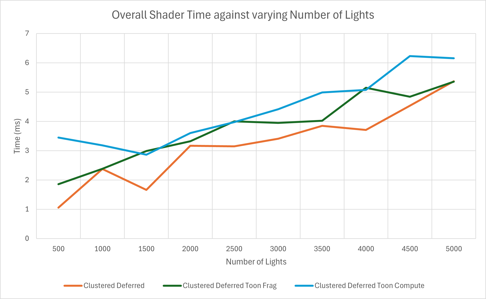|
|:--:|
|Overall Shader Time against varying Number of Lights for Toon Shading Methods (shorter is better)|

We can observe from the above graph that both of our methods scale approximately equally with the unmodified clustered deferred rendering technique. This shows that modifying fragment shader in a small way (simply adjusting the exact amounts of light contribution) and adding a basic compute pass (equivalent to read, linear operations, store) do not affect scalability of the shaders.

### Credits

- [Vite](https://vitejs.dev/)
- [loaders.gl](https://loaders.gl/)
- [dat.GUI](https://github.com/dataarts/dat.gui)
- [stats.js](https://github.com/mrdoob/stats.js)
- [wgpu-matrix](https://github.com/greggman/wgpu-matrix)
- [light clustering](https://www.aortiz.me/2018/12/21/CG.html#clustered-shading)
- [deferred shading image](http://www.leadwerks.com/files/Deferred_Rendering_in_Leadwerks_Engine.pdf)
- [toon shader](https://roystan.net/articles/toon-shader/)
- [wgpu timer](https://webgpufundamentals.org/webgpu/lessons/webgpu-timing.html)