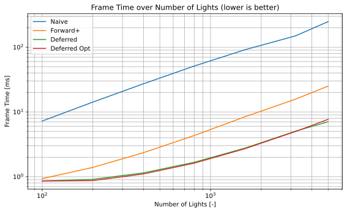

WebGL Forward+ and Clustered Deferred Shading
=============================================

**University of Pennsylvania, CIS 5650: GPU Programming and Architecture: Project 4**

* Dominik Kau ([LinkedIn](https://www.linkedin.com/in/dominikkau/))
* Tested on: Windows 10, i7-4790k @ 4.4 GHz, 16 GB, RTX 2060 SUPER 8192 MB

## Live Demo

[Click here for an interactive live demo of the various renderers!](https://dominikkau.github.io/Project4-WebGPU-Forward-Plus-and-Clustered-Deferred/)

## Demo Video

(Read on, this might load for a bit...)

# Implemented Features

## Naive Forward Renderer

In a basic forward renderer, a shader is applied iteratively for every mesh and every light in the scene.
This means that for each light and mesh pair, shading is calculated, regardless of whether the light has any influence on the mesh.
As the number of meshes and lights increases, the renderer scales poorly due to redundant computations.
Specifically, in iterations where the light is far away from the mesh, the lighting computations become meaningless because the light won't impact the shading.
Moreover, fragments that are occluded in the final image may still undergo unnecessary computations, such as light interactions, which will ultimately be discarded.
This inefficiency results in a significant computational overhead as the scene complexity grows.

## Clustered Forward+ Renderer

The Clustered Forward+ renderer addresses some of the inefficiencies inherent in the naive forward rendering method.
The scene is subdivided along all three axes into clusters, where each cluster contains a subset of the lights that influence that region.
Using a compute shader, we can compute which lights affect each cluster.
During the subsequent rendering pass, only the lights that belong to the cluster containing the current fragment will be used for shading, reducing the number of unnecessary light computations.
While this method improves efficiency by eliminating the need to process lights outside of a fragment’s region of influence, it still suffers from the problem of unnecessary computations for fragments that are occluded by other objects.

Each color represents a different cluster.
In total 16 clusters are created in the horizontal direction, 9 in the vertical and 32 in the depth direction.

## Clustered Deferred Renderer 

The Clustered Deferred renderer builds on the concept of clustered rendering but optimizes further by "deferring" the shading process.
In this method, important geometry information is computed in a first pass and saved into a G-buffer, a collection of textures that store information, such as position, normal, and material properties of a fragment.
Because the render keeps track of the depth of each fragment, only the closest fragment appears in the final textures.
The lighting is then calculated in a separate pass based on the stored G-buffer data - completely decoupling the lighting computations from the geometry pass.
This deferred approach significantly reduces redundant computations since lighting is only computed for the closest fragments, that are actually visible.
One downside of this technique is the handling of transparent materials which cannot be supported in this basic version where one value in each texture corresponds to one pixel.
Another downside is the increased memory usage due to the handling of multiple textures.

In the top left is the albedo texture, i.e. color sampled from the mesh textures, displayed.
To the right is a representation of the global position and in the bottom left is a representation of the mesh normals.
The final render is given in the bottom right.

## Optimized G-Buffer

To optimize the memory footprint of the Clustered Deferred renderer, the G-buffer can be compressed.
I reduced the three different textures into a single 32-bit texture.
The four color channels (red, green blue and alpha) are stored in the first channel of the G-buffer texture by making use of the fact that colors are usually represented as 8-bit values. 
Using bit shift operations, all four color channels fit into a single 32-bit value.

I compressed the normal and position vectors into 32-bit integers, a feature that is natively supported by WebGPU ([WebGPU.rocks](https://webgpu.rocks/wgsl/functions/packing/)).
By packing together two floats into one integer, I could fit the - in total six vector components - into the remaining three 32-bit integers.

# Performance Analysis

The above diagram shows the average time per frame for a duration of a minute of the sponza scene as shown in the above gif.
Compared are the four presented renderers.
In all cases the lights buffer was sized to the maximum number of lights which is 5000.
For the clustered implementations, the maximum number of lights per cluster was set to 1024.
The number of clusters was 16 x 9 x 32 = 4608.

The naive renderer is overall by far the slowest - it also shows the worst scaling with the number of lights.
Both deferred renderers show very good scaling with an increasing number of lights. 
There’s little difference between the two, probably because the performance of the application is not memory bound.
Thus, a decrease in memory usage will not yield a big improvement.
The performance of the forward+ implementation lies between the other two types of renders.

The same trends can be observed with different numbers of clusters and with different (maximum) number of lights per cluster.
This makes sense because the implementation with regards to the clustering is the same for the Forward+ and the two deferred renderers.
I would expect an even more significant performance difference if a different scene with more prominent object occlusion was rendered.
On the flip side, a scene with basically no occlusion should result in very similar performance.
Indeed, if the camera is turned by 180° and mostly looking at a flat wall, the performance difference is significantly smaller.
For 3200 lights, the difference between the deferred and forward+ implementation is only around 5 %, compared to the nearly 300 % in the original orientation.

## Credits
- [WebGPU Struct Alignment](https://webgpufundamentals.org/webgpu/lessons/resources/wgsl-offset-computer.html)
- [Intersection Algorithm](https://github.com/gszauer/GamePhysicsCookbook/blob/master/Code/Geometry3D.cpp#L319)
- [LearnWebGPU: Projection Matrices](https://eliemichel.github.io/LearnWebGPU/basic-3d-rendering/3d-meshes/projection-matrices.html)
- [WebGPU Fundamentals](https://webgpufundamentals.org/)
- [WebGPU.rocks](https://webgpu.rocks/)
- [Vite](https://vitejs.dev/)
- [loaders.gl](https://loaders.gl/)
- [dat.GUI](https://github.com/dataarts/dat.gui)
- [stats.js](https://github.com/mrdoob/stats.js)
- [wgpu-matrix](https://github.com/greggman/wgpu-matrix)
