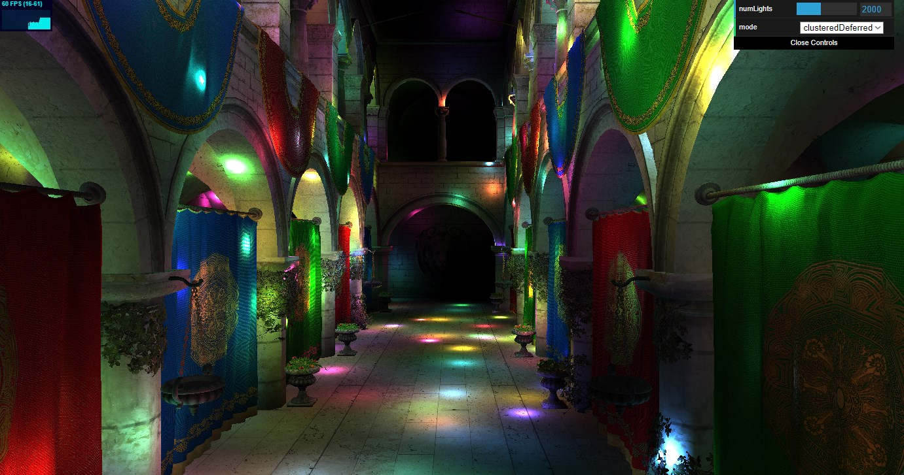
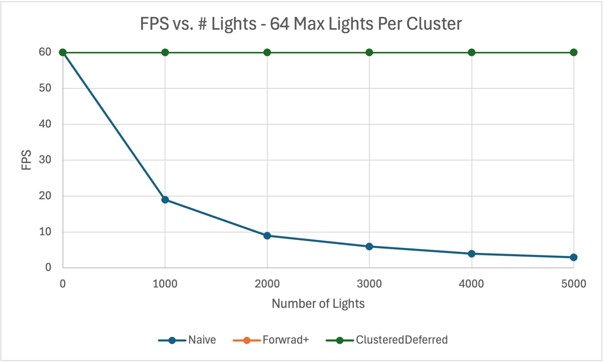
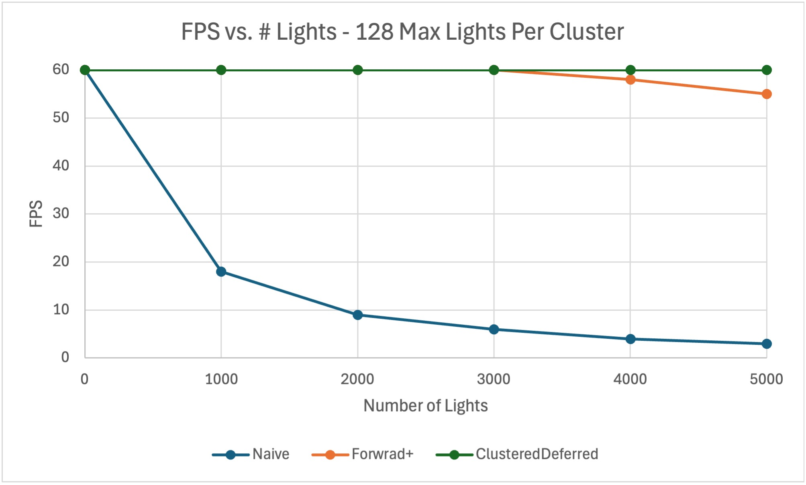
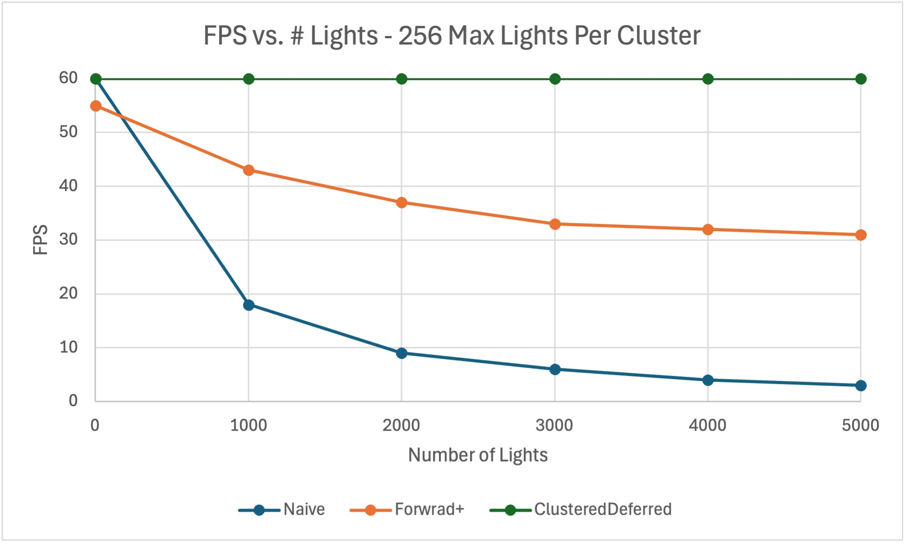
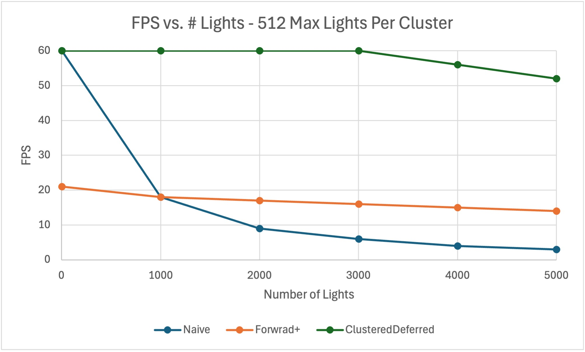
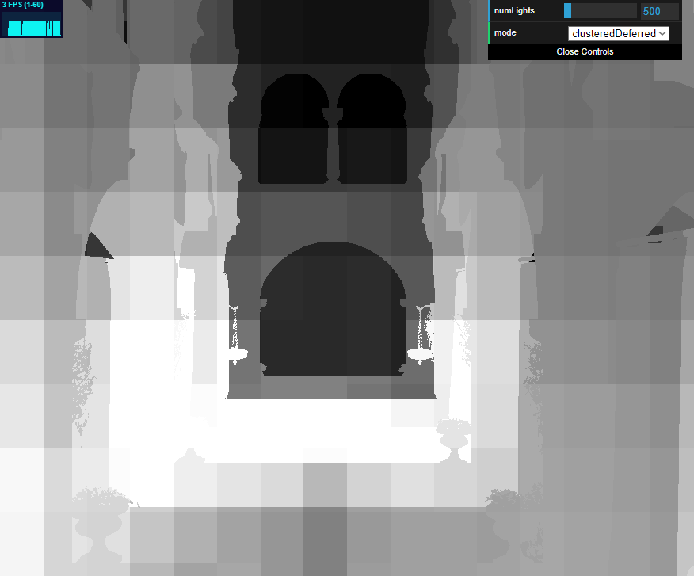

# WebGL Forward+ and Clustered Deferred Shading

======================

**University of Pennsylvania, CIS 5650: GPU Programming and Architecture, Project 4 - Forward+ & Clustered Deferred Shading**

- Jordan Hochman
  - [LinkedIn](https://www.linkedin.com/in/jhochman24), [Personal Website](https://jordanh.xyz), [GitHub](https://github.com/JHawk0224)
- Tested on: **Google Chrome (130.0.6723.59)** and **Opera GX (LVL6 - 114.0.5282.106)** on
  Windows 11, Ryzen 7 5800 @ 3.4GHz 32GB, GeForce RTX 3060 Ti 8GB (Compute Capability: 8.6)

## Welcome to my WebGPU Graphics Pipelines Project!

In this project, I implemented multiple graphics pipelines using WebGPU. The first is a naive implementation that runs a normal vertex shader and then fragment shader pass. The second is a 3D-clustered Forward+ pass with a compute shader to determine which clusters are affected by which lights, and the last is a also a 3D-clustered pass, but this time it's deferred. The colors (albedos), normals, positions, and depths are precomputed into a buffer at once, and then these are combined in the final fragment shader as opposed to the original architecture (it uses the same compute shader for the lights). More details can be found in `INSTRUCTIONS.md` [here](INSTRUCTIONS.md).

### Demo Video/GIF

Here is a demo GIF of it running. Note that the FPS cap/framiness is due to the GIF itself, and not the actual graphics pipeline. The GIF only has so many frames per second, so instead, look at the FPS counter in the top left. The same is true for most of the other GIFs in this README.

### Live Demo

Try out the demo [here](https://jhawk0224.github.io/CIS5650-Project4-WebGPU-Forward-Plus-and-Clustered-Deferred)! You can select which pipeline is being used, the naive one, the forward+ one, or the clustered deferred one.

### Performance Analysis

I tested the performance of the three pipelines above, and you can find a summary below. The detailed data can be found [here](simulationData.xlsx) if you're interested.

To test the performance, I ran the pipelines with multiple values for the maximum number of lights per cluster (which from here on out I will call "maximum LPC"). The higher this value, the more light can be contributed to each cluster, but then it also takes more compute and memory bandwidth. I chose to run the tests with 64, 128, 256, and 512 for this maximum value, and here are the results:

In these graphs, the FPS is in the y-axis, and the number of lights in the scene is on the x-axis. The FPS was measured averaging over 5 seconds. Since we're measuring FPS, higher is better. And as the maximum LPC increases, we should expect the FPS to drop as it takes more resources to render the scene.

The first thing I want to note is that the Naive implementation has the same exact performance for all values of maximum LPC. This is because this implementation does not rely on the maximum LPC at all. Because of this, I only collected this data once, but I put it on all graphs for an easier visual comparison. Now we can see that for 1 light in the scene, it can run at 60 FPS, but this drastically drops off as the number of lights decreases.

On the other hand, the Clustered Deferred implementation is almost entirely at 60 FPS for every test. It only starts barely dropping for the most intense scenes where the maximum LPC is 512 and the number of lights is above 4000.

The Forward+ implementation sits in the middle. For lower values of maximum LPC, it also achieves 60 FPS no matter how many lights there are, but we see this changes at around 256 maximum LPC. Here, the FPS is about half as much in the low 30s. It drops even more in performance to the 10s and 20s for FPS for 512 maximum LPC.

Interestingly, this drop off does't get more and more severe, it actually levels out past a certain point, no matter what the maximum LPC is (although this point is different). This makes sense because we would think there is only so much overhead with setting up the pipelines, and once the bottleneck has been reached, adding more lights won't make much of a difference.

One reason the Clustered Deferred implementation performs better than the Forward+ one is because when there are so many lights, it's really efficient to pre-compute all of the color, normal, and depth buffers. The Forward+ would actually be better if the workload had more vertices than fragments, while the deferred implementation is good for high fragment counts.

### Gallery

### Debug Images

This is a GIF from while I was debugging the clustered deferred pipeline. It is showing the number of lights in each cluster as the grey-scale value for each fragment (pixel).

### Credits

- [Vite](https://vitejs.dev/)
- [loaders.gl](https://loaders.gl/)
- [dat.GUI](https://github.com/dataarts/dat.gui)
- [stats.js](https://github.com/mrdoob/stats.js)
- [wgpu-matrix](https://github.com/greggman/wgpu-matrix)
