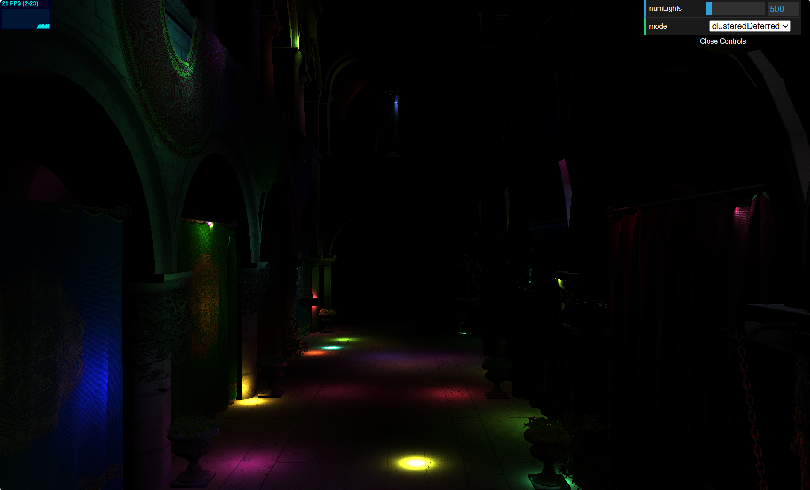
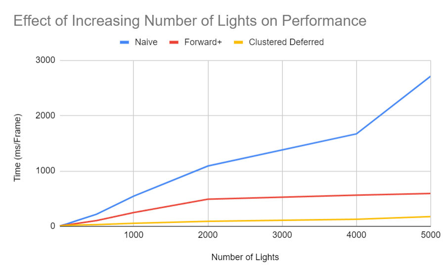
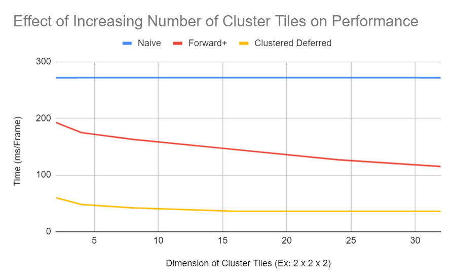

WebGL Forward+ and Clustered Deferred Shading
======================

**University of Pennsylvania, CIS 565: GPU Programming and Architecture, Project 4**

* Joanna Fisch
  * [LinkedIn](https://www.linkedin.com/in/joanna-fisch-bb2979186/), [Website](https://sites.google.com/view/joannafischsportfolio/home)
* Tested on: Windows 11, i7-12700H @ 2.30GHz 16GB, NVIDIA GeForce RTX 3060 (Laptop)

### Live Demo

### Demo Video

https://github.com/user-attachments/assets/b7489c6c-6df0-490f-b5c1-9a3dfee5fc16

### Project Description
In this WebGPU project, I implemented two advanced rendering techniques: Forward+ Shading and Clustered Deferred Shading, using the Sponza atrium model and a large number of point lights. These methods enable efficient lighting calculations by partitioning the scene into clusters or tiles, ensuring that each fragment or pixel is only influenced by relevant lights. This approach significantly optimizes the rendering process in scenes with many dynamic lights.

The project also includes performance analysis and optimization efforts, comparing the two methods to determine their efficiency across different workloads. I leveraged WebGPU's capabilities to manage complex GPU tasks, providing a detailed breakdown of how these rendering methods scale with varying light counts.

### Features Implemented
1. Naive Renderer
2. Forward+ Shading: Implemented a clustering data structure to track the lights within each tile/cluster. Optimized the fragment shader to process only the lights overlapping with the cluster of each fragment, improving performance.
3. Clustered Deferred Shading: Used the clustering logic from Forward+ to store vertex attributes (position, normals, etc.) in a G-buffer. Implemented a second pass to apply lighting only to the necessary pixels using data from the G-buffer.

<table>
  <tr>
    <td></td>
    <td></td>
    <td></td>
  </tr>
 <tr>
    <td><i> Position </i></td>
    <td><i> Albedo </i></td>
    <td><i> Normal </i></td>
  </tr>
  <tr>
    <td colspan="3" align="center"><i> Three textures that make up the G-Buffer</i></td>
  </tr>
</table>

### Performance Analysis

* Is one faster? Based on my data, Clustered Deferred consistently outperforms Forward+ at higher light counts, especially beyond 500 lights. For example, with 5000 lights, Clustered Deferred takes 175ms, while Forward+ takes 593ms.
* Better at Certain Workloads?
  * Forward+: Suitable for moderate light counts (50-500 lights), but its performance degrades quickly beyond this range.
  * Clustered Deferred: Handles large numbers of lights better because of its deferred nature, which avoids per-fragment lighting calculations during the initial pass.
* Benefits & Tradeoffs:
  * Forward+:
    * Pros: Simpler implementation, handles small to moderate scenes efficiently, doesn’t require G-buffer management.
    * Cons: Performs poorly with many lights due to heavy fragment shader workload.
  * Clustered Deferred:
    * Pros: Better scalability with light count, efficient due to G-buffer, reduces redundant per-pixel light computations.
    * Cons: Requires more memory for G-buffer, more complex shader logic, and more post-process passes.
* Explanation of Performance Differences: Clustered Deferred reduces the lighting calculation load by first storing geometry data (position, normals, etc.) in a G-buffer, allowing lighting to be computed only in the necessary pixels, whereas Forward+ has to calculate lighting for every fragment per draw call.

<table>
  <tr>
    <td></td>
  </tr>
  <tr>
    <td colspan="3" align="center"><i> Cluster Grid (16,16,24), Cluster Workgroup Size (4,4,4), Max Number of Lights per Cluster 1000</i></td>
  </tr>
</table>

<table>
  <tr>
    <td></td>
  </tr>
  <tr>
    <td colspan="3" align="center"><i> Number of Lights 500, Cluster Workgroup Size (4,4,4), Max Number of Lights per Cluster 1000</i></td>
  </tr>
</table>

### Credits

- [Vite](https://vitejs.dev/)
- [loaders.gl](https://loaders.gl/)
- [dat.GUI](https://github.com/dataarts/dat.gui)
- [stats.js](https://github.com/mrdoob/stats.js)
- [wgpu-matrix](https://github.com/greggman/wgpu-matrix)
