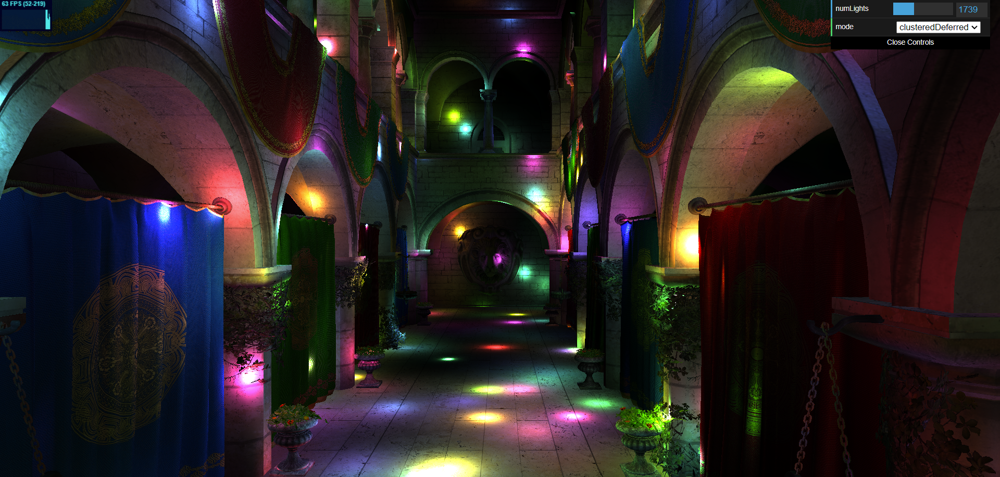
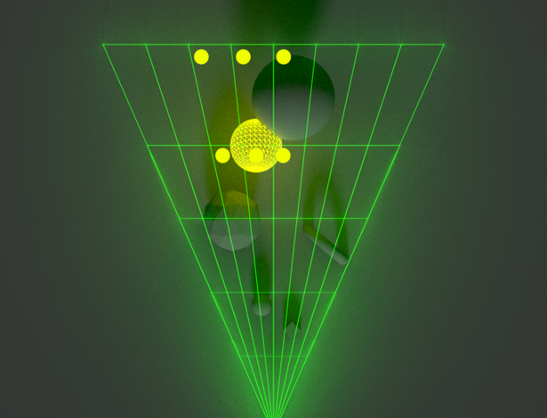
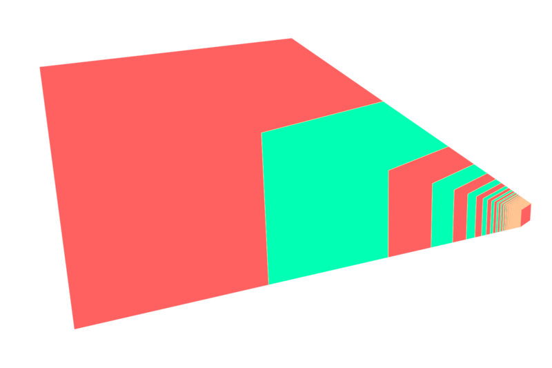
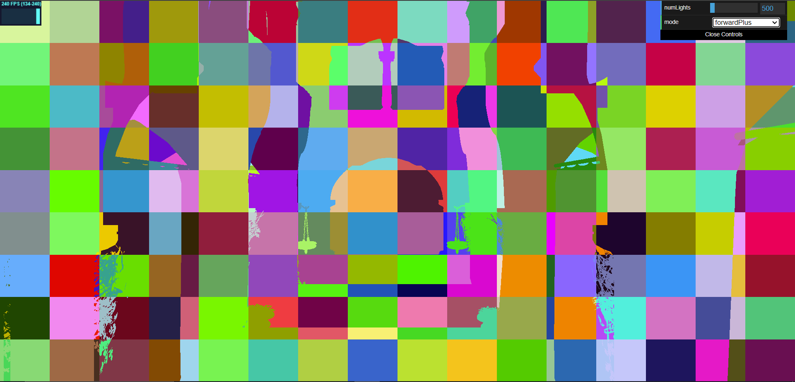
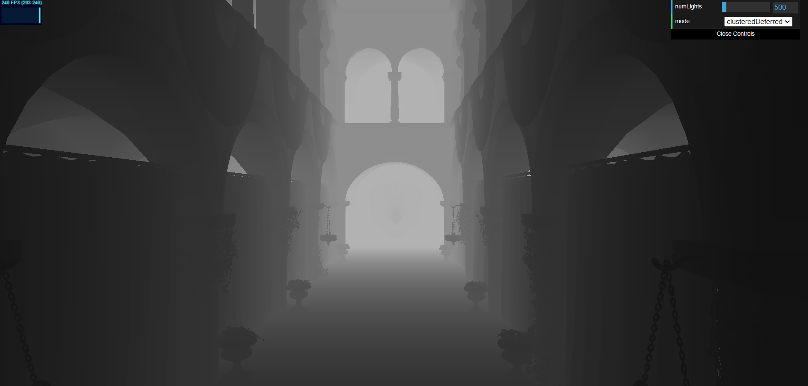
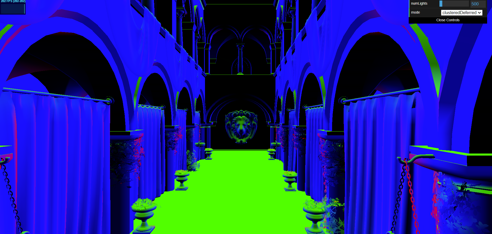
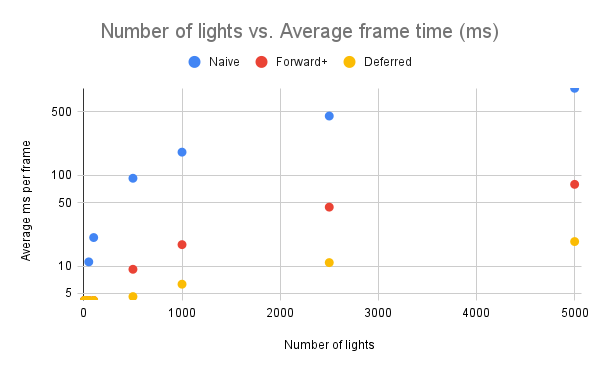
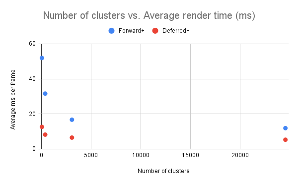

  

WebGPU Forward+ and Clustered Deferred Shading
======================

University of Pennsylvania, CIS 565: GPU Programming and Architecture, Project 4

- Matt Schwartz
- Tested on: Windows 10 22H2, Intel(R) Core(TM) i7-10750H CPU @ 2.60GHz, NVIDIA GeForce RTX 2060

# Overview

With the modern GPUs, compute is quickly becoming cheaper as memory bandwidth becomes the bottleneck. In this project, I explore several different approaches to rendering, from the classic forward rendering strategy, to more modern versions that utilize clustering to improve efficiency. These rendering pipelines are all implemented in WebGPU which, at the time of writing, is still a relatively young and exciting technology for highly compatible web-based GPU usage. 

### ▶️ Live Demo

[Try it out! (on WebGPU-enabled browsers only)](https://mzschwartz5.github.io/Project4-WebGPU-Forward-Plus-and-Clustered-Deferred/)

### 📼 Demo Video

  

 

# Methods

## Naive Rendering (Forward Rendering)

In traditional rendering, every drawable object in a scene is drawn once per frame, and lighting calculations are performed for each object during shading. This is effective but, as we'll see, there are ways to do better. However, this naive approach will serve as a good baseline of comparison.

The main drawback with the naive approach is that it's expensive to calculate lighting, and we're doing it for every light, for every object, every frame. Many (if not most) lights will not even have a significant impact on all objects, so we're wasting compute resources. Further, a fragment that is shaded may later be discarded during depth testing - another waste of resources. 

## Forward+ Rendering (with clustering)

Forward+ rendering capitalizes on the inefficiency of computing lighting for all objects by all lights. It works by dividing up a scene into clusters:

  

  <em>Camera view divided into clusters, and tagged with affecting lights <a href="https://www.aortiz.me/2018/12/21/CG.html#clustered-shading">(source)</a></em>

 

These clusters are 3D frustums, portions of the overall camera frustum. In each cluster, we tag the lights whose radius intersects the bounds of the cluster. Now, whenever we shade a fragment, we can reference the lights affecting it based on the cluster its a member of, and ignore all other lights.

An important implementation note: its easiest to construct the clusters in NDC (normalized device coordinate) space, where the camera frustum has been transformed to look like a cube. In this space, the clusters are rectangular prisms. However, when doing intersection testing, operating in view space is the most sensible choice, as otherwise the spherical point lights become ovoids and intersection testing is complicated.

Also, when slicing up the NDC cube into clusters, note that depth-spacing matters. Regular slices in NDC space become wildly non-linear in view space. We can achieve a good cluster spacing in view space by slicing exponentially in NDC space.

  
  <table>
    <tr>
      <td></td>
      <td></td>
  </table>
  <em>Linear (left) vs. Exponential (right) spacing in NDC space, shown in view space <a href="https://www.aortiz.me/2018/12/21/CG.html#clustered-shading">(source)</a></em>

 

Finally, a visualization of the clusters in the above Sponza scene (where each cluster is given a random color):

  
  <em>Randomly colored clusters in Sponza scene (16 x 9 x 24)</em>

 

## Deferred Clustered Rendering

Deferred rendering capitalizes on the wasteful overdraw done by naive rendering, whereby fragments of objects may be shaded and then discarded due to being occluded by other objects closer to the camera. It works by running multiple render passes; typically, the first pass processes the scene's geometry and writes stores relevant data (depth, albedos, normals, etc.). Notably, the first pass does not calculate any lighting. Thus, any fragments that get discarded did not waste precious compute on calculating lighting. The second pass uses the data stored from the first pass and does the lighting calculations, effectively decoupling geometry from lights.

Alone, deferred rendering is not a novel concept. In the project, though, I implement and test it with clustering.

Since we've already seen how clustering works, lets look at some visualizations of the buffers output by the first pass of deferred rendering:

  
  <table>
    <tr>
      <td></td>
      <td></td>
      <td></td>
  </table>
  <em>From left to right: depth buffer, normal buffer, and albedo buffer</em>

 

# Performance Analysis

For the following tests, I used [WebGPU Inspector](https://chromewebstore.google.com/detail/webgpu-inspector/holcbbnljhkpkjkhgkagjkhhpeochfal) to do profiling and find the average milliseconds per frame for each method.

For each test, we will compare:
- Naive 
- Forward+
- Clustered Deferred 

There are three main independent variables we can adjust:
1. Total lights in the scene
1. Cluster dimensions
1. Cluster workgroup size (the number of GPU threads doing work per work-group)

## Lights

As we increase the number of the lights in the scene, I would expect clustered deferred rendering to increasingly outperform the other two approaches. At lower light counts however, the overhead of computing clusters and writing to and reading from buffers may give Forward+ rendering an edge. Naive, most likely, will only win out at very, very low light counts.

Let's see what the data says:

  

  <em>Note the log scale on the y-axis. Also, it's hard to tell because the dots overlap, but all three approaches performed identically in the 5-50 light range.</em>

 

Well, while it is true that all three approaches converge towards lower light counts, it doesn't appear to be the case that Naive wins out at any light count. However, I think that at low light counts, the frame time is dominated by other activities, such as the compute shader used to move lights around. Any differences due to render technique is simply noise on top of that.

What we can definitively see, however, is how much better deferred behaves compared to forward+. At 5000 lights, clustered deferred performs on average 4x better than forward+. And as the number of lights increases, the gap between the two approaches widens. This is the power of avoiding overdraw and decoupling geometry from lighting.

## Cluster dimensions

In the previous test, the cluster dimensions were held constant at (16 x 8 x 24) in (x, y, z), where z is depth. In this test, we'll fix the number of lights at 1000 and vary these dimensions. I will keep the ratio of the dimensions constant while varying the overall number of clusters.

Since a dimension of (1x1x1) is equivalent to no clustering at all, I expect that, as we decrease the dimensionality, performance will degrade. However, I expect that increasing it beyond a certain point will also degrade performance, as it increases the number of computations necessary to create the clusters.

  

 

Unfortunately, I couldn't push the number of clusters any higher, due to  buffer size limits, so we'll never know the point at which performance begins to degrade again. What's interesting, however, is the diminishing return of additional clusters. From 3072 clusters (16 x 8 x 24) to 24,576 clusters (32 x 16 x 48), there's a very minimal improvement - for the deferred method, a drop from 6.5ms to 5.3ms per frame.

## Workgroup size

Finally, we'll keep the lights constant at 1K again, the cluster dimensions constant at (16 x 8 x 24), and vary the workgroup size. Previously, we've been operating with 3D workgroups at a size of (16 x 16 x 1). With 3D workgroups, the maximum number of threads that can be run per block (at least on my machine) is 256 - which means the product of the x\*y\*z dimensions of the workgroup size cannot exceed 256. Because this is so limiting, I will simply try various different configurations rather than keeping any ratios constant.

And the results... are not very significant! In fact, there wasn't a noticeable difference at all in any (reaosnable - i.e. not (1x1x1)) configuration that I tried! As a result, I'm not even bothering to show the rather flat graph here.

## Miscellaneous

There were some other performance optimizations I made along the way, unrelated to specific rendering techniques, that I'd like to discuss. Namely:

### G-buffer optimizations

The G-buffer is the store of geometry-related information from the first pass of deferred rendering. In its naive form, it holds position, albedos, and normals, for a total of (4 x 4) + (4 x 1) + (4 x 4) = 36 bytes of data per pixel. Since memory bandwidth is a big bottleneck, any amount that we can reduce this by can increase performance.

1. Instead of storing the position, we can only store depth (the z value). The rest can be reconstructed using the fragment coordinate and our inverse view / projection matrices. Compute is free compared to memory access, making this worthwhile.
1. Similarly, since we know normal vectors are, well, normalized, we only need two of the three components to reconstruct the third.
1. We could go even further by packing these two normals into a 32-bit unsigned int, or ditching the depth value altogether and relying on the depth buffer from the first pass (which has a little less precision compared to what I stored in the G-buffer, since its normalized). However, for this project, I only implemented the first two optimizations.

Here's how the deferred renderer performs with and without these optimizations (5k lights):

### Render bundles

# Credits

- [Vite](https://vitejs.dev/)
- [loaders.gl](https://loaders.gl/)
- [dat.GUI](https://github.com/dataarts/dat.gui)
- [stats.js](https://github.com/mrdoob/stats.js)
- [wgpu-matrix](https://github.com/greggman/wgpu-matrix)
