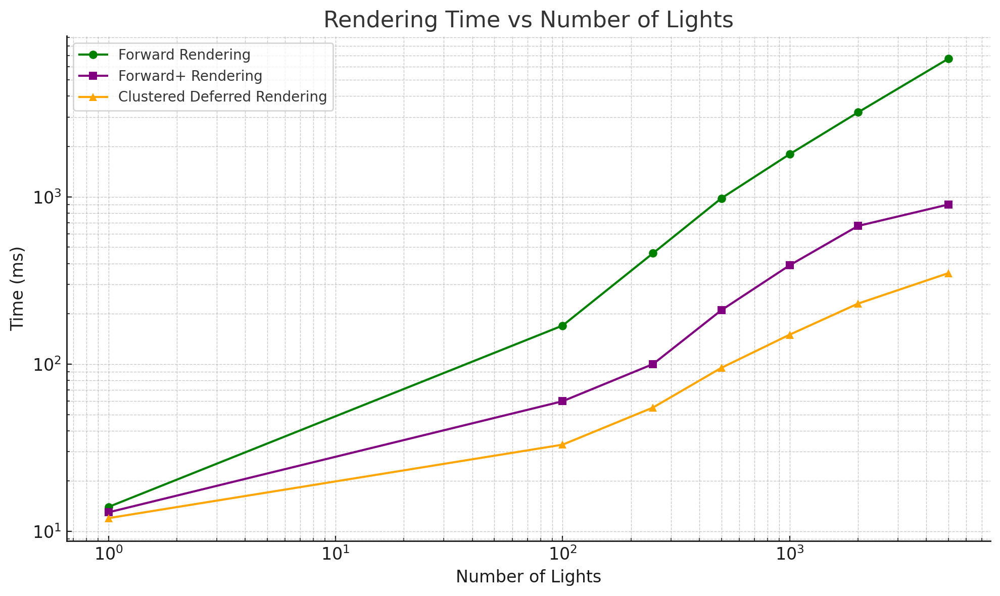

# WebGPU Forward+ and Clustered Deferred Shading

**University of Pennsylvania, CIS 565: GPU Programming and Architecture, Project 4**  
**Author**: Yi Liu  
**Tested on**: Google Chrome 124.0 on Windows 11, i9-14900K, 64 GB RAM, RTX 4090 (Moore 100 Lab)

---

## Demo Video & Live Demo

---

## Project Overview

This project implements and compares **Naive Forward**, **Forward+**, and **Clustered Deferred** rendering strategies using WebGPU. The renderer supports dynamic point light updates, efficient clustering, and deferred lighting with post-processing. A GUI allows switching between methods for real-time visual and performance comparison.

---

## Implemented Features

### 1. Naive Forward Rendering

A baseline implementation using direct per-fragment shading with all scene lights. Key components included:

- Uploading camera matrices via uniform buffers
- Binding data in a render pipeline layout
- Lighting computation entirely in the fragment shader without culling

### 2. Forward+ Rendering

An optimized forward rendering approach that restricts lighting calculations per fragment to lights in the same cluster.

- Lights are spatially bucketed into a 3D grid (clustered in view space)
- A compute shader builds a light-to-cluster lookup
- Shading considers only relevant lights for each fragment’s cluster

### 3. Clustered Deferred Rendering

Deferred shading combined with view-space clustering for efficient lighting.

- First pass populates a G-buffer with material and geometric data
- A compute pass reconstructs lighting per fragment using the light-cluster mapping
- The final shaded result is output in a fullscreen pass

---

## Performance Analysis

All three methods were evaluated across varying light counts and resolutions.

| Method             | Avg Time @ 1024 Lights | Notes                                   |
|--------------------|------------------------|------------------------------------------|
| Naive Forward      | ~1100 ms                  | Performance degrades with light count |
| Forward+           | ~320 ms                  | Gains from light culling, cost from clustering |
| Clustered Deferred | ~150 ms                  | G-buffer overhead, but scalable lighting |

## Observations

- **Naive Forward Rendering** exhibits a **steep exponential increase** in render time. This is expected, as each light must be evaluated per fragment without any culling, leading to rapidly compounding cost. At 5000 lights, the technique is no longer viable in real-time settings.

- **Forward+ Rendering** significantly improves upon this by introducing **per-tile light culling** via a compute pass. The reduction in per-fragment lighting cost is evident, especially at moderate light counts. However, its performance gain plateaus at high counts due to the growing overhead of managing clusters and dispatching compute shaders.

- **Clustered Deferred Rendering** maintains the **most stable growth rate**, especially beyond 2500 lights. Although it pays a one-time cost to populate G-buffers and cluster lights in 3D space, it benefits from efficient decoupling of lighting and geometry, and avoids redundant light evaluations. The method’s **scalability** makes it ideal for dense lighting scenarios.

---

## G-Buffer Implementation

G-buffer stores essential per-fragment data during the geometry pass to support **clustered deferred shading**. Specifically, we write the following to the G-buffer:

- `rgba8unorm`: Encodes **albedo** (diffuse color).
- `rg16snorm`: Packs the **normal vector** using octahedral encoding.
- `r32float`: Stores **depth** or **linear z** for cluster mapping.

This setup enables lighting to be computed in a fullscreen pass using only visible pixels. By decoupling geometry from lighting, we significantly reduce redundant light calculations and gain scalability under high light counts.

---

## Technical Stack

- TypeScript + WGSL via Vite
- [wgpu-matrix](https://github.com/greggman/wgpu-matrix) for math
- [dat.GUI](https://github.com/dataarts/dat.gui) for renderer toggle
- [Chrome WebGPU DevTools](https://chromewebstore.google.com/detail/webgpu-devtools/ckabpgjkjmbkfmichbbgcgbelkbbpopi) for frame capture

---

