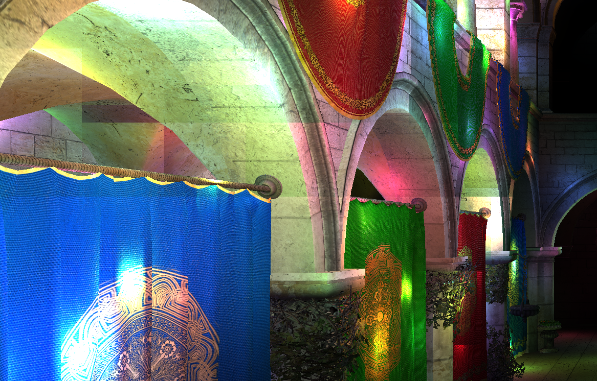
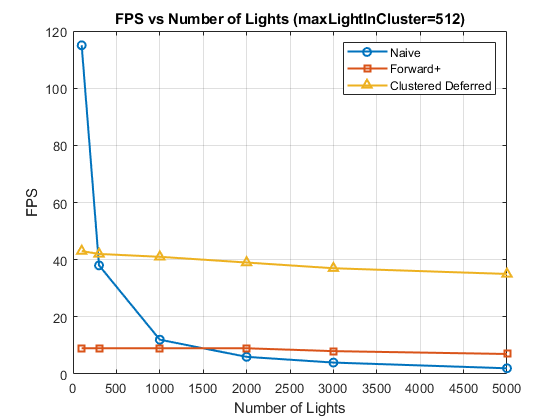
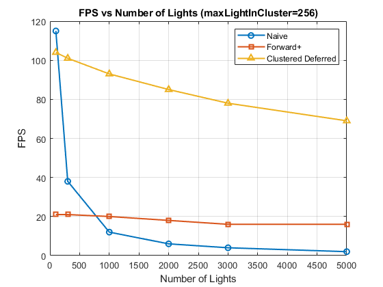

WebGL Forward+ and Clustered Deferred Shading
======================

**University of Pennsylvania, CIS 565: GPU Programming and Architecture, Project 4**

* Mufeng Xu
* Tested on: **Google Chrome 129.0** on
  Windows 11, i9-13900H @ 2.6GHz 32GB, RTX 4080 Laptop 12282MB (Personal Computer)

## Live Demo

[GitHub Page](https://solemnwind.github.io/Project4-WebGPU-Forward-Plus-and-Clustered-Deferred/)

## Demo Video/GIF

## Implemented WebGPU Rendering Methods

### Naive

In the naive rendering method, each fragment must evaluate the contribution of every light in the scene, summing these contributions to determine the final color. The computational complexity of this approach scales with the number of lights, which can significantly reduce the frame rate if the light count is large. This method is inefficient, as it wastes considerable GPU time on lights that have no effect on the fragment, unnecessarily consuming processing power.

### Forward+

In my Forward+ rendering implementation, I performed light culling in the view space. 
In the view space the AABBs are best aligned with the frustums. 
And the uv(XY) spaces are linearly partitioned,
while the z space is partitioned in the log scale.
And in every partition, a cluster of lights is collected and used to compute the contributions 
to the frustum.

When implementing clusters of lights, we needed to constraint the maximum size
of the cluster, that is, `maxLightInCluster`.
However, this is not an arbitrarily selected number. When the number is not large enough,
there would be artifacts in the rendered scene when the number of lights is large.

This is because when the total number of lights is large, 
the number of lights that reside in one cluster could exceed `maxLightInCluster`, 
therefore some lights are discarded in rendering. While these discarded lights can 
appear in a neighboring cluster, causing the intensity and color difference between neighboring
clusters, and the artifacts appear.

To address this issue, we need to set a higher `maxLightInCluster`, and after testing,
when it's set to 512, there will be no artifact observed even when the numLights is set to 
the maximum.

### Clustered Defered

This method also uses the "clustered" method. However the key difference is that it has a 
G-buffer. The G-buffer pre-pass computes the depth, albedo and normal information and these
data are later passed to the fragment shader. This method is more efficient than the other 2 methods
because it avoids shading occluded objects and only transform and rasterize each object once.
But it also uses more memory bandwidth and loses scene information.

## Performance Analysis

Clustered Deferred rendering offers the best overall performance. When the number of lights is low, the naive rendering method outperforms the clustered forward (Forward+) method. However, as the light count increases, the efficiency of clustered forward shines, allowing the Forward+ method to achieve a higher frame rate.

From the performance chart, we observe that the FPS of the naive rendering method drops drastically as the number of lights increases. In contrast, both the Forward+ and Clustered Deferred methods maintain relatively stable performance, showing much less sensitivity to the increase in light count.

And `maxLightInCluster` has a significant impact on the performance.

When the `maxLightInCluster` is reduced to 256, as shown in the performance chart, the FPS of both Forward+ and Clustered Deferred methods more than doubles. This suggests that lowering `maxLightInCluster` can greatly enhance performance. However, this comes at the cost of potential rendering artifacts when the cluster size is too small. Therefore, finding a solution to address these artifacts would make it worthwhile to reduce the `maxLightInCluster` for improved efficiency.

## Credits

- [Vite](https://vitejs.dev/)
- [loaders.gl](https://loaders.gl/)
- [dat.GUI](https://github.com/dataarts/dat.gui)
- [stats.js](https://github.com/mrdoob/stats.js)
- [wgpu-matrix](https://github.com/greggman/wgpu-matrix)
