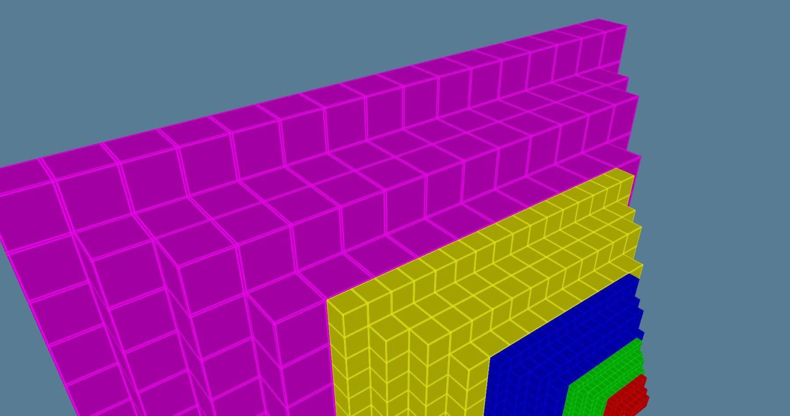
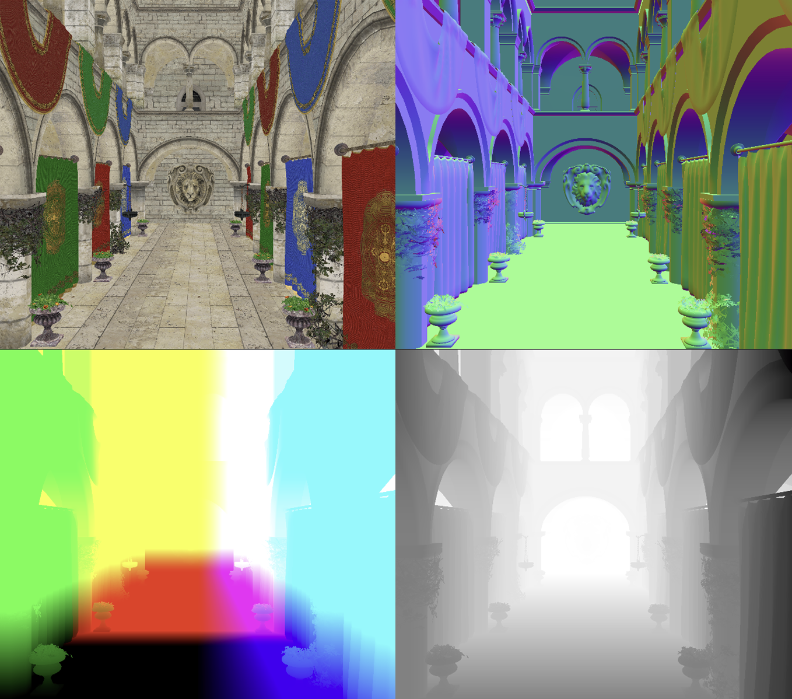
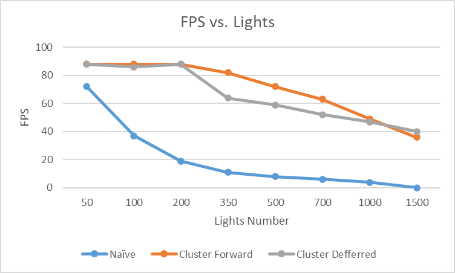

WebGL Forward+ and Clustered Deferred Shading
======================

**University of Pennsylvania, CIS 565: GPU Programming and Architecture, Project 4**

* Zhiyi Zhou
* Tested on: Windows 11, i9-13900H @ 2.6GHz 64GB, RTX4060 Laptop

### Live Demo
[Demo](https://zhiyi1801.github.io/Project4-WebGPU-Forward-Plus-and-Clustered-Deferred-2024fall/)

## Features
- Naive Renderer
- Cluster Forward
- Cluster Deferred
- Bloom
- Render Bundles

### Naive Renderer
  In naive forward rendering, the light contribution calculation needs to be performed `fn * ln` times, where `fn` is the number of fragments and `ln` is the number of lights.

### Cluster Forward
  What I've actually implemented is a technique known as Cluster Forward. Cluster Forward Rendering is a modern rendering technique designed to efficiently handle large numbers of lights in a scene. Unlike traditional forward rendering, where every object may be processed for each light, Cluster Forward breaks down the scene into **3D clusters**(Forward Plus should use 2D Clusters depending on the max/min depth in the tile) to optimize light calculations. Each cluster contains a list of lights that affect it, reducing the number of lights considered for each pixel and improving performance in scenes with a high light count.
  
  - **Key Features of Cluster Forward:**
    - **3D Cluster Division:** The camera's view frustum is divided into multiple clusters not only in screen space (as with Forward+), but also along the depth axis, making the system more accurate in handling lights that affect objects at varying depths.
    - **Efficient Light Culling:** Lights are assigned to relevant clusters based on their volume and influence. This reduces unnecessary calculations, ensuring only the lights that affect the objects or fragments in each cluster are computed.
    - **Improved Performance:** By reducing the number of lights each pixel needs to process, Cluster Forward is much more scalable in handling scenes with complex lighting setups compared to traditional forward rendering.

### Cluster Deferred
  Clustered Deferred is an optimized deferred rendering technique that divides the camera's view frustum into 3D clusters, with each cluster managing its own lights. Geometric information is first stored in G-buffers, and then lighting is calculated only for relevant pixels and lights. This technique excels at handling scenes with a large number of lights by reducing redundant lighting calculations.
  

### Bloom
  Use compute shader to do Bloom. Since the `rgbfloat` format is not allowed in storage textures, I used the `r32float` format for the storage texture. To store the RGB values, I packed them into a 32-bit float using an 11-11-10 bit layout, where the red and green channels take 11 bits each, and the blue channel takes 10 bits. This approach efficiently uses the available space in the `r32float` format while preserving the precision of the color data. Because I didn't visualize the lights, the visual effect of bloom is not very obvious

  
| No Bloom   | Bloom      | 
| :-----------------------:    | :----------------------: | 
|   | | !

### Render Bundles
  There is no improvement in performance, probably because the scene being drawn is not complex enough.

## Analysis
  

## Credits

- [Vite](https://vitejs.dev/)
- [loaders.gl](https://loaders.gl/)
- [dat.GUI](https://github.com/dataarts/dat.gui)
- [stats.js](https://github.com/mrdoob/stats.js)
- [wgpu-matrix](https://github.com/greggman/wgpu-matrix)
