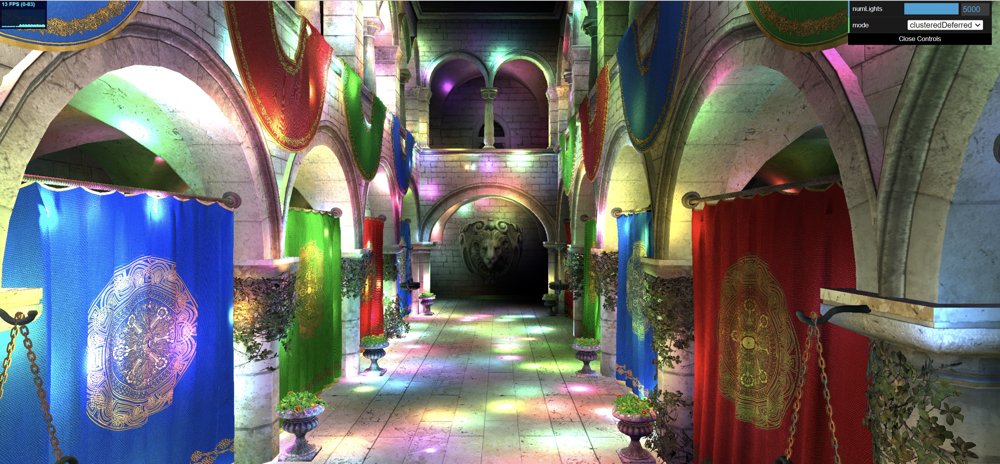
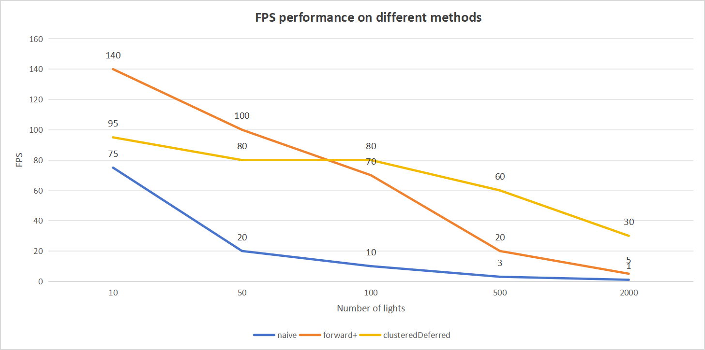

WebGL Forward+ and Clustered Deferred Shading
======================

**University of Pennsylvania, CIS 565: GPU Programming and Architecture, Project 4**

* Akiko Zhu
  * [LinkedIn](https://www.linkedin.com/in/geming-akiko-zhu-b6705a255/)
* Tested on: Windows 11, i9-12900H @ 2.50GHz 16GB, RTX 3070Ti 8GB (Personal), Google Chrome

### Live Demo

https://akikozzm.github.io/Project4-WebGPU-Forward-Plus-and-Clustered-Deferred/

### Demo Video/GIF

### Introduction
In this assignment, I implemented naive forward shading, forward plus shading, and clustered deferred shading pipeline.
The clustered deferred shading pipeline can render 5000 lights without the programming stuck.

### Performance Analysis
#### Test Environment
- Resolution: 2K
- The number of lights: 10, 50, 100, 500, 2000

As the diagram shows, clustered deferred shading technique should be faster and stable than forward plus technique. For the naive forward shading technique, once the lights are over 100, the computer starts to freeze and eventually dead.

### Credits

- [Vite](https://vitejs.dev/)
- [loaders.gl](https://loaders.gl/)
- [dat.GUI](https://github.com/dataarts/dat.gui)
- [stats.js](https://github.com/mrdoob/stats.js)
- [wgpu-matrix](https://github.com/greggman/wgpu-matrix)
