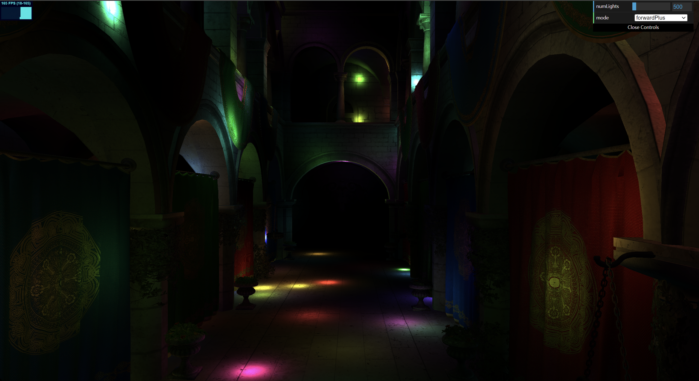

WebGL Forward+ and Clustered Deferred Shading
======================

**University of Pennsylvania, CIS 565: GPU Programming and Architecture, Project 4**

* Annie Qiu
   * [LinkedIn](https://github.com/AnnieQiuuu/Project0-Getting-Started/blob/main/www.linkedin.com/in/annie-qiu-30531921a)
* Tested on: Windows 11, i9-12900H @2500 Mhz, 16GB, RTX 3070 Ti 8GB (Personal)

### Overview
This project implements Naive, Forward+ and Clustered Deferred Shading techniques using WebGPU. It showcases the Sponza Atrium model with a large number of point lights. A GUI is provided to switch between the different rendering modes for comparison.

### Features
Naive
- The Naive rendering is the simple forward rendering where each object is rendered directly using the same lighting calculation for every fragment.

Forward+
- The Forward+ is the optimized forward rendering. It divides the frustrum into clusters and assigns lights to these clusters in the compute shader.
- Only lights that affect a specific cluster are considered when shading fragments in that cluster, so this method reduces unnecessary light computations and improves performance in scenes with many lights.

Clustered Deferred
- A rendering technique that stores intermediate shading information (like colors, normals, and positions) in multiple G-buffers during the first pass
- In the second pass, lighting is calculated by reading from the G-buffers, and similar to the foward+, only relevant lights within each 3D cluster will be used.

### Screenshot

- Number of Lights: 500
- Mode: Forward+
- FPS: 165 (6.06ms)

- Number of Lights: 2526
- Mode: Clustered Deferred
- FPS: 120 (83.33ms)

### Live Demo

### Demo Video/GIF

[![Demo Video Link]](https://youtu.be/UlBPg0pRh2A)

#### Naive

#### Forward+

#### Clustered Deferred

### Performance Analysis

#### Performance Chart

- X axis: ms
- Y aixs( Number of lights): [100, 200, 500, 1000, 2000, 3000, 5000]
- Blue Line: Naive
- Red Line: Forward+
- Yellow Line: Clustered Deferred 
- Cluster size: 16 X 9 X 24
- Compute pass dispatch Workgroup: (4, 3, 6)
- Cluster wrokgroupsize: [4, 4, 4]
As shown in the chart image, the millisecond increased as the number of lights increased, which means the performace decreased. Naive is the slowest.
Clustered Deferred is the fastest and followed by the Forward+. As the number of lights lower than 500, both Forward+ and Deferred reach the refresh rate limitation and stay with 6.06ms(165 fps).

#### Performance Overview:
Clustered Deferred is the fastest implementation, followed by Forward+ as the second fastest. The Naive method is the slowest.
Due to refresh rate limitations, both Forward+ and Clustered Deferred can achieve up to 165 fps when the number of lights is fewer than 500.

#### Performace Difference:
Forward+ may be faster in simpler scenes with fewer lights or transparent objects, as it avoids multiple G-buffer passes and uses less memory bandwidth.
Clustered Deferred excels in complex scenes with more geometry and lights, efficiently handling shading by processing lights only once per fragment in each cluster.

#### Trade offs
- Forward+ Shading:
  - Benefits:
    - Easier to handle transparency and MSAA.
    - Lower memory usage by avoiding multiple G-buffers, reducing memory bandwidth usage.
  - Tradeoffs:
    - Suffers from overdraw, as occluded fragments are still shaded.
    - Performance drops in scenes with many lights due to recalculating the full lighting equation for each fragment.

- Clustered Deferred Shading:
  - Benefits:
    - Reduces overdraw by performing depth testing before lighting calculations.
    - Well-suited for complex scenes with many lights and detailed geometry.
  - Tradeoffs:
    - Higher memory bandwidth consumption due to multiple G-buffer reads.
    - Challenging to implement MSAA and transparency, often requiring extra passes.
    - More complex pipeline and higher memory usage.

### Bloopers & Debug
- [Fixed] The Forward didn't work as expected in the beginning. It was really slow previously. I fixed by not using `let cluster = clusterSet.clusters[clusterIdx]` but using `clusterSet.clusters[clusterIdx]` directly in fragment shader. It is because when I use `let cluster = clusterSet.clusters[clusterIdx]`, I created a copy of the entire cluster at the specified index. And in a fragment shader, this operation is performed per-pixel, which can lead to millions of copies, so to caused a large memory overhead. Before fixed: 10 FPS. After fixed: 165 FPS.

### Credits

- [Vite](https://vitejs.dev/)
- [loaders.gl](https://loaders.gl/)
- [dat.GUI](https://github.com/dataarts/dat.gui)
- [stats.js](https://github.com/mrdoob/stats.js)
- [wgpu-matrix](https://github.com/greggman/wgpu-matrix)
- [Clustered-method](https://github.com/DaveH355/clustered-shading/tree/main/img)