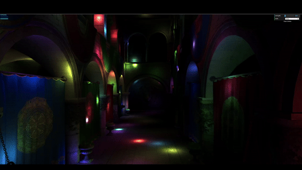

WebGL Forward+ and Clustered Deferred Shading
======================

**University of Pennsylvania, CIS 565: GPU Programming and Architecture, Project 4**

* Xinran Tao
* Tested on: **Google Chrome 130.0.6723.59** on
  Windows 11 Enterprise, AMD Ryzen 7 7800X3D 8 Core Processor @ 4.201GHz, RTX 2080Ti (Personal PC)

### Live Demo

[](http://theboilingpoint.github.io/Project4-WebGPU-Forward-Plus-and-Clustered-Deferred)

### Demo Video/GIF



### Introduction
This project implements naive, Forward+ and Clustered Deferred Shading methods using WebGPU. The project uses the Sponza atrium model and a large number of point lights (500 - 5000). For Forward+ and Clustered Deferred Shading methods, the maximum number of lights contained by each cluster can be adjusted in `./src/shaders/shader.ts`:
```typescript
export const constants = {
    ...
    maxLightsPerCluster: 500,
    ...
};

```
The more lights the scene contains, the larger the number of maximum lights per cluster should be to avoid artifacts. 

The GUI allows toggling between the different rendering modes.

### Methods Overview
#### Naive
The main function starts by sampling the diffuse texture using the texture coordinates provided. If the alpha value of the sampled texture is less than 0.5, the fragment is discarded, which means it is not rendered. This is useful for handling transparency or masked areas of the texture. Next, the shader computes the total contribution of all lights by iterating over the available lights in the `LightSet`. For each light, a function called `calculateLightContrib` (not shown in the code) computes how much that light affects the current fragment, based on its position and normal.

The total light contribution is then combined with the diffuse color sampled from the texture, resulting in the final fragment color. The output of the shader is a four-component vector containing the final RGB color and an alpha value of 1.

#### Forward+
The **Forward+ fragment shader** optimizes performance by using **clustered lighting**, unlike the naive shader that loops over all lights for each fragment. Instead, this shader divides the screen into **clusters** and assigns each fragment to a precomputed set of lights affecting that cluster. This significantly reduces the number of lights processed per fragment.

The shader first samples the diffuse texture and discards fragments with low alpha, as in the naive approach. It then calculates which cluster the fragment belongs to using its screen and view-space coordinates. From the cluster, it retrieves the relevant lights and computes their contribution to the fragment's color. The final color is the sum of the light contributions multiplied by the diffuse texture.

This clustering approach in Forward+ minimizes unnecessary lighting calculations, making it more efficient in scenes with many lights.

#### Clustered Deferred Shading
The **clustered deferred fragment shader** improves upon Forward+ by using a **G-buffer** to separate geometry and lighting calculations. Instead of computing lighting in a single pass, it stores fragment data like position, normals, and albedo in the G-buffer during the first pass. This data is then used in the lighting pass to calculate lighting only for visible fragments.

Unlike Forward+, which directly computes lighting for each fragment, the clustered deferred shader fetches precomputed data from the G-buffer, selects the relevant light cluster, and applies lighting. This method optimizes performance by reducing redundant calculations, especially in scenes with many lights.

### Performance Analysis
For this part, [WebGPU Inspector](https://github.com/brendan-duncan/webgpu_inspector) is used. The canvas size is fixed at 1906 x 1578.

- **Setting 1:** maxLightsPerCluster = 500, clusterDimensions = [16, 16, 16]
  - 

- **Setting 2:** maxLightsPerCluster = 100, numLights = 2000, Dimensions in Each Axis = cube root of numLights
  - 
  - 

#### Performance Comparison (First Graph - Lights Count vs. Average Frame Time)
The first graph compares the **Naive**, **Forward+**, and **Clustered Deferred** shading methods. It is clear that **Clustered Deferred** performs significantly better than both **Naive** and **Forward+** as the number of lights increases.

The **Naive fragment shader** shows the worst performance, with frame time increasing rapidly as the light count grows. Starting at 467 ms with 500 lights, the frame time grows to over 1551 ms at 5000 lights, indicating that it does not scale well with more lights. This is because the naive shader iterates over **all lights** for every fragment, making it highly inefficient as the scene becomes more complex. By 5000 lights, it is about 2.5 times slower than **Forward+** and more than 13 times slower than **Clustered Deferred**.

**Forward+**, in comparison, starts at 467 ms for 500 lights but increases more gradually, reaching 617.2 ms at 5000 lights. This shows that Forward+ handles increasing light counts better than Naive shading but still suffers from performance degradation as more lights are added. This is because while **Forward+** clusters the scene and limits the number of lights considered per fragment, it still processes all lights in the forward pass, making it less efficient in very large lighting setups.

The **Clustered Deferred shader** consistently outperforms both methods. It maintains a steady frame time of around 116.7 ms from 500 lights up to 3000 lights, and even at 5000 lights, its frame time only increases to 133.5 ms. This massive performance gain is due to its **deferred shading technique**, where lighting calculations are separated from the geometry pass, and lighting is only applied to visible fragments. Clustered Deferred’s use of clusters to minimize the number of lights processed per fragment ensures that even with large numbers of lights, performance remains steady.

#### Scalability
The **Clustered Deferred** method clearly excels in scalability compared to **Naive** and **Forward+**. As the number of lights increases, the **Naive shader** becomes impractically slow, while **Forward+** struggles with larger light counts but remains usable. **Clustered Deferred** handles large numbers of lights with minimal performance degradation, making it the best choice for scenes with many lights.

#### Memory Usage (Third Graph - Cluster Count vs. Buffer Memory)
In terms of memory usage, both **Forward+** and **Clustered Deferred** show a similar memory footprint at lower cluster counts. As the cluster count increases, **Clustered Deferred** consumes slightly more memory than **Forward+**. At 8000 clusters, **Clustered Deferred** uses around 13.1 MB of memory, compared to **Forward+** at 11.3 MB. This higher memory usage is due to **Clustered Deferred's** need for a **G-buffer** to store intermediate data like positions, normals, and albedo, which is not required in **Forward+**.

#### Benefits and Tradeoffs
- **Clustered Deferred** provides the best performance in scenes with a high number of lights, especially as the lighting calculations are deferred until after the geometry pass, focusing only on visible fragments. However, this comes at the cost of higher memory usage due to the G-buffer.
- **Forward+** is simpler and uses less memory, but it scales poorly in scenes with many lights, leading to increased frame times as the light count grows.
- **Naive shading** is the least efficient method, especially as the number of lights increases, due to its brute-force approach of processing all lights for each fragment. It is not suited for complex lighting setups.

#### Explanation for Performance Differences
The **Naive shader** suffers from poor performance because it does not cull or limit the number of lights considered for each fragment, resulting in a direct increase in frame time with more lights. **Forward+** improves on this by clustering the scene and limiting the lights affecting each fragment, but since all lighting is still done in a forward pass, it becomes inefficient in large light counts. **Clustered Deferred** avoids this problem by deferring lighting calculations to a separate pass, applying lighting only to visible fragments and using clusters to minimize the lights per fragment. This results in far more stable performance across different light counts.

#### Feature Analysis and Impact on Performance

1. **Dynamic Lighting**:
   - **Naive**: Performance degrades severely with more lights.
   - **Forward+**: Manages light counts better than Naive, but still suffers at higher light counts due to the forward pass.
   - **Clustered Deferred**: Handles dynamic lighting much better, maintaining consistent performance across different light counts by deferring lighting calculations and using clusters.

2. **Cluster Count**:
   - **Naive**: Does not use clustering, hence its poor performance scalability.
   - **Forward+**: Increasing cluster count slightly reduces performance but remains more efficient than Naive.
   - **Clustered Deferred**: Easily handles more clusters without significant performance drops, making it highly efficient in complex scenes.

3. **Buffer Memory Usage**:
   - **Forward+** uses less memory, making it more suitable for memory-constrained systems, but at the cost of reduced performance with more lights.
   - **Clustered Deferred** consumes more memory due to the G-buffer, but the tradeoff is its superior performance in handling large lighting workloads.

#### Conclusion
In summary, **Clustered Deferred Shading** is the most efficient method for handling complex scenes with numerous lights, as it scales well with both light counts and cluster counts while maintaining low frame times. **Forward+** offers a middle ground between the simplicity of Naive shading and the advanced performance of Clustered Deferred, but it struggles with higher light counts. **Naive shading**, while functional, is highly inefficient for scenes with many lights, making it impractical for large-scale lighting setups.

### Future Improvements
Both **Forward+** and **Clustered Deferred** methods can be improved by addressing performance bottlenecks and further optimizing lighting calculations.

For **Forward+**, one improvement could be **dynamic clustering** where cluster sizes are adjusted based on scene complexity, minimizing empty clusters. For **Clustered Deferred**, improvements can focus on reducing **G-buffer memory usage** by encoding data more efficiently, such as using **compressed formats** or **packed data structures**. Additionally, implementing **tile-based or per-cluster light culling** during the lighting pass can significantly reduce the number of lights evaluated, optimizing the shader for scenes with many lights or complex geometries.

### Credits

- [Vite](https://vitejs.dev/)
- [loaders.gl](https://loaders.gl/)
- [dat.GUI](https://github.com/dataarts/dat.gui)
- [stats.js](https://github.com/mrdoob/stats.js)
- [wgpu-matrix](https://github.com/greggman/wgpu-matrix)
- [WebGPU Inspector](https://github.com/brendan-duncan/webgpu_inspector)
