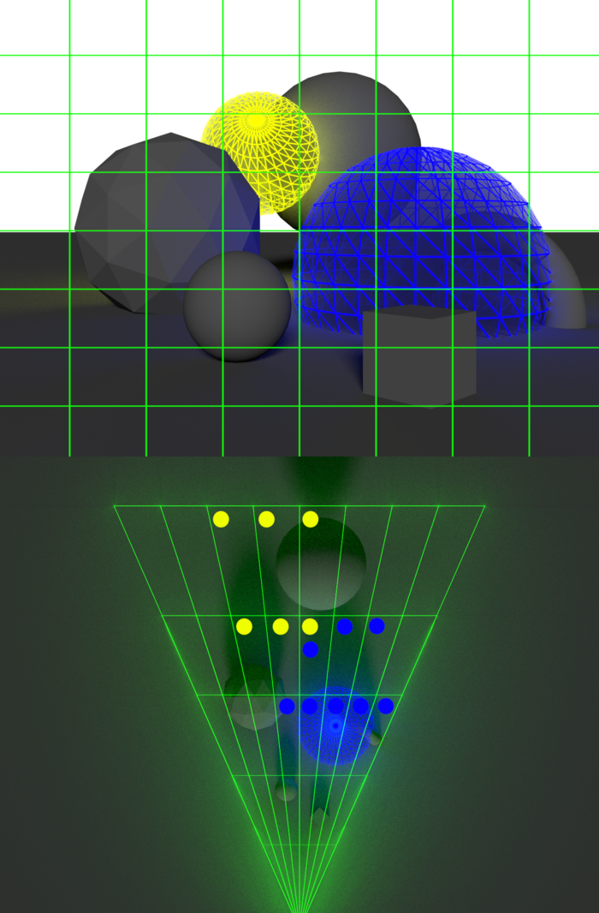
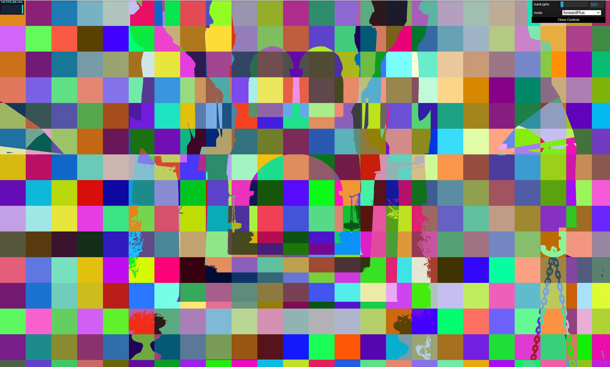
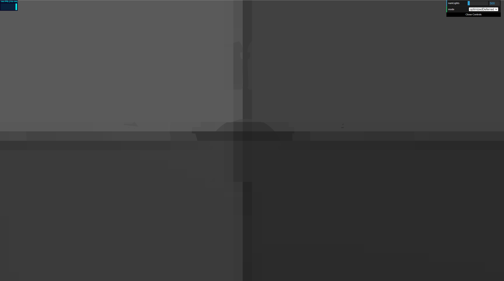

# WebGL Forward+ and Clustered Deferred Shading

**University of Pennsylvania, CIS 565: GPU Programming and Architecture, Project 4**

-   Jinxiang Wang
-   Tested on: Windows 11, AMD Ryzen 9 8945HS w/ Radeon 780M Graphics 4.00 GHz 32GB, RTX 4070 Laptop 8 GB

[**_Live Demo_**](https://jinxiangw.github.io/Project4-WebGPU-Forward-Plus-and-Clustered-Deferred/)

### Demo Video/GIF

## Features Implemented

### Part 1:

1. Naive Pipeline
2. Clustered Forward+ Pipeline
3. Clustered Deferred Pipeline

### Part 2:

1. G-buffer Optimization  
   a. Combined all G-buffers into 1 4-channel rgba32float buffer. One channel is unused  
   b. Replaced full screen vertex + fragment rendering pass with a compute pass
2. Compute pass bloom  
   a. Completed bright pixel extraction and 2-pass Gaussian blur.  
   b. Failed to add filtered color back to framebuffer because related implementations on WebGPU is a bit ambiguous.

### Scene Spec

All test rendering is performed under the following specification:

| Model  | Resolution |
| ------ | ---------- |
| Sponza | 2560x1440  |

### Naive Pipeline

---

Naive pipeline facilitates understanding the basic structure of this project. In general, this pipeline uses one simple render pass to complete the rendering, in which all lights in the light set will be evaluated for each fragment. The performance of this way of rendering is very poor when we have many dynamic light source in the scene.

| Light Count | Naive (ms) |
| ----------- | ---------- |
| 100         | 29         |
| 300         | 80         |
| 500         | 120        |
| 700         | 182        |
| 1000        | 260        |

### Clustered Forward+

---

Clustered Forward+ is an improvement to traditional forward pipeline. The biggest difference is its utilization of compute pass to perform tile-based light culling. Also, it uses pre-z, an adittional render pass to populate depth buffer, to reduce overdraw.

The above picture illustrates how "cluster" works in this context. Basically, we divide view frustum into small clusters based on its pixel position and depth.

Then for each cluster, we loop through the light set to record the light index of which that will contribute to the final color. This is acchieved by calculating the intersection of the cluster's AABB with light's radius.

Finally, in the last render pass, instead of loop through the light set, we focus on the lights that will make actual contribution to the cluster's color. For each fragment that is valid, i.e. not being discard by prez depth, we find its 1-d tile index by

1. find its x and y tile segment index based on tile size and its fragCoord (pixel coordinate);
2. find its linear depth by reconstructing its view space position and compute its z tile segment index accordingly, depth = (rawDepth - nclip) / (fclip - nclip);
3. tileIdx = z `*` numTilesX `*` numTilesY + y `*` numTilesX + x.

<!--  -->

| Tile Index                   | Light Count (max = 1000)      |
| ---------------------------- | ----------------------------- |
|  |  |

| Light Count | Naive (ms) | Forward+ (ms) |
| ----------- | ---------- | ------------- |
| 100         | 29         | 9             |
| 300         | 80         | 21            |
| 500         | 120        | 30            |
| 700         | 182        | 43            |
| 1000        | 260        | 56            |

The improvement is noticeable.

## Performance Analysis

### Credits

-   [Vite](https://vitejs.dev/)
-   [loaders.gl](https://loaders.gl/)
-   [dat.GUI](https://github.com/dataarts/dat.gui)
-   [stats.js](https://github.com/mrdoob/stats.js)
-   [wgpu-matrix](https://github.com/greggman/wgpu-matrix)
