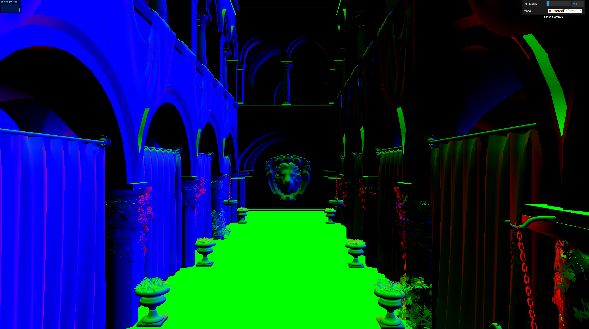

# WebGL Forward+ and Clustered Deferred Shading

**University of Pennsylvania, CIS 565: GPU Programming and Architecture, Project 4**

-   Jinxiang Wang
-   Tested on: Windows 11, AMD Ryzen 9 8945HS w/ Radeon 780M Graphics 4.00 GHz 32GB, RTX 4070 Laptop 8 GB

[**_Live Demo_**](https://jinxiangw.github.io/Project4-WebGPU-Forward-Plus-and-Clustered-Deferred/)

### Demo Video/GIF

## Features Implemented

### Part 1:

1. Naive Pipeline
2. Clustered Forward+ Pipeline
3. Clustered Deferred Pipeline

### Part 2:

1. G-buffer Optimization  
   a. Combined all G-buffers into 1 4-channel rgba32float buffer. One channel is unused  
   b. Replaced full screen vertex + fragment rendering pass with a compute pass
2. Compute pass bloom  
   a. Completed bright pixel extraction and 2-pass Gaussian blur.  
   b. Failed to add filtered color back to framebuffer because related implementations on WebGPU is a bit ambiguous.

### Scene Spec

All test rendering is performed under the following specification:

| Model  | Resolution |
| ------ | ---------- |
| Sponza | 3412x1906  |

### Naive Pipeline

---

Naive pipeline facilitates understanding the basic structure of this project. In general, this pipeline uses one simple render pass to complete the rendering, in which all lights in the light set will be evaluated for each fragment. The performance of this way of rendering is very poor when we have many dynamic light source in the scene.

| Light Count | Naive (ms) |
| ----------- | ---------- |
| 100         | 29         |
| 300         | 80         |
| 500         | 120        |
| 700         | 182        |
| 1000        | 260        |

### Clustered Forward+

---

Clustered Forward+ is an improvement to traditional forward pipeline. The biggest difference is its utilization of compute pass to perform tile-based light culling. Also, it uses pre-z, an adittional render pass to populate depth buffer, to reduce overdraw.

The above picture illustrates how "cluster" works in this context. Basically, we divide view frustum into small clusters based on its pixel position and depth.

Then for each cluster, we loop through the light set to record the light index of which that will contribute to the final color. This is acchieved by calculating the intersection of the cluster's AABB with light's radius.

Finally, in the last render pass, instead of loop through the light set, we focus on the lights that will make actual contribution to the cluster's color. For each fragment that is valid, i.e. not being discard by prez depth, we find its 1-d tile index by

1. find its x and y tile segment index based on tile size and its fragCoord (pixel coordinate);
2. find its linear depth by reconstructing its view space position and compute its z tile segment index accordingly, depth = (rawDepth - nclip) / (fclip - nclip);
3. tileIdx = z `*` numTilesX `*` numTilesY + y `*` numTilesX + x.

<!--  -->

| Tile Index                   | Light Count (max = 1000)      |
| ---------------------------- | ----------------------------- |
|  |  |

| Light Count | Naive (ms) | Forward+ (ms) |
| ----------- | ---------- | ------------- |
| 100         | 29         | 9             |
| 300         | 80         | 21            |
| 500         | 120        | 30            |
| 700         | 182        | 43            |
| 1000        | 260        | 56            |

The improvement is noticeable.

### Clustered Deferred

---

Traditional deferred pipeline addresses two issues, overdraw and the time complexity of lighting. However, when a scene contains a large set of lights, memory bandwidth becomes the threshold. Interacting with a huge amount of lights from storage buffer is heavily performance consumable.

Applying the same concept introduced in the above method, we could clusterize the frustum and reduce the amount of lighting computation for each fragment. And unlike forward render pipeline, deferred pipeline only involves 1 vertex-heavy rendering pass. The performance of clustered deferred pipeline is slightly better than clustered forwared pipeline.

| Albedo                           | Normal                           | World Position                     |
| -------------------------------- | -------------------------------- | ---------------------------------- |
|  |  |  |

| Light Count | Naive (ms) | Forward+ (ms) | Clustered Deferred (ms) |
| ----------- | ---------- | ------------- | ----------------------- |
| 100         | 29         | 9             | 9                       |
| 300         | 80         | 21            | 14                      |
| 500         | 120        | 30            | 20                      |
| 700         | 182        | 43            | 19                      |
| 1000        | 260        | 56            | 36                      |

### Optimized Deferred

---

We could take a further step of optimization on clustered deferred pipeline. Since multiple gbuffers is not feasible in some situation. It requires multiple scree-sized textures and multiple times read from texture memory - still texture memory and memory bandwidth issue.

Taking a look at our G-buffers, we realize that multiple G-buffers can actually be compressed into one texture with a 4-channel 32 uint precision format (actually 3 channel will suffice, but WebGPU only allows for 4-channel texture creation) by implementing the flowing rubrics:

1. x channel: 16 bit for normal.x, 16 bit for normal.y
2. y channel: 16 bit for normal.z, 16 bit for depth
3. z channel: 24 bit, 8 bit each for albedo.rgba
4. w channel: spare channel for roughness, metalic, etc.

| G-buffer               | Clustered Deferred | Optimized Deferred |
| ---------------------- | ------------------ | ------------------ |
| Albedo (bgra8unorm)    | 26 MB              | 0 MB               |
| Normal (rgba16float)   | 52 MB              | 0 MB               |
| Position (rgba16float) | 52 MB              | 0 MB               |
| Unity (rgba32uint)     | 0 MB               | 104 MB             |
| Total                  | 130 MB             | 104 MB             |

|      | Clustered Deferred | Optimized Deferred |
| ---- | ------------------ | ------------------ |
| Read | 3 times            | 1 time             |

Another optimization that we could take is to subsitute the last full screen renderpass with one compute pass. This provides a better flexibility on data structures we would like to apply in final rendering and gives more space for parallelism optimization.

| Light Count | Naive (ms) | Forward+ (ms) | Clustered Deferred (ms) | Optimized Deferred (ms) |
| ----------- | ---------- | ------------- | ----------------------- | ----------------------- |
| 100         | 29         | 9             | 9                       | 7                       |
| 300         | 80         | 21            | 14                      | 15                      |
| 500         | 120        | 30            | 20                      | 19                      |
| 700         | 182        | 43            | 29                      | 24                      |
| 1000        | 260        | 56            | 36                      | 32                      |

### Bloom

---

A general bloom effect consists of the following operations:

1. Extract pixels with high luminance
2. Down sample the bloom texture and blur
3. Up sample and add the result back to the original color

For the first part, thanks to [hdmmY](https://github.com/hdmmY/Bloom-Effect-Unity), I managed to extract the high luminance pixel, avoid potential pixel flickering and edge cut off.

However, many things are ambiguous and frustrating when implementing the second and the third part. Reasons includes that WebGPU does not support hardware level mipmap generation and requires additional compute/render pass to acchieve this, WebGPU has not yet read-write storage texture support in one compute pass and additional intermediate texture and compute pass needs to be created, etc.

## Performance Analysis

### Credits

-   [Vite](https://vitejs.dev/)
-   [loaders.gl](https://loaders.gl/)
-   [dat.GUI](https://github.com/dataarts/dat.gui)
-   [stats.js](https://github.com/mrdoob/stats.js)
-   [wgpu-matrix](https://github.com/greggman/wgpu-matrix)
