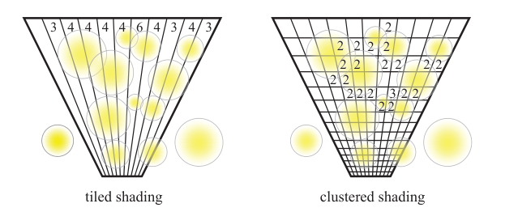
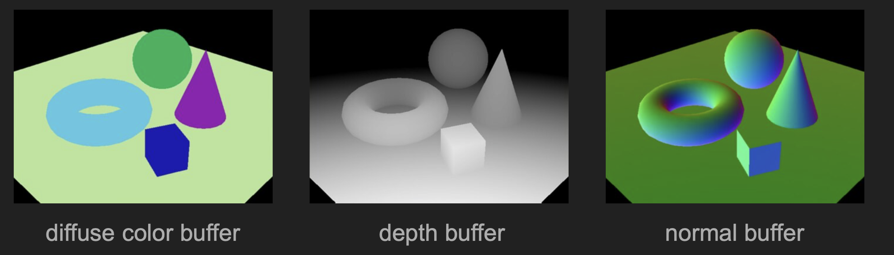

WebGL Forward+ and Clustered Deferred Shading
======================

**University of Pennsylvania, CIS 5650: GPU Programming and Architecture, Project 4**

- Wang Ruipeng
    - [LinkedIn](https://www.linkedin.com/in/ruipeng-wang-681b89287/)
    - [Personal Website](https://wang-ruipeng.github.io/)
- Tested on: Windows 10, i7-10750H CPU @ 2.60GHz 16GB, RTX 2070 Max-Q 8GB

# Live Demo

[Click here to visit live demo. Chrome required.](https://wang-ruipeng.github.io/CIS565-24fall-Proj4/)

# Demo GIF

# Background

The ability to place hundreds or even thousands of lights in a scene is often required in modern game engine since they provide a good tool for artist to create immersive lighting condition. To address such problem, graphics engineers have come up with different rendering pipelines. Based on the evolution of rendering pipelines, we have several approaches for implementing multi-light rendering.

- Traditional forward shading
- Clustered forward shading
- Deferred shading
- Clustered deferred shading

Here are the detailed description of each methods:

1. **Traditional Forward Shading**: In this method, every object is rendered with all active lights in the scene.
    - **Advantage**: Simple to implement and integrates well with transparency.
    - **Disadvantage**: Becomes inefficient with many lights, as each object processes every light, even if it's far away.
2. **Clustered Forward Shading**: This improves upon traditional forward shading by dividing the screen into clusters and assigning lights only to relevant clusters.
    - **Advantage**: More efficient with numerous lights, reducing the number of unnecessary light-object interactions.
    - **Disadvantage**: Still faces limitations with transparency and requires additional overhead for clustering.
3. **Deferred Shading**: This technique decouples lighting from object rendering by storing surface data in G-buffers, and then applying lighting in a separate pass.
    - **Advantage**: Handles many lights efficiently, since lighting is applied per-pixel, and only visible pixels are processed.
    - **Disadvantage**: High memory cost due to G-buffer storage and struggles with transparent objects.
4. **Clustered Deferred Shading**: Combines the strengths of clustered and deferred shading by clustering lights and applying them in a deferred pass.
    - **Advantage**: Extremely efficient for scenes with many lights and complex lighting, offering optimized per-pixel lighting while reducing unnecessary calculations.
    - **Disadvantage**: High memory use and more complex to implement, with some limitations on handling transparency.

# Shading Methods in this Demo

## Naive

This is the **Traditional Forward Shading** technique. During shading, each fragment traverses every light in the scene to calculate its contribution, which can be extremely slow as the number of lights increases. This results in performance bottlenecks, especially in scenes with many lights, due to the unnecessary processing of lights that may not even affect the fragment.

## Clustered Forward

In my **Clustered Forward Shading** implementation, I perform light culling in **view space**, using linear partitioning along the **xy axes** and logarithmic depth partitioning along the **z axis**. Compared to tile shading, this approach has similar or even better performance, particularly in worst-case scenarios. However, it comes with higher memory overhead. 

In the debug shader, the clustering and partitioning can be visualized, providing a clear view of how the scene is divided into clusters.

## Clustered Deferred

The **Clustered Deferred Shading** implementation is similar to forward shading, but with a key difference: a **G-buffer pre-pass** is performed to render **diffuse**, **normal**, and **depth** information for the scene. This data is then passed to the fragment shader. In the fragment shader, the world coordinates are reconstructed from the depth, and based on these coordinates, each fragment determines which cluster it belongs to. Lighting is then applied based on the relevant lights for that cluster.

## Clustered Deferred Packed

For the extra credit, I implemented optimizing the G-buffer used for the clustered deferred renderer. I compressed three textures into one texture. The all four channels for the compressed buffer are:

1. **Diffuse Color**: The diffuse color is packed into a 4-component 8-bit unsigned normalized integer format using `pack4x8unorm`. This channel stores the base color of the material, sampled from the diffuse texture. Only fragments with alpha values greater than 0.5 are processed, otherwise they are discarded, to ensure the transparency of certain objects.
2. **Normal Vector**: The normal vector is encoded using octahedral encoding to fit the 3D normal into a 2D space, which is then packed into a 2-component 16-bit unsigned normalized integer format using `pack2x16unorm`.
3. **Depth**: The depth is stored in a 32-bit floating point format, bitcast to an unsigned integer (`u32`). This channel contains the depth information in view space, which is essential for reconstructing world positions in the deferred shading pass.
4. **Padding**: The fourth component is set to `1` for alignment purposes, ensuring the G-buffer data is stored as a `vec4<u32>`.

# Performance Analysis

I conducted tests with both 256 and 512 maximum lights per cluster. It's worth noting that when using 256 lights per cluster, significant lighting artifacts began to appear once the number of lights exceeded around 3,000. Therefore, the results with 512 lights per cluster are more reliable for performance evaluation.

Both versions of **Clustered Deferred Shading** performed very well in terms of frames per second (FPS). However, the **Clustered Deferred (Packed)** variant was somehow 1–2 FPS slower than the standard **Clustered Deferred**. I believe this is due to the additional overhead from decompressing the packed G-buffer data, as the packed pipeline requires extra steps to unpack and decode the compressed information.

 

It's important to note that **maxLightsPerCluster** also affects performance, a trend observed across all rendering methods. Increasing **maxLightsPerCluster** from 256 to 512 results in nearly a 50% performance drop. This is because higher limits require processing more lights per cluster, which leads to additional computational overhead during the shading phase.

### Credits

- [Vite](https://vitejs.dev/)
- [loaders.gl](https://loaders.gl/)
- [dat.GUI](https://github.com/dataarts/dat.gui)
- [stats.js](https://github.com/mrdoob/stats.js)
- [wgpu-matrix](https://github.com/greggman/wgpu-matrix)
