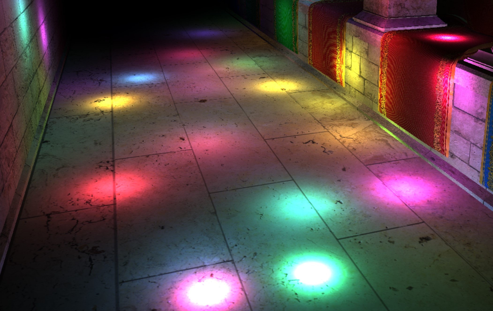
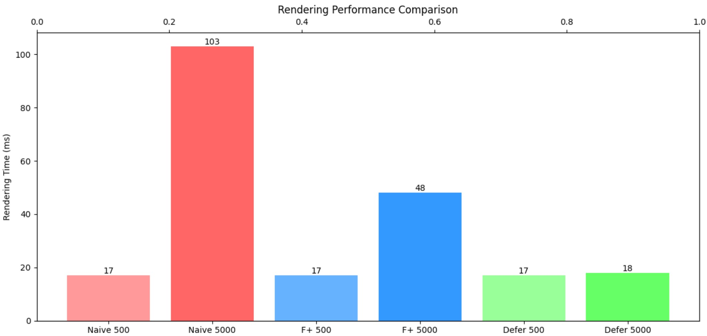
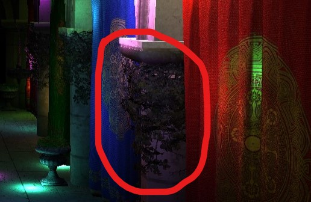
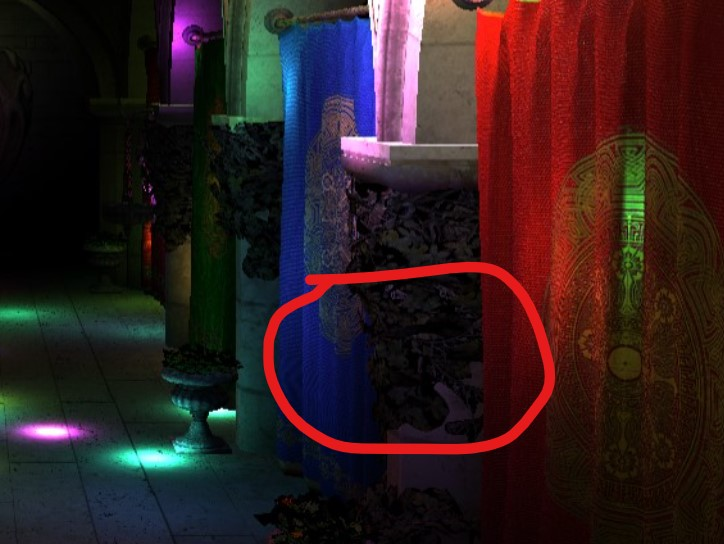

WebGL Forward+ and Clustered Deferred Shading
======================

**University of Pennsylvania, CIS 565: GPU Programming and Architecture, Project 4**

* Jiahang Mao
  * [LinkedIn](https://www.linkedin.com/in/jay-jiahang-m-b05608192/)
* Tested on: Windows 11, i5-13600kf @ 5.0GHz 64GB, RTX 4090 24GB, Personal Computer

### Live Demo

### Demo Video/GIF
https://drive.google.com/file/d/1tSUshR0p2dVxj_0ULDdDVzmoL6dSO4vG/view?usp=sharing

### Feature Introductoin & Performance

There are three rendering methods implemented here.
1. Naive : Each fragment shader will access all the lights sources in the scene and compute their light contribution.
2. Forward Plus (F+) : Implemented with light clustering. We split the camera view space into 16x16x16 voxels, and therefore reducing the number of lights to check against at each draw call.
3. Clustered Deferred : We render the color and normal into G-Buffers, then fragment shader can compute the per-pixel light contribution.

#### Peformance

Comparing Naive, Forward Plus ( F+ ), and Clustered Deferred ( CD ) at 1080p resolution.

From the performance result we can see that, at relatively low number of light count ( 500 ), there isn't a clear difference between three rendering methods. All of which can achieve 60 fps. While increasing the number of lights 10 times will show great optimization from both clustering and deferred shading.

#### Visual Trade-off

The performance improvement from deferred shading also comes visual quality trade-off. One example may be seen between naive and cluster deferred, where latter lacks in geometry details:

Naive (Correct version)

Cluster Deferred ( Detailed Geometry is Wrong)

### Credits

3rd party code used
- [Vite](https://vitejs.dev/)
- [loaders.gl](https://loaders.gl/)
- [dat.GUI](https://github.com/dataarts/dat.gui)
- [stats.js](https://github.com/mrdoob/stats.js)
- [wgpu-matrix](https://github.com/greggman/wgpu-matrix)
