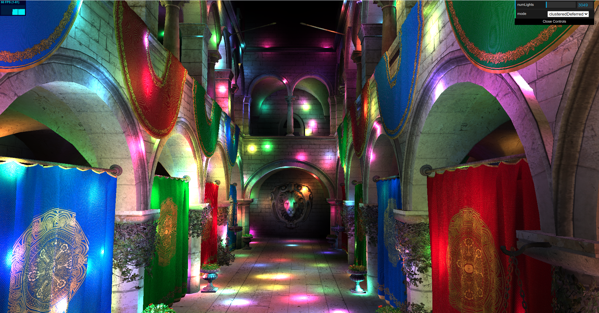
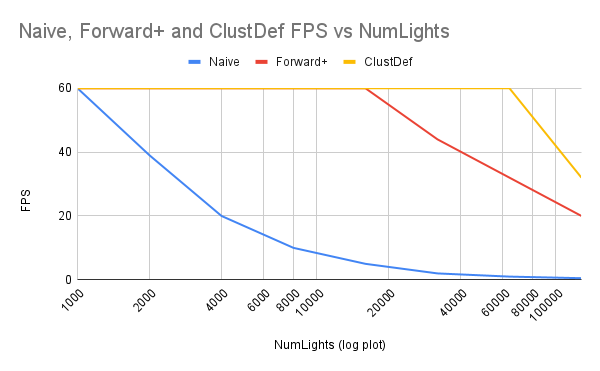

WebGL Forward+ and Clustered Deferred Shading
======================

**University of Pennsylvania, CIS 565: GPU Programming and Architecture, Project 4**

* Joshua Smith
  * [LinkedIn](https://www.linkedin.com/in/joshua-smith-32b165158/)
* Tested on: Ubuntu 20.04, Ryzen 9 3900x @ 4.6GHz, 24GB RTX 4090 (Personal)

### Live Demo (click image, browser must support WebGPU)

### Demo GIF (Actual render is higher quality)

### Project Description

In this project, I implemented Forward+ and Clustered Deferred Shading. I also added some final pieces to a Naive Forward shading method to become acquanted with rendering/shaders on WebGPU. The naive method was relatively simple to implement compared to Forward+ and Clustered Deferred methods, but ultimately was much slower. These methods made use of clustered light-culling, where forming a set of frustrum volumes to group lights in the camera space allowed for much higher frame rates. In addition, this project was an exercise in projection/transformation operations, having to transform camera/projected/world coordinates with 4x4 rotation, translation, and projection matrices. Additionally, I implemented a collision test between an Axis-Aligned Bounding Box and a Sphere, where the sphere was in World Coordinates and the AABB was derived from its position in Normalized Device Coordinates. 

**Items Completed**:
  * Naive Shading Implementation
  * Forward+ Shading Implementation
  * Clustered Deferred Shading Implementation

----

### Analysis

**Naive Forward Rendering**

In this method, every part of the scene tests all lights in the scene. This is relatively simple to implement. In the fragment shader, we iterate through an array of light objects and their positions. If the fragment position is within a specified radius of the fragment, then the light contributes to the fragments final color. This works well for numLights < 2000, but as we scale up the disco party, it becomes unusably slow. Fortunately, most lights are very far from a given fragment, and with some smarter culling methods, we can drastically improve runtime.

**Forward+ Rendering**

In this method, we first form a set a frustrums in the camera frame. I implemented the frustrums as square tiles in the camera frame, and uniformly spaced along the depth axis between the near and far Z plane. The shader that formed this frustrum for every cluster index, then looped through all lights to test which lights intersected or were close to intersecting the frustrum. I specify close to intersecting because instead of directly testing the frustrum/sphere intersection we test the intersection of the sphere and the frustrum's axis-aligned bounding box. This allowed a simpler implementation that also avoided some more expensive intersection computations. This cluster shader sets a list of nearby light indices for every cluster. Then, in the fragment shader, we first calculate the frustrum/cluster that the fragment is located with. Then, we only need to compare with the much smaller cluster light set instead of the overall light set. This allows orders of magnitude less distance compares, and therefore allows for a higher framerate. 
resolution: 1848x966

**Deferred Rendering**
This method builds on the clustering method in the Forward+ Rendering method and adds a two-stage deferring shading process. First, the relevant information to final rendering, in this case albedo, normals, and depth are rendered into texture buffers. This is the stage where overdraw will occur, but overdrawing simple texture assignment is more efficient than overdrawing more complex lighting computations in the later lighting stage. Then in the lighting stage, we read these textures via u,v coordinates. We can derive each fragments 3d position, and can directly access albedo, normal, and depth from our saved GBuffers from the previous stage. Then, with this information, we can finally compute lighting with the same methodology as before. 

### Performance

Initially, running 2500 lights with Forward+ rendering with a max cluster lights size of 256 yielded a framerate of 60fps. (I was unable to configure linux google chrome to exceed the 60 framerate cap). However, This small buffer size was being filled, causing valid lights to not be considered in the final lighting. Increasing the buffer size to 512 caused a massive drop in framerate to 36fps. This was ultimately caused by a mistake in the final cluster rendering code. I was copying every cluster before computing light computation. After fixing this I was able to increase the maxLightsSize beyond 2048 without performance issues. 

Relative Performance Graph:

Here we can see the relative scaling of the different methods framerate as the number of lights increases. Not suprisingly, the naive linear light lookup method has its framerate half whenever the number of lights is doubled.

### Credits

- [Vite](https://vitejs.dev/)
- [loaders.gl](https://loaders.gl/)
- [dat.GUI](https://github.com/dataarts/dat.gui)
- [stats.js](https://github.com/mrdoob/stats.js)
- [wgpu-matrix](https://github.com/greggman/wgpu-matrix)
