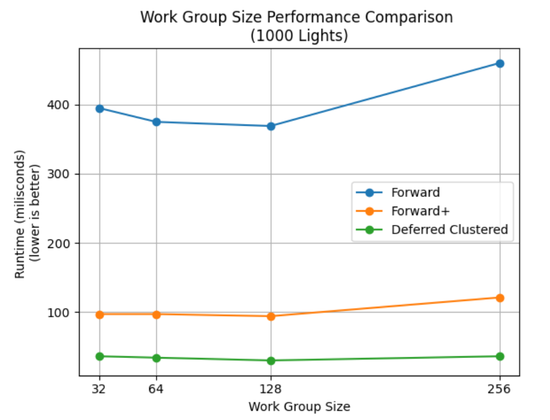
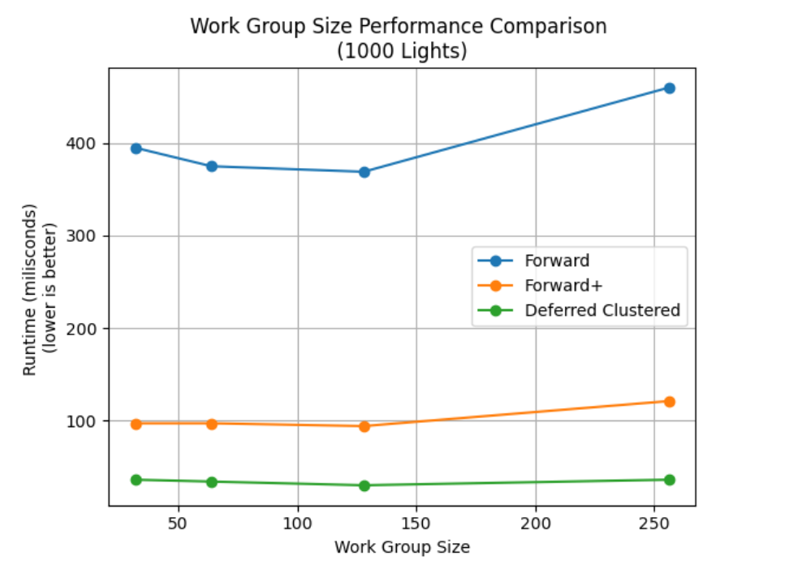

WebGL Forward+ and Clustered Deferred Shading
======================

**University of Pennsylvania, CIS 565: GPU Programming and Architecture, Project 4**

* Catherine Cheng
  * [LinkedIn](https://www.linkedin.com/in/catherine-wanning-cheng/), [personal website](https://www.catherine-wanning-cheng.com/projects-1)
* Tested on: Windows 11, AMD Ryzen 7 5800H @ 3.20GHz 16GB, NVIDIA GeForce RTX 3070

## Introduction
This project is an implementation of Forward Clustered and Clustered Deferred shading methods. A scene with the Sponza atrium model and a large number of point lights are as showcased, and a GUI is implemented to toggle between the different rendering modes.

### Live Demo
[Live Demo Link](https://cwncwncwn.github.io/CIS565-Project4-WebGPU-Forward-Plus-and-Clustered-Deferred/)

### Demo Video/GIF

## Performance Analysis
Below is a comparison of runtime for all three methods based on different light numbers:

Based on observation, by restricting the number of lights tested, forward+ and deferred clustered methods are much more efficient than naive forward method. Between forward+ and deferred clustered methods, deferred clustered method is still more efficient than forward+ method.

- **Naive**
  - Naive Forward  method is a traditional rendering method where each object is drawn one by one, applying all active lights in the scene directly during the fragment shading stage. Every fragment (pixel) computes lighting for all lights, even if most of them may not influence that pixel.

  - **Pros**: Simple to implement, directly integrates with materials.
  - **Cons**: Becomes very inefficient with a high number of lights, as each fragment has to process every light.
- **Forward+ (Clustered)**
  - Clustered Forward method builds on forward rendering but introduces a light clustering technique. The scene is divided into 3D clusters (in screen space), and lights are assigned to clusters based on their influence. During shading, each fragment only computes lighting for the lights that affect its cluster, reducing the number of lights considered per fragment.

  - **Pros**: Reduces the number of lights per fragment, improving performance for scenes with many lights. Works well with transparency.
  - **Cons**: Still processes lighting during fragment shading, leading to some overhead with many clusters or complex light calculations.

- **Deferred Clustered**
  - Clustered deferred rendering splits the rendering process into two passes: the first pass (G-buffer pass) stores information such as world-space position, normals, and albedo into textures (G-buffer), and the second pass performs lighting calculations in screen space using the G-buffer. Like Forward+, it clusters the view frustum and assigns lights to clusters, reducing the number of lights considered per pixel.

  - **Pros**: Highly efficient for scenes with many lights, as lighting is computed in screen space, not per object. It performs better with more lights than forward methods.
  - **Cons**: Cannot handle transparent objects efficiently and requires more memory for the G-buffer. Also, deferred rendering introduces bandwidth overhead due to writing and reading from G-buffer textures.

Besides light number, work group size has impact towards runtime as well, as shown below:

Working with WebGPU, I had discovered that the maximum work group size cannot exceed 256. Based on observation, the work group size of 128 provides best performance for all three methods.

### Credits

- [Vite](https://vitejs.dev/)
- [loaders.gl](https://loaders.gl/)
- [dat.GUI](https://github.com/dataarts/dat.gui)
- [stats.js](https://github.com/mrdoob/stats.js)
- [wgpu-matrix](https://github.com/greggman/wgpu-matrix)
