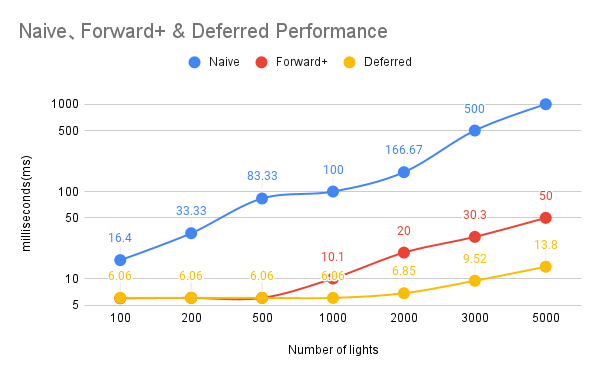

WebGL Forward+ and Clustered Deferred Shading
======================

**University of Pennsylvania, CIS 565: GPU Programming and Architecture, Project 4**

* Runjie Zhao
* Tested on: **Google Chrome 222.2** on
  Windows 11, i9 185H 2500 Mhz, GTX 4080 Laptop GPU

### Live Demo

https://runjiezhao1.github.io/Project4-WebGPU-Forward-Plus-and-Clustered-Deferred/

### Demo Video/GIF

[]

### Feature

* Naive implementation
* Forward+ implmentation
* Clustered deferred implementation

### Explanation

* Forward+: Forward+ shading improves upon traditional forward rendering by dividing the screen into a grid of 2D tiles and assigning lights to each tile based on their area of influence. Instead of processing every light for every pixel, it performs light culling per tile, significantly reducing the number of lights that need to be evaluated for each pixel. By culling lights to specific tiles, Forward+ reduces the amount of lighting computations for each pixel, especially in scenes with many lights. Instead of evaluating all lights globally, each tile only processes lights that affect its specific area. This leads to a significant reduction in redundant calculations, especially in larger scenes with scattered lights.

* Tradeoff in forward+: The first one is complexity. Forward+ adds some complexity compared to traditional forward rendering, as the screen must be divided into tiles, and the lights must be culled per tile. The second one is limited light scalability. While Forward+ performs well with a moderate number of lights, as the number of lights per tile grows, performance can degrade because each pixel in the tile must evaluate all lights assigned to that tile.

* Clustered Deferred: Clustered Deferred shading divides the screen into 3D clusters (tiles subdivided by depth) and assigns lights to clusters. By using 3D clusters, light culling is more precise than in Forward+, as lights are culled not only in screen space but also by depth. This reduces the number of lights per cluster and leads to fewer computations per pixel. Clustered Deferred shading improves performance by culling lights based on both 2D screen coordinates and depth, allowing for more efficient light processing. By assigning lights to 3D clusters, only the relevant lights need to be processed for each pixel, resulting in significant performance gains in complex, light-heavy scenes.

* Tradeoff in clustered deferred: The first one is memory overhead. Clustered Deferred requires a G-buffer to store scene data (e.g., normals, depth), which increases memory usage compared to Forward+.

### Performance Analysis

* Resolution: 1980x1080

* Test Result:

* 

* Conclusion: As we can tell from the graph above, naive implementation without any optimization has very low frame rate and it stays below 20. For forward+ implementation, it improves the frame rate. However, as number of lights go up, it drops drastically when it comes to about 3500 lights, its frame rate is only about 40. For cluster deferrerd implementation, its frame rate keeps at 144 which is the maximum. After the stress test, its frame rate begins to drop after 4000 number of lights. We can obvious find that clustered deferred implementation is better than forward+ implmentation which is better than naive implementation.

### Credits

- [Vite](https://vitejs.dev/)
- [loaders.gl](https://loaders.gl/)
- [dat.GUI](https://github.com/dataarts/dat.gui)
- [stats.js](https://github.com/mrdoob/stats.js)
- [wgpu-matrix](https://github.com/greggman/wgpu-matrix)
