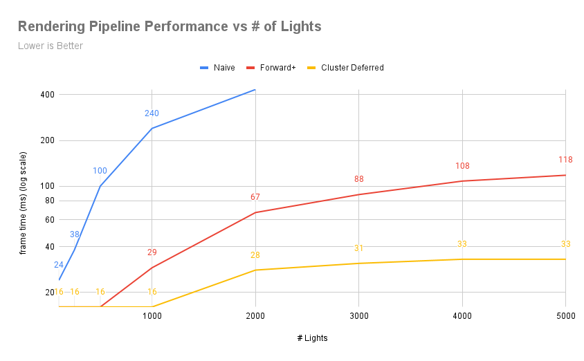
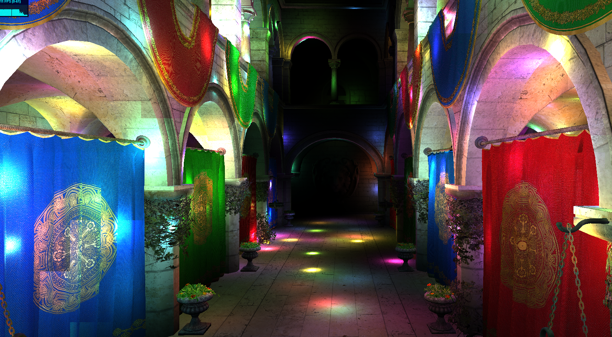
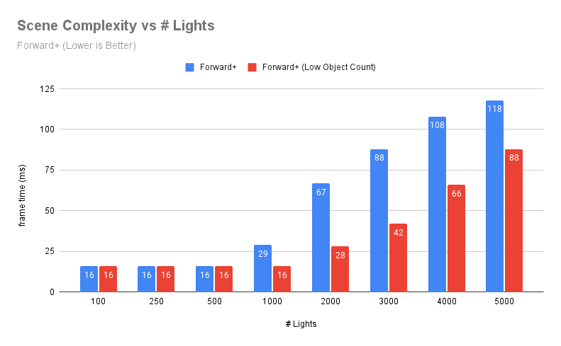
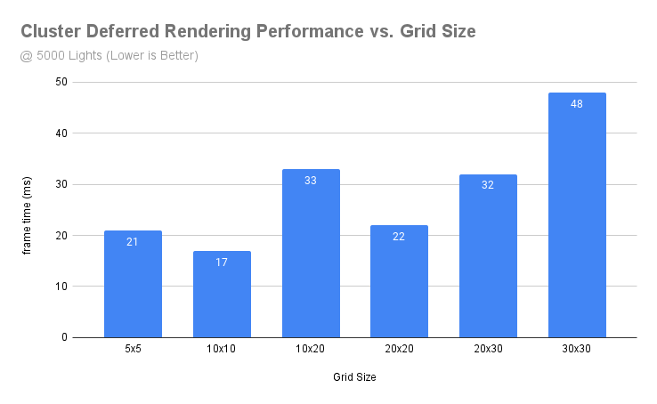

WebGL Forward+ and Clustered Deferred Shading
======================

**University of Pennsylvania, CIS 565: GPU Programming and Architecture, Project 4**

* Rahul Aggarwal
  * [LinkedIn](https://www.linkedin.com/in/rahul-aggarwal-32133a1b3/)
* Tested on: Windows 11, i7-12700H @ 2.3GHz, RTX 3050 Ti Laptop 4GB (Personal)

## Live Demo

[Live Demo](http://rahulaggarwal965.github.io/CIS5650-Project4-WebGPU-Forward-Plus-and-Clustered-Deferred)

## Demo Video/GIF

## Methodology

### Naive Rendering
Naive rendering is the simplest approach to real-time rendering. In this method, each object in the scene is rendered independently, and every light source is applied to each fragment (pixel) of each object. This brute-force approach has significant limitations, especially as the number of lights in a scene increases, since every light must be tested against every pixel.

In our implementation, we began by creating a buffer that holds the view projection matrix, which allows us to transform objects from world space into camera space. This matrix is essential for computing where objects should be drawn relative to the camera. Although this method is straightforward, it quickly becomes inefficient in scenes with many lights or complex lighting effects because every fragment is processed multiple times for every light.

### Forward+ Rendering
Forward+ rendering builds on the traditional forward rendering method but improves efficiency by spatially clustering lights in a scene and applying only relevant lights to each fragment. In a typical forward renderer, all lights are tested against every fragment, leading to significant overhead in complex scenes. Forward+ addresses this by dividing the screen into clusters and determining which lights affect each cluster.

In our implementation, we created a data structure that divides the view frustum into clusters, and for each cluster, we track the lights that influence it. During rendering, we limit the lighting calculations for each fragment to only the lights that overlap its cluster, greatly reducing unnecessary computations. This approach strikes a balance between efficiency and flexibility by handling dynamic lighting in a way that scales better with the number of lights, especially for scenes with hundreds of light sources.

One important thing to note that is that we divide the z-dimensio or depth **exponentially**. This means that the clusters expand according to their area depth wise as we go farther out. This allows us to maintain high visual fidelity in the forefront while areas with a smaller amount of pixels in the background can be treated more as a group.

### Clustered Deferred Rendering
Clustered Deferred rendering further optimizes the process by separating the lighting calculations from the geometry rendering. This method builds on Forward+ by clustering the scene into regions, but instead of applying lights directly during the geometry pass, it defers lighting to a separate pass. In the first pass, all geometric information (such as normals, positions, and material properties) is stored in multiple render targets called a G-buffer. This G-buffer holds the necessary information to later apply lighting in a second, fullscreen pass.

The advantage of this method is that we only need to compute lighting once per pixel, instead of once per light per pixel. Since the geometry and lighting are handled in separate passes, Clustered Deferred rendering excels in scenes with high numbers of lights, as the lighting calculations are decoupled from the complexity of the geometry.

In our implementation, we reused the clustering logic from Forward+, which allows us to efficiently divide the scene into clusters. The G-buffer stores all the necessary information during the geometry pass, and in the second pass, we use the lights that affect each cluster to compute the final color for each pixel. This approach scales well with both geometry and lighting complexity, making it a powerful method for real-time rendering with many dynamic light sources.

*DO NOT* leave the README to the last minute! It is a crucial part of the
project, and we will not be able to grade you without a good README.

This assignment has a considerable amount of performance analysis compared
to implementation work. Complete the implementation early to leave time!

## Performance Analysis

### Rendering Performance

This graph depicts the performance of three different rendering methods—Naive, Forward+, and Clustered Deferred—against varying numbers of lights. The y-axis shows the frame time (in milliseconds) on a logarithmic scale, where lower values represent better performance. The x-axis shows the number of lights in the scene, ranging from 150 to 5000. Note that differences only start to emerge around 500 lights or so, before which we are vsync locked at 60 FPS mostly.

#### Naive Rendering

Naive rendering has poor scalability, with a frame time that appears to grow exponentially as the number of lights increases. This reflects its $O(o \times n \times m)$ complexity, where o is the number of objects, n is the number of fragments and m is the number of lights. Each fragment is processed for every light, resulting in severe performance bottlenecks.

#### Forward+ Rendering

The growth is more linear, indicating better scalability compared to Naive. The complexity can be considered $O(o \times n \times k)$, where o is the number of objects, n is the number of fragments and k is the number of lights affecting each cluster (much smaller than the total number of lights). This shows that Forward+ manages lights more efficiently by limiting the number of lights affecting each fragment to those in the corresponding cluster.

#### Cluster Deferred Rendering

The near-flat curve suggests that Clustered Deferred scales far better than both Naive and Forward+ rendering. The complexity can be approximated as $O(n \times k)$, where n is the number of fragments and k is the number of lights affecting each cluster. By separating the lighting and geometry passes and leveraging the G-buffer, this method achieves the highest efficiency. The lighting calculations are decoupled from the geometry, so the performance is relatively unaffected by the number of lights.

### Scene Complexity

We observe this dependence with respect to the number of objects by limiting the scope of the forward+ rendering's algorithm by changing the view. 
| Low Object Count View | High Object Count View |
|----------|----------|
|  |    |

Below we show a graph comparing the default view to a view that is looking at much less objects.

As we can see, the first two algorithms (naive is implied) depend on the complexity of the current scene.

### Trade-offs

The trade-offs then are quite clear. If the # of lights in the scene is low, naive rendering may be used. However, if there are larger amounts of lights, we can transition to forward+ rendering. Finally, if we have a large amount of scene complexity, potentially with many occlusions, clustering deferred rendering should be used.

### Cluster Grid Size

We compare cluster grid size on the clustering deferred algorithm to get an idea of different patch dimensions.

We see a low correlation trendline, showing that as we increase the grid size (thereby decreasing patch size), we get worse performance. However, we also see that there when we go too low, we also decrease in performance.

- Optimal Grid Size: The 10x10 grid achieves the best performance because it provides a good balance between having a reasonable number of clusters and avoiding too much overhead in managing those clusters.

- Impact of Over-Segmenting: As the grid size increases, particularly in non-square aspect ratios (like 10x20 or 30x30), performance suffers due to the increased overhead in managing too many clusters and lights, leading to longer frame times.

- Impact of Under-Segmenting: A grid that is too small (like 5x5) results in large clusters, which may overlap with many lights, thus requiring more lighting calculations per fragment.

## Optimization Features

### G-Buffer Packing (+5)

In my implementation of the G-buffer optimization, I focused on packing the color data into a single float value while leaving the normal vector components unpacked. Here's how I approached it:

* Color Packing: I first converted the RGB color channels from the 0.0-1.0 range to 8-bit integers (0-255). I then packed these 8-bit values into a single 24-bit u32, where the red channel occupies the highest 8 bits, green the middle 8, and blue the lowest 8. To store this packed value in a float, I normalized it by dividing by the maximum 24-bit value, 16777215.

* Color Unpacking: To retrieve the original RGB color, I reversed the process. I multiplied the packed float by 16777215 to recover the 24-bit u32 value. Then, I used bitwise shifts and masks to extract each color channel, and converted the values back into the 0.0-1.0 range.

* Shader Integration: In the fragment shader, I packed the sampled diffuse color into the alpha component of the output vec4f. The normal vector's x, y, and z components were stored in the first three components of the vec4f.

This optimization allowed me to reduce the G-buffer's memory footprint by efficiently packing the color data. However, I did not notice any meaningful performance improvements when changing the number of lights or scene complexity. This is likely due to the fact that my GPU's memory throughput and compute are too large for this optimization to be of value.

### Credits

- [deze's ed post](https://edstem.org/us/courses/60839/discussion/5509685)
- [webgpu deferred rendering example](https://webgpu.github.io/webgpu-samples/?sample=deferredRendering#fragmentDeferredRendering.wgslk)
- [Vite](https://vitejs.dev/)
- [loaders.gl](https://loaders.gl/)
- [dat.GUI](https://github.com/dataarts/dat.gui)
- [stats.js](https://github.com/mrdoob/stats.js)
- [wgpu-matrix](https://github.com/greggman/wgpu-matrix)
