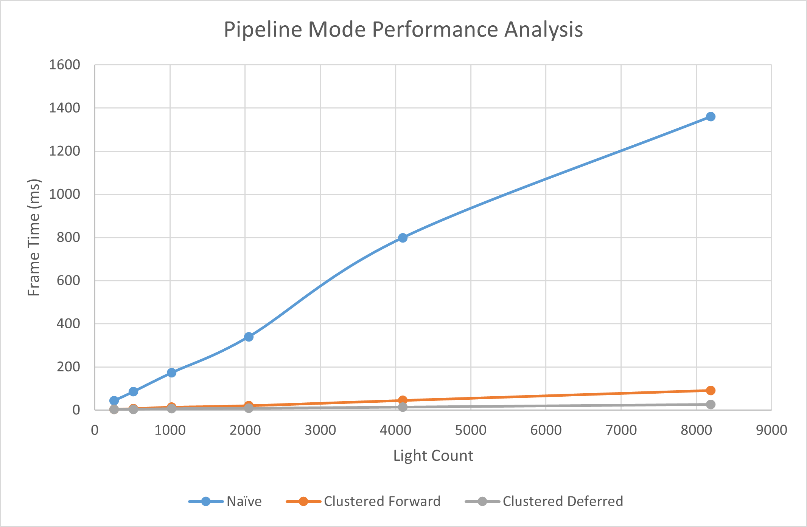
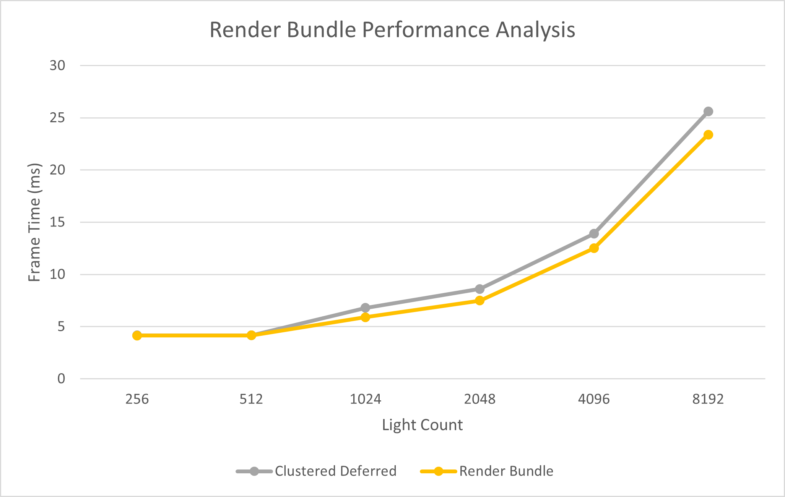

WebGL Forward+ and Clustered Deferred Shading
======================

**University of Pennsylvania, CIS 565: GPU Programming and Architecture, Project 4**

* Zhen Ren
  * https://www.linkedin.com/in/zhen-ren-837089208/
* Tested on: Windows 11, i9-13900H @ 2.60 GHz 16GB, RTX 4070 Laptop 8GB (Self laptop)

### Live Demo
https://zhiqing-r.github.io/Project4-WebGPU-Forward-Plus-and-Clustered-Deferred/

### Demo Video/GIF

## Introduction

In this assignment, I implemented both clustered forward shading and clustered deferred shading. I achieved 30+ fps with 8192 lights and 2k resolution. The project contains the following features:
- Naive forward shading pipeline
- Clustered forward (forward +) shading pipeline
- Clustered deferred shading pipeline

and following extras:
- Compressed Gbuffer using only 3 uint32
- Light sorting
- Optimized clustering algorithm
- Render bundle

Maximum 8192 light supported. Can be higher, but the number of light stored in each cluster is limited.

## Clustered Forward (Forward +)
Clustered forward pipeline can be used to optimize scenes with multiple light source. In the tradition forward pipeline, for each fragment, we need to iterate through all light source and do shading. However, many lights may have no contribution to the pixel. Forward clustered algorithm can optimize this by clustering lights to many sub tiles or clusters in the camera space and cull out irrelevant lights at shading stage.

[img source](https://www.aortiz.me/2018/12/21/CG.html)

The core of this algorithm is clustering lights. In this project, I focus on sphere-frustum intersection. An simple way to do this is to use the AABB of frustums to do intersection test. However, the false positive rate can be high.

The algorithm I used is called cone-testing, which is calculating a cone that can wrap the frustums and the spheres and then test if two cones intersect each other.

(a) normal rendering; (b) tiles passed sphere-frustum test; (c) tiles passed cone test\
[img source](https://lxjk.github.io/2018/03/25/Improve-Tile-based-Light-Culling-with-Spherical-sliced-Cone.html)

### Z Binning
Another optimization I implemented is called Z binning. An interesting observation is that, the light list of each cluster equals to

`{X sliced Frustums} ∩ {Y sliced Frustums} ∩ {Z sliced Frustums}`

Since X sliced frustums and Y sliced frustums have a irregular shape, we can use

`{X Y tiles} ∩ {Z sliced Frustums}`

to calculate the light lists of each cluster.

To get more information about this algorithm, this is a nice [source](https://advances.realtimerendering.com/s2017/2017_Sig_Improved_Culling_final.pdf)\
The main benefit of using z binning is that the time complexity of light clustering changed from O(X * Y * Z) to O(X * Y + Z).

In this project, I also sort the light by z to reduce the size of z bins since I can use only a start and an end value to record all lights in the bin.

## Clustered Deferred
Clustered deferred pipeline is the deferred pipeline usign the light clustering info. The main different is that it uses a gbuffer to store all shading info and then use a full screen pass to do shaing.

The gbuffer layout looks like this, except that I do not have specular data, so I only used three 32 bit uint to store scene info and used 32 bit for the depth and deleted stencil.

Note that the normal is encoded to FP16 components. The algorithm I used is called Octahedron encoding, which encode normals by projecting them on a octahedron and then map them on to a cube. More info [here](https://knarkowicz.wordpress.com/2014/04/16/octahedron-normal-vector-encoding/)

## Performance Analysis

### Test Environment
Resolution: 2560 x 1440

Light number: 256, 512, 1024, 2048, 4096, 8192

Test metrics: Frame time, FPS

Test tools: [WebGPU Inspector](https://github.com/brendan-duncan/webgpu_inspector)

### Different Pipelines

***Performance Comparison with 8192 lights***
| Pipelines          | Frame Time (ms) |  FPS  | Speed up |
|--------------------|-----------------|-------|----------|
| Naive Forward      |      1360       |   0.74|    1.0   |
| Clustered Forward  |       91        |  10.99|  14.85   |
| Clustered Deferred |       25.6      |  39.06|  52.78   |

From the graph, we can see that ***Clustered Deferred > Clustered Forward > Naive Forward*** in terms of FPS. Using clustered light data, the number of light shaded in each fragment is reduced and therefore, the frame time decreases. Compared to light shading stage, the overhead of sorting, z binning and clustering is small.

Clustered deferred is much faster than clustered forward, since deferred rendering pipeline reduces overdraw, which means fragments that are occluded will not do shading again since they are alreadyd culled out in the gbuffer generation stage. Light shading is a heavy task and gbuffer reduces number of shading fragments a lot.

The fallback of derferred pipeline is mainly the large bandwidth pressure from the gbuffer. However, this is not obvious on PC, especially the gbuffer is already compressed. Forward rendering may be more powerful on mobile devices and when shading model requires many parameters to be stored in the gbuffer.

### Render Bundle

I only tested render bundle on clustered deferred rendering since the improvement of render bundle on other two pipelines are subtle.

From the graph, we can see that the improvement of render bundle is less than 9%. Render bundle can reduce CPU time. Since the draw calls in this project is not large, the improvement of runder bundle is also limited.

## Possible Optimizations

- Better sorting algorithm, like radix sort. [Interesting reading](https://linebender.org/wiki/gpu/sorting/)
- Use uint16 to store light lists. This can halve the light list size.
- Better sphere-frustum intersection algorithms.

## References

[Cone testing Reference](https://lxjk.github.io/2018/03/25/Improve-Tile-based-Light-Culling-with-Spherical-sliced-Cone.html)

[Clustered forward 1](https://themaister.net/blog/2020/01/10/clustered-shading-evolution-in-granite/)

[Clustered forward 2](https://advances.realtimerendering.com/s2017/2017_Sig_Improved_Culling_final.pdf)

[Normal encoding](https://knarkowicz.wordpress.com/2014/04/16/octahedron-normal-vector-encoding/)