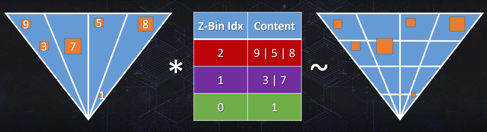

WebGL Forward+ and Clustered Deferred Shading
======================

**University of Pennsylvania, CIS 565: GPU Programming and Architecture, Project 4**

* Zhen Ren
  * https://www.linkedin.com/in/zhen-ren-837089208/
* Tested on: Windows 11, i9-13900H @ 2.60 GHz 16GB, RTX 4070 Laptop 8GB (Self laptop)

### Live Demo

### Demo Video/GIF

## Introduction

In this assignment, I implemented both clustered forward shading and clustered deferred shading. The project contains the following features:
- Naive forward shading pipeline
- Clustered forward (forward +) shading pipeline
- Clustered deferred shading pipeline

and following extras:
- Compressed Gbuffer using only 3 uint32
- Light sorting
- Optimized clustering algorithm
- Render bundle

## Clustered Forward (Forward +)
Clustered forward pipeline can be used to optimize scenes with multiple light source. In the tradition forward pipeline, for each fragment, we need to iterate through all light source and do shading. However, many lights may have no contribution to the pixel. Forward clustered algorithm can optimize this by clustering lights to many sub tiles or clusters in the camera space and cull out irrelevant lights at shading stage.

[img source](https://www.aortiz.me/2018/12/21/CG.html)

The core of this algorithm is clustering lights. In this project, I focus on sphere-frustum intersection. An simple way to do this is to use the AABB of frustums to do intersection test. However, the false positive rate can be high.

The algorithm I used is called cone-testing, which is calculating a cone that can wrap the frustums and the spheres and then test if two cones intersect each other.

(a) normal rendering; (b) tiles passed sphere-frustum test; (c) tiles passed cone test\
[img source](https://lxjk.github.io/2018/03/25/Improve-Tile-based-Light-Culling-with-Spherical-sliced-Cone.html)

### Z Binning
Another optimization I implemented is called Z binning. An interesting observation is that, the light list of each cluster equals to

`{X sliced Frustums} ∩ {Y sliced Frustums} ∩ {Z sliced Frustums}`

Since X sliced frustums and Y sliced frustums have a irregular shape, we can use

`{X Y tiles} ∩ {Z sliced Frustums}`

to calculate the light lists of each cluster.

To get more information about this algorithm, this is a nice [source](https://advances.realtimerendering.com/s2017/2017_Sig_Improved_Culling_final.pdf)

In this project, I also sort the light by z to reduce the size of z bins since I can use only a start and an end value to record all lights in the bin.

## Clustered Deferred
Clustered deferred pipeline is the deferred pipeline usign the light clustering info. The main different is that it uses a gbuffer to store all shading info and then use a full screen pass to do shaing.

The gbuffer layout looks like this, except that I do not have specular data, so I only used three 32 bit uint to store the scene info and used 32 bit for the depth and delete stencil.

### Credits

- [Vite](https://vitejs.dev/)
- [loaders.gl](https://loaders.gl/)
- [dat.GUI](https://github.com/dataarts/dat.gui)
- [stats.js](https://github.com/mrdoob/stats.js)
- [wgpu-matrix](https://github.com/greggman/wgpu-matrix)

[Cone testing Reference](https://lxjk.github.io/2018/03/25/Improve-Tile-based-Light-Culling-with-Spherical-sliced-Cone.html)

https://themaister.net/blog/2020/01/10/clustered-shading-evolution-in-granite/

https://advances.realtimerendering.com/s2017/2017_Sig_Improved_Culling_final.pdf

https://knarkowicz.wordpress.com/2014/04/16/octahedron-normal-vector-encoding/