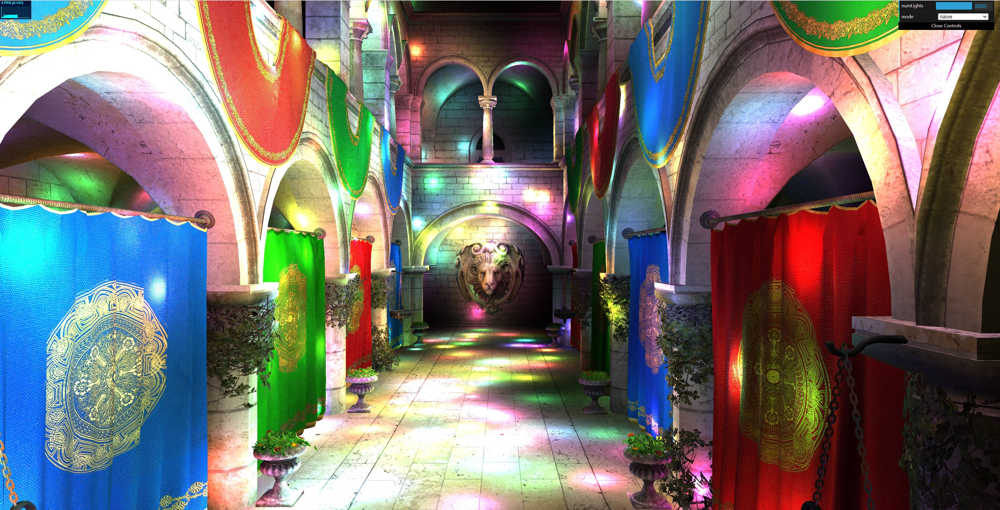
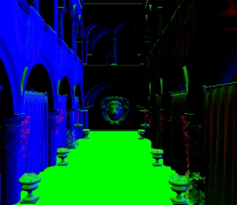

WebGPU Forward+ and Clustered Deferred Shading
================

* Jichu Mao
  * [LinkedIn](https://www.linkedin.com/in/jichu-mao-a3a980226/)
  *  [Personal Website](https://jichu.art/)
* Tested on: Windows 11,  i7-13700K @ 3.40 GHz, 32GB, RTX 4090 24GB

### <a name="p1">Live Demo</a>
[https://jichumao.github.io/Project4-WebGPU-Forward-Plus-and-Clustered-Deferred/](https://jichumao.github.io/Project4-WebGPU-Forward-Plus-and-Clustered-Deferred/)

### Demo GIF

 | *Random Lights move in the Scene*|
 |:--:|
 |  |

## Table of Contents
* [Demo](#p1)
* [Introduction](#pi)
  * [Forward Shading(Naïve)](#p2)
  * [Clustered Forward Shading(*Forward+)](#p3)
  * [Clustered Deferred Shading](#p4)
* [Performance Analysis](#p5)

## <a name="pi">Introduction</a>

In this project, I implemented the Forward+ and Clustered Deferred shading methods using WebGPU. The scene features the Sponza Atrium model with a large number of dynamic point lights. The project compares different rendering methods in terms of performance and efficiency, especially in high-resolution settings with thousands of moving lights. The base code for this project is derived from a GPU course project at the University of Pennsylvania

**Key Features**
- WebGPU-based Rendering Pipelines:
  - Forward Shading Pipeline
  - Clustered Forward (Forward+) Shading Pipeline
  - Clustered Deferred Shading Pipeline
- Additional Implementations:
  - Optional post-processing Bloom effect
  - Optimized GBuffer compression

Users can freely adjust the maximum number of lights. For performance reasons, the default limit is set to 5000, but this can be modified in `shaders.ts` as needed. Similarly, the maximum number of lights per cluster can also be customized in the same file.

## <a name="p2">Forward Shading(Naïve)</a> 

The main characteristic of Forward Shading is that the fragment shader computes the influence of all lights on each fragment individually. However, not all lights significantly affect every fragment, and many fragment computations are ultimately discarded due to depth testing. As a result, this method introduces substantial computational overhead, which is why it is considered the "naïve" approach.

In a 4K scene with 5000 randomly moving lights, the naïve Forward Shading method achieves only **3 frames per second**, far below the over **100 frames per second** achieved with Clustered Deferred Shading.

 | *Forward Shading(in 4K resolution, 5000 random lights)*|
 |:--:|
 |  |

## <a name="p3">Clustered Forward Shading(Forward+)</a> 

Clustered Forward Shading, also known as Forward+, improves upon the naïve approach by dividing the view frustum into a 3D grid of clusters and assigning lights to these clusters based on their spatial influence. During rendering, each fragment shader processes only the lights that affect its corresponding cluster, significantly reducing the number of light calculations per fragment.

**Steps**:

1. **Clustering Compute Shader**

 A [compute shader](https://webgpufundamentals.org/webgpu/lessons/webgpu-compute-shaders.html) divides the view frustum into clusters and determines which lights affect each cluster.
  A key point here is the use of non-linear division along the z-axis (in this project, logarithmic splitting is used). Since lights have a stronger impact on the scene near the camera, using simple "uniform slices" along the z-axis can lead to precision issues, resulting in visual artifacts. Logarithmic division helps achieve denser clustering near the camera, which aligns with practical experience.(See details [here](https://www.aortiz.me/2018/12/21/CG.html))

2. **Light Assignment**

Lights are assigned to clusters by testing whether they intersect with the cluster boundaries. 
The critical part here is the intersection test between the light and the [AABB](https://en.wikipedia.org/wiki/Bounding_volume) (Axis-Aligned Bounding Box) of the cluster. Since clusters in view space are not regular cubes, a more efficient method is needed for intersection testing.

 Fortunately, clusters in NDC (Normalized Device Coordinates) space are cubes! Thus, I computed the x, y, and z ranges of each cluster in NDC space, and then transformed these back to view space. By finding the maximum and minimum coordinates of the cluster's vertices, I could easily determine the bounding box, which is then tested for intersection with the light's bounding sphere. If the bounding box intersects with the light, it indicates that the light affects this cluster, and the light is added to the cluster's light set.

<table>
  <tr>
    <td align="center"><b>Step1 Clustering</b></td>
    <td align="center"><b>Step2 Light Assignment</b></td>
    <td align="center"><b>Step3 Shading</b></td>
  </tr>
  <tr>
    <td></td>
    <td></td>
    <td></td>
  </tr>
  <tr>
    <td colspan="3" align="center"><i> Clustered Forward Shading Steps</i></td>
  </tr>
</table>  

3. **Shading in Fragment Shader**

The fragment shader accesses the list of relevant lights for its cluster, reducing unnecessary computations. With step 1 and step 2 complete, we are almost done! We simply need to identify the corresponding cluster for the current fragment in the fragment shader, and then perform lighting calculations using the set of lights assigned to that cluster. Compared to the naive approach, this method significantly reduces the computational cost of lighting calculations!

This method balances performance and visual fidelity, achieving higher frame rates compared to the naïve approach, especially in scenes with a large number of lights. *[Credits for pics](https://www.aortiz.me/2018/12/21/CG.html)*

## <a name="p4">Clustered Deferred Shading</a> 

Clustered Deferred Shading further optimizes rendering by decoupling geometry processing from lighting calculations. The rendering pipeline consists of two main passes:
1. **G-buffer Pass**:
  - Renders geometry information into multiple render targets, collectively known as the G-buffer.
  - Stores data such as positions, normals, color and other material properties.
<table>
  <tr>
    <td align="center"><b>Position</b></td>
    <td align="center"><b>Normal</b></td>
    </tr>
    <td></td>
    <td></td>
    <tr>
    <td align="center"><b>Color</b></td>
    <td align="center"><b>Depth</b></td>
  </tr>
  <tr>
    <td></td>
    <td></td>
  </tr>
  <tr>
    <td colspan="4" align="center"><i> G-Buffer Data read from WebGPU Inspecter</i></td>
  </tr>
</table>  

2. **Lighting Pass**:
  - A fullscreen pass that reads from the G-buffer and computes lighting using the clustered light information.
  - Only the visible fragments are shaded, eliminating wasted computations on fragments that do not contribute to the final image.

Before the first stage, just like in Clustered Forward Shading, I pre-assign clusters and lights. However, the difference lies in the shading process being split into two phases. First, during the Geometry Pass (or G-buffer Pass), all the geometry data from the camera’s view is stored in textures. Then, in the Lighting Pass, only a fullscreen triangle is rendered, and the geometry information is extracted from the G-buffer. Finally, we got the result like this(Yeah!!)

 | *Final Scene(G-Buffers with lighting)*|
 |:--:|
 |  |

The key advantage of this approach is that it significantly reduces the cost of overdraw. In previous methods, many fragments undergo lighting calculations only to fail the depth test. Deferred shading ensures that we only perform shading for the final visible fragments on the screen. This results in another leap in shading efficiency and performance!

## <a name="p5">Performance Analysis</a> 

### Test Benchmarks
  - Resolution: 3840 * 2560(4K)
  - Number of Lights in the Scene: 128($2^7$) - 8192($2^{13}$)
  - Metrics: Rendering time per frame (in milliseconds), Frames Per Second (FPS)

### Overview

This section examines the performance of three shading methods: **Naive Forward Shading**, **Clustered Forward Shading**, and **Clustered Deferred Shading**. These methods were tested in a 4K resolution scene featuring the Sponza Atrium model with a varying number of dynamic point lights.

| Number of Lights | Naive (ms) | Clustered Forward (ms) | Clustered Deferred (ms) |
|------------------|------------|------------------------|--------------------------|
| 256              | 18.8       | 1.6                    | 0.5                      |
| 512              | 34.4       | 3.4                    | 1.1                      |
| 1024             | 71.4       | 7.0                    | 2.3                      |
| 2048             | 142.8      | 14.2                   | 4.1                      |
| 4096             | 273.6      | 27.7                   | 8.2                      |
| 8192             | 550.8      | 52.6                   | 15.1                     |

The results show that as the number of lights increases, Clustered Deferred Shading demonstrates superior scalability and efficiency, outperforming the other methods, especially with higher light counts.

### Analysis by Light Count

- Naive Forward Shading:
  - The performance of Naive Forward Shading degrades quickly as the number of lights increases, from 18.8 ms at 256 lights to 550.8 ms at 8192 lights.
  - The root of this inefficiency lies in the fact that the fragment shader computes the influence of all lights on every fragment, regardless of whether they are relevant to the scene. This introduces substantial computational overhead and results in many unnecessary light calculations.

- Clustered Forward Shading:
  - Clustered Forward Shading drastically improves upon the naive method, achieving 1.6 ms with 256 lights and 52.6 ms with 8192 lights. This improvement is due to the clustering of the view frustum into 3D regions (clusters), which allows the system to calculate only the lights relevant to each fragment, rather than all lights.
  - However, as the light count increases, performance still begins to degrade. The method remains efficient up to 4096 lights, after which the computation cost starts to grow, albeit much slower than the Naive approach.

- Clustered Deferred Shading:
  - Clustered Deferred Shading shows the best overall performance, particularly with larger numbers of lights. It starts at 0.5 ms with 256 lights and scales to only 15.1 ms with 8192 lights.
  - The major performance advantage comes from decoupling the geometry and lighting calculations. By first storing geometry data (positions, normals, etc.) in the G-buffer, lighting is only computed for visible fragments during a second pass. This eliminates redundant computations and makes the method highly scalable.

### Performance Insights
- Naive Forward Shading:

This method becomes impractical once the number of lights exceeds 500, as the cost of processing all lights for each fragment skyrockets.
- Clustered Forward Shading:

Works well for small to moderate light counts but begins to show performance degradation as the number of lights exceeds 4000. Still, it is significantly more efficient than the naive method thanks to the clustering mechanism, which limits the light calculations to relevant clusters.
- Clustered Deferred Shading:

This method is ideal for scenes with a high number of dynamic lights, as it efficiently handles light calculations by storing geometry information in a G-buffer and shading only visible fragments. The performance remains stable and scalable even with over 8000 lights, making it the most effective method for large, complex scenes.

## <a name="references">Credits</a>

- [WebGPU Inspector](https://chromewebstore.google.com/detail/webgpu-inspector/holcbbnljhkpkjkhgkagjkhhpeochfal)
- [WebGPU devtools](https://github.com/takahirox/webgpu-devtools)
- [Vite](https://vitejs.dev/)
- [loaders.gl](https://loaders.gl/)
- [dat.GUI](https://github.com/dataarts/dat.gui)
- [stats.js](https://github.com/mrdoob/stats.js)
- [wgpu-matrix](https://github.com/greggman/wgpu-matrix)
