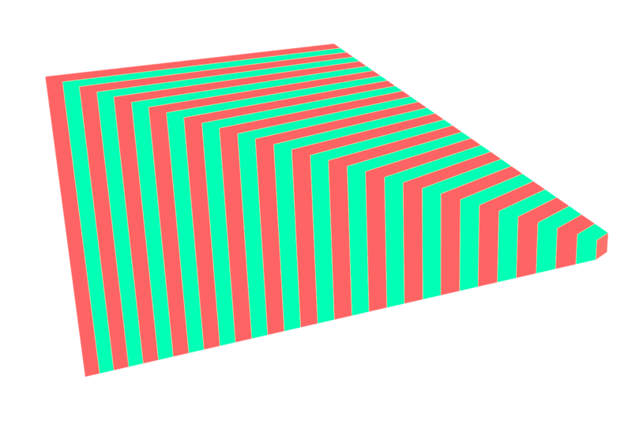

WebGPU Forward Clustered and Clustered Deferred Shading
======================

**University of Pennsylvania, CIS 565: GPU Programming and Architecture, Project 4**

* Zixiao Wang
  * [LinkedIn](https://www.linkedin.com/in/zixiao-wang-826a5a255/)
* Tested and rendered on: Windows 11, i7-12800H @ 2.40 GHz 32GB, GTX 3070TI (Laptop)

### Live Demo

[Live Demo Link](https://lanbiubiu1.github.io/Project4-WebGPU-Forward-Plus-and-Clustered-Deferred/)

### Demo Video/GIF
#### 5000 Lights


#### 5000 Lights, interactive


### Introduction

In this project, I implemented the Forward clustered and Clustered Deferred shading methods with WebGPU. The project is able to reach 90 FPS with 5000 lights and 2K resolution. The Project contains:

* Naive implementation of forward shading
* Clustered forward shading
* Clustered deferred shading
* GUI to show the FPS and manipulate the number of lights in the scene.

The scene can be interactive with the mouse and WASD on the keyboard.

### Clustered Forward

By dividing the view frustum into a 3D grid of clusters, each cluster is assigned the lights that could potentially affect it. This allows for more efficient computation during rendering by reducing the number of light calculations per pixel, significantly improving performance compared to naive forward or deferred rendering approaches. Clustered lighting techniques are especially useful in scenes with many lights, offering scalability and improved lighting precision.


  

In the forward clustered approach, the scene is rendered by looping through each object and determining how many of the lights in its view-frustum cluster affect it. Instead of evaluating all lights for every fragment, forward clustered lighting assigns lights to clusters, allowing fragments only to evaluate lights relevant to their specific cluster

### Clustered Deferred
Deferred clustered lighting builds upon deferred rendering by integrating clustered light assignment. Deferred rendering separates geometry and lighting into different passes. During the first pass, the scene geometry is rendered to create G-buffer textures, which store normal, albedo, and depth for each pixel. In the fullscreen pass, clustered lighting is applied using the G-buffer data. By grouping lights into clusters and only applying relevant lights to each cluster, deferred clustered lighting efficiently handles complex lighting scenarios with high light counts.  This approach is ideal for scenes where managing numerous lights can lead to performance challenges in traditional methods.

  

* 1st is Albedo
* 2nd is depth
* 3rd is normal

### Z(Depth) Slicing

In dividing the view frustum into clusters along the Z-axis (depth), there are two common methods: uniform Z slicing and logarithmic Z slicing.

  
* left is uniform Z-slicing
* right is logarithmic Z-slicing


1st is uniform Z slicing. In uniform Z slicing, the view frustum is divided into equal intervals along the depth axis. This approach is simple to implement but can lead to inefficient clustering and problems. It mainly slicing the depth into very "thin" slices. Once there are a large number of lights in each cluster, the problem appears as follows, there is a cross-black-boundary on the screen:


2nd is Logarithmic Z slicing. It divides the view frustum into slices that increase in size logarithmically with distance from the camera. Logarithmic slicing ensures a better balance of cluster density and light assignment, particularly in large scenes

### Performance Analysis


The graph displays the frames per second (FPS) achieved by three different rendering approaches (Naive Forward, Forward Clustered, and Deferred Clustered) as the number of lights in the scene increases. 
* The Naive Forward approach (red line) demonstrates a significant drop in FPS as the number of lights increases. As the number of lights doubled, the number of calculations for each fragment also doubled. At 500 lights, it starts at 25 FPS and quickly degrades to 3 FPS as the number of lights reaches 2000 and above. This poor performance is expected for the Naive Forward method, as it requires each light to be evaluated for each fragment, making the complexity grow rapidly with the number of lights. This approach is not scalable for scenes with many lights, resulting in unacceptable FPS values beyond 1000 lights.
* The Forward Clustered approach (blue line) performs significantly better compared to the Naive Forward approach. At 500 lights, it achieves 220 FPS, but it also shows a declining trend as the number of lights increases. By the time it reaches 5000 lights, the FPS drops to 28. This optimization offers better performance than the Naive Forward approach, but the decline in FPS with increasing lights indicates that the Forward Clustered approach still struggles to manage very large numbers of lights efficiently, which is also understandable. Even the maximum number of lights is 1024 for each cluster and 16 * 9 * 24 clusters, meaning it is enough to handle a large number of lights. But once the number of lights goes up, more and more light is assigned to each cluster, so each cluster faces the same challenge the fragment in the naive approach faced. The number of lighting calculations for each cluster increases drastically, especially the cluster near the camera since it uses logarithm depth slicing.
  * Also, the forward approach overall faces an overdraw problem, which doing calculations for color that will not show on the screen. For example, one object blocks the other one behind. If there is a light source on the roof, both objects will be included in the calculation, but only the front of the object will show on the final screen image.
  
* The Deferred Clustered approach (green line) provides the best performance among the three methods. Starting at 360 FPS with 500 lights, it maintains a high FPS even as the number of lights increases, dropping to 90 FPS at 5000 lights. The Deferred Clustered approach allows it to manage complex lighting scenarios by grouping lights into clusters and only processing them where necessary. One of the key reasons why deferred clustered lighting achieves superior performance is the decoupling of light calculations from other rendering stages. In deferred shading, the scene geometry is first rendered to multiple G-buffers. Once this data is collected, the lighting calculations are performed as a separate pass, using the data stored in the G-buffers. This separation means that lighting calculations are only applied to the pixels visible on the screen, avoiding over-draw issues in the forward shading approach.

For real-time applications with complex lighting, the Deferred Clustered approach is the recommended choice, as it provides a much higher FPS, ensuring smoother visual experiences.

### Credits

- [Vite](https://vitejs.dev/)
- [loaders.gl](https://loaders.gl/)
- [dat.GUI](https://github.com/dataarts/dat.gui)
- [stats.js](https://github.com/mrdoob/stats.js)
- [wgpu-matrix](https://github.com/greggman/wgpu-matrix)
- [Picture credit](https://www.aortiz.me/2018/12/21/CG.html)

#### code reference
- WebGPU API: detail about the function parameters and return types of [createSampler()](https://developer.mozilla.org/en-US/docs/Web/API/GPUDevice/createSampler)
- WGSL: [Depth Texture Types](https://www.w3.org/TR/WGSL/#texture-depth)
- Nividia CG Tutorial: gets really confusing while transforming among multiple spaces in shaders code, good to reference before starting writing [Coordinate Systems](https://developer.download.nvidia.com/CgTutorial/cg_tutorial_chapter04.html)
- use as a reference for computing shader: https://github.com/toji/webgpu-clustered-shading/blob/main/js/webgpu-renderer/shaders/clustered-compute.js
  ```
    clusters.bounds[tileIndex].minAABB = min(min(minPointNear, minPointFar),min(maxPointNear, maxPointFar));
    clusters.bounds[tileIndex].maxAABB = max(max(minPointNear, minPointFar),max(maxPointNear, maxPointFar));
  ```

