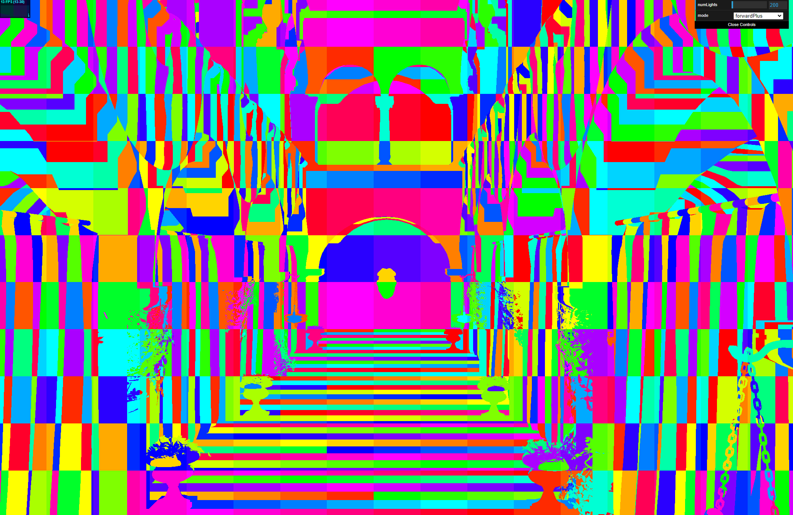

WebGPU Forward+ and Clustered Deferred Shading
======================

**University of Pennsylvania, CIS 565: GPU Programming and Architecture, Project 4**

* CARLOS LOPEZ GARCES
  * [LinkedIn](https://www.linkedin.com/in/clopezgarces/)
  * [Personal website](https://carlos-lopez-garces.github.io/)
* Tested on: Windows 11, 13th Gen Intel(R) Core(TM) i9-13900HX @ 2.20 GHz, RAM 32GB, NVIDIA GeForce RTX 4060, personal laptop.

### Live Demo

[](http://TODO.github.io/Project4-WebGPU-Forward-Plus-and-Clustered-Deferred)

### Demo Video/GIF

https://github.com/user-attachments/assets/e6605346-edd8-4a74-bef5-1b1123f41ada

## WebGPU-Based Rasterization Renderers

This project implements three WebGPU-based rasterization renderers that explore different techniques for handling lighting in a scene. The primary goal is to demonstrate different approaches to managing light calculations in a real-time rendering context, each with varying levels of complexity and efficiency.

1. **Naive Renderer**
2. **Forward+ Renderer**
3. **Clustered Deferred Renderer (Optional Toon Shading Postprocessing)**

### Naive Renderer


The **Naive Renderer** is the simplest, but most inefficient, of the three renderers. It computes the lighting for each fragment by iterating over all the lights in the scene. This approach is particularly inefficient for scenes with many lights, as it scales poorly when the number of lights increases.

The fragment shader computes the contribution of all lights in the scene for every fragment. This means that for each fragment, the shader loops over up to 5000 lights, regardless of their distance from the fragment or whether the light has any actual contribution to the fragment (since lights falls off with distance). This makes it inefficient for scenes with many lights and large numbers of fragments being shaded.

### Forward+ Renderer


The **Forward+ Renderer** follows an efficient light management approach known as light clustering. This approach divides the scene into clusters, with each cluster being assigned a subset of the lights that influence that region. This way, only the lights that are relevant to a specific cluster are evaluated by the fragments within that cluster. This ensures that only a relevant subset of lights is evaluated by the fragments of a cluster, unlike the naive renderer, which evaluates all lights for every fragment.

Since the lights in the scene are dynamic (they can move), the light clustering must be recomputed for each frame. The clustering compute shader is invoked during every draw call, ensuring that the light information for each cluster is updated to reflect the current positions of the lights.

During rendering, each fragment identifies the cluster that corresponds to its position. The clusters are bound to the render pass and used to look up the specific lights that affect the fragment.

One of the advantages of the Forward+ Renderer is that the maximum number of lights per cluster is configurable. By adjusting this number, you can fine-tune the balance between rendering performance and lighting accuracy. Fewer lights per cluster improve performance but may lead to less detailed lighting, while allowing more lights per cluster increases lighting accuracy at some cost. While the Naive Renderer’s performance scales poorly with an increasing number of lights, the Forward+ approach scales much better, provided that the number of lights per cluster is fine-tuned for the scene.

### Light Clustering

The following images shows clusters of different sizes (in pixels for xy and depth slices for the z dimension):

| 32px x 32px x 32 | 64px x 64px x 32 |
|-----------------|-----------------|
|  |  |
| **128px x 128px x 32** | **512px x 512px x 32** |
|  |  |

Clusters may be rectangular (e.g. 512px x 64px x 32):


Cluster depth increases by a power of 2 as the cluster z-index increases, so clusters near the camera are smaller allowing for a finer-grain allocation of lights to those fragments, which results in more precise lighting for them. Observe that the lion mask at the far end cannot be distinguished when there are few depth slices: nearby fragments at the far end are assigned to the same clusters (same color).

| 128px x 128px x 32 | 128px x 128px x 128 |
|-----------------|-----------------|
|  |  |
| **128px x 128px x 256** | **128px x 128px x 512** |
|  |  |

Here we can observe how the number of lights assigned to each cluster changes across frames as lights move throughout the scene; the interval `[0, maxLightsPerCluster]` is remapped to `[0, 1] = [black, white]` here.


### Clustered Deferred Renderer


The **Clustered Deferred Renderer** builds on the Forward+ approach by combining light clustering with a deferred rendering pipeline, which separates the computation of shading attributes (like albedo, normals, and positions) into an initial pass using a G-buffer; the G-buffer is generated using a compute shader.

Like the Forward+ Renderer, the Clustered Deferred Renderer divides the scene into clusters, assigning a subset of the lights to each cluster. These clusters are used during shading to limit the number of lights each fragment evaluates, optimizing performance.

After the G-buffer is generated, a fullscreen quad render pass computes the final lighting for each fragment. The G-buffer data (albedo, normals, positions) is combined with the light clusters, allowing the renderer to compute lighting efficiently for each fragment. Since the lighting is deferred, the light computations are only performed for visible fragments.

#### G-Buffer

Examples of textures in the G-Buffer:

| Albedo G-Buffer | Normal G-Buffer | Position G-Buffer |
|-----------------|-----------------|-------------------|
|  |  |  |

#### Postprocessing with Toon Shading

The Clustered Deferred Renderer includes the option to perform a postprocessing pass over the final rendered image. This pass applies a **toon shading effect**, which gives the scene a stylized look.

When postprocessing is enabled, the output of the deferred pass is not presented to the screen. Instead, it's rendered to a texture that is later bound to the postprocessing compute pipeline, which alters it to produce a toon shading effect (ramp shading and edge detection with a Sobel filter). The output texture of the compute shader is then presented to the screen using a simple fullscreen quad render pass.


## Performance

The Naive renderer evaluates the lighting equation for all lights in the scene at every fragment, even at fragments that are overdrawn by others (because that's how rasterization works). The Forward+ renderer reduces the number of lights evaluated per fragment (at the cost of a compute shader pass for clustering the lights and managing the corresponding buffer), but still suffers from overdraw. The Clustered Deferred renderer solves the fragment overdraw problem using a G-Buffer for evaluating lights only on visible fragments.

The first performance statistic presented is FPS. For a scene with 200 lights and image resolution 1430x933, both the Forward+ and Clustered Deferred renderers evaluate an average of 52 lights per cluster when the maximum number per cluster is also 200 and the light radius is 10. In spite of evaluating as few as 1/4 of the total lights per cluster, Forward+ achieves 65% of the FPS of the Naive renderer; since the only major difference is the computation of the clusters (with its corresponding buffer management), the slowdown must be caused by that (perhaps it's not a flaw of the technique, but of the implementation). The same clustering compute pass is executed by the Clustered Deferred renderer, so it must incur a comparable cost; however, this cost is offset (significantly) by the gains from avoiding overdraw.

| Renderer, 200 lights total, 200 max per cluster, radius 10   | FPS         |
|-----------------------------------|-------------|
| Naive Renderer                    | 48          |
| Forward+ Renderer                 | 31          |
| Clustered Deferred Renderer       | 128         |
| Clustered Deferred with Postprocessing | 127    |

Increasing both the total number of lights and the maximum lights per clusters to 500, results are consistent with the previous one. In this case, the clustered renderers process an average of 133 lights per cluster. Still, the Forward+ renderer underperforms.

| Renderer, 500 lights total, 500 max per cluster, radius 10   | FPS         |
|-----------------------------------|-------------|
| Naive Renderer                    | 19          |
| Forward+ Renderer                 | 8          |
| Clustered Deferred Renderer       | 41         |
| Clustered Deferred with Postprocessing | 40    |

Increasing the total number of lights to 1000 and keeping the maximum per cluster at 200, Forward+ performs better than Naive for the first time. The difference in number of lights processed is quite large, though, which explains the results: Forward+ processes an average of 97 lights per cluster in this case. The resulting Forward+ rendered image is not an acceptable approximation to the expected one (produced by the Naive renderer); observe below the difference in scene illumination.

| Renderer, 1000 lights total, 200 max per cluster, radius 10   | FPS         |
|-----------------------------------|-------------|
| Naive Renderer                    | 19          |
| Forward+ Renderer                 | 47          |
| Clustered Deferred Renderer       | 192         |
| Clustered Deferred with Postprocessing | 190    |

|Naive rendered image| Forward+ rendered image|
|----|----|
|||

### Performance: duration of GPU passes

Let's now determine where the bulk of the frame time comes from, by measuring the execution time of each of the GPU (render and compute) passes.

To measure the duration of a GPU pass, the [GPUQuerySet](https://developer.mozilla.org/en-US/docs/Web/API/GPUQuerySet) API was used. Having the GPU write a timestamp to a `GPUQuerySet` can be encoded as a command and queued for execution on the GPU. Furthermore, we can tie a `GPUQuerySet` to a render or compute pass as follows:

```ts
const computePass = encoder.beginComputePass();
...
computePass.writeTimestamp(this.perfQuerySet, 1);
...
computePass.end();
```

This requires the creation of the `GPU` device with an experimental flag that may not be supported everywhere: `chromium-experimental-timestamp-query-inside-passes`. 

If the `perf` flag of each renderer is set to true, each pass is timed.

The following execution times were obtained for an image of size 2308 x 1351, 500 total lights, 128 lights per cluster (maximum), and clusters of dimensions 128x128x16. Time reported is average of 100 frames.

| Naive GPU Pass | Average Execution Time (ms) |
|------------------------------------|---------------------|
| Main render pass       | 303.347  |

The execution times of Forward+ passes show clearly that the main render pass is where the slowdown happens. It's interesting that being similar to the Naive Renderer's render pass, it takes 200ms more; the difference lies in the use of the light clusters. As shown before, fragments indeed process fewer lights in Forward+ than in Naive; the most likely explanation of the slowdown then is the copy of the clusters buffer. Observe how insignificant the duration of the light clustering pass is, in comparison.

| Forward+ GPU Passes | Average Execution Time (ms) |
|------------------------------------|---------------------|
| Light clustering compute pass | 0.951 |
| Main render pass       | 498.786  |


In the case of the Clustered Deferred Renderer, the bulk of the frame time is spent in the deferred render pass; the other passes take an insignificant amount of time in comparison. Observe how short the light clustering compute pass duration is; this helps confirm that that's not the cause of Forward+'s slowdown.

| Clustered Deferred GPU Passes | Average Execution Time (ms) |
|------------------------------------|---------------------|
| G-Buffer render pass              | 3.772  |
| Light clustering compute pass | 0.579 |
| Deferred render pass       | 124.732  |
| Postprocessing (toon shading) compute pass | 2.780  |
| Final render pass          | 0.834          |


### Credits

- [Vite](https://vitejs.dev/)
- [loaders.gl](https://loaders.gl/)
- [dat.GUI](https://github.com/dataarts/dat.gui)
- [stats.js](https://github.com/mrdoob/stats.js)
- [wgpu-matrix](https://github.com/greggman/wgpu-matrix)
