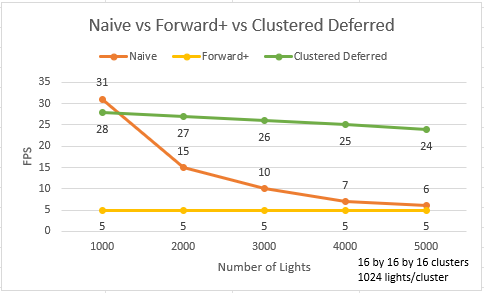

**University of Pennsylvania, CIS 565: GPU Programming and Architecture, Project 4 - WebGL Forward+ and Clustered Deferred Shading**

* Yin Tang
  * [Linkedin](https://www.linkedin.com/in/yin-tang-jackeyty/), [Github](https://github.com/JackeyTY), [Personal Website](https://jackeytang.com/)
* Tested on: Google Chrome 130.0 on Windows 11 Pro, AMD Ryzen 9 7950X @ 5.00GHz 64GB, NVIDIA GeForce RTX 4090 24GB (personal desktop)

 

### Overview

In this project we experimented with forward+ and clustered deferred rendering using WebGPU. We can see that clustered deferred shading can significantly improve the performance when dealing with scene that has complex lightings.

#### **Naive Shading**

This is the classic forward rendering method. A **single rendering pipeline** processes all objects in the scene. Each object's **vertex attributes** (such as position, normal, and texture coordinates) are calculated in the **vertex shader**. In the **fragment shader**, we iterate over **all active lights** in the scene and accumulate their contributions to compute the final color for each fragment (pixel). This approach ensures that every **visible fragment** receives lighting contributions from every light source, but it can become expensive with a large number of lights.

#### **Forward+ Shading**

In **Forward+ shading**, the camera's view frustum is divided into a 3D grid of **clusters**. During shading, we only need to iterate through the lights that influence the current cluster, which reduces unnecessary light calculations. **Two** pipelines are created. The **compute pipeline** first determines which lights overlap with each cluster, creating a **light list** for each cluster. In the **render pipeline**, during shading, we only iterate over the lights stored in the light list for the cluster containing the current fragment, improving performance, but there still can have overdrawn.

#### **Clustered Deferred Shading**

In **clustered deferred shading**, the camera’s view frustum is divided into a 3D grid of **clusters**, similar to Forward+ shading. However, instead of applying lighting during the final shading pass, this method defers lighting calculations to a later stage. **Three** pipelines are created. In the **compute pipeline**, we determine which lights overlap with each cluster, generating a **light list** for each one. In the **geometry pass**, we store the necessary attributes for shading, albedo, normal and depth, in a **G-buffer**. During the **lighting pass**, we iterate only through the lights relevant to the current cluster, efficiently computing lighting based on the data stored in the G-buffer. With the additional memory buffer, this approach reduces redundant calculations and allows for scalable performance with complex scenes and many dynamic lights.

 

### Performance Analysis

Tests are conducted using 16 by 16 by 16 3D clusters with maximum 1024 lights per cluster. We can see that clustered deferred shading maintains high FPS even with significant number of lights. The performance for naive shading method drops as the number of lights increases, which is as expected since more lights need to be iterated in the fragment shader to compute the final color. The performance for both forward+ and clustered deferred shading methods does not change much with the number of lights, that's probably because in the clustering compute shader we always iterate through all the lights in the scene to find overlapping lights, without reaching the maximum allowed light number to break early. Also, it is interesting to see that forward+ shading is actually slower than naive method, indicating that the improvement introduced by efficient light iteration per cluster does not offset the addition light clustering computation and cluster light lists memory buffer read/write.

Further analysis on the cluster grid size is conducted with 5000 lights in the scene. We can see hat 16 by 16 by 16 3D clusters performs slightly better than 8 by 8 by 8 clusters, but eventually they reach the same average FPS when maximum number of lights per cluster becomes very large. Another thing to note is that the FPS and maximum light number per cluster follows a linear relationship, which is also as expected, meaning that with 5000 lights in the scene, light lists for all clusters are saturated.

 

### Credits

- [A Primer On Efficient Rendering Algorithms & Clustered Shading](https://www.aortiz.me/2018/12/21/CG.html)
- [Forward vs Deferred vs Forward+ Rendering with DirectX 11](https://www.3dgep.com/forward-plus/)
- [WebGPU](https://www.w3.org/TR/webgpu/)
