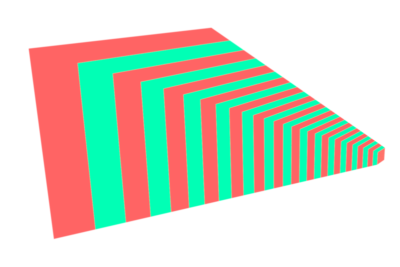

WebGPU Forward Clustered and Clustered Deferred Shading
======================

**University of Pennsylvania, CIS 565: GPU Programming and Architecture, Project 4**

* Zixiao Wang
  * [LinkedIn](https://www.linkedin.com/in/zixiao-wang-826a5a255/)
* Tested and rendered on: Windows 11, i7-12800H @ 2.40 GHz 32GB, GTX 3070TI (Laptop)

### Live Demo

[Live Demo Link](https://lanbiubiu1.github.io/Project4-WebGPU-Forward-Plus-and-Clustered-Deferred/)

### Demo Video/GIF
#### 5000 Lights


#### 5000 Lights, interactive


### Introduction

In this project, I implemented the Forward clustered and Clustered Deferred shading methods with WebGPU. The project is able to reach 90 FPS with 5000 lights and 2K resolution. The Project contains:

* Naive implementation of forward shading
* Clustered forward shading
* Clustered deferred shading
* GUI to show the FPS and manipulate the number of lights in the scene.

The scene can be interactive with the mouse and WASD on the keyboard.

### Clustered Forward

By dividing the view frustum into a 3D grid of clusters, each cluster is assigned the lights that could potentially affect it. This allows for more efficient computation during rendering by reducing the number of light calculations per pixel, significantly improving performance compared to naive forward or deferred rendering approaches. Clustered lighting techniques are especially useful in scenes with many lights, offering scalability and improved lighting precision.


  

In the forward clustered approach, the scene is rendered by looping through each object and determining how many of the lights in its view-frustum cluster affect it. Instead of evaluating all lights for every fragment, forward clustered lighting assigns lights to clusters, allowing fragments only to evaluate lights relevant to their specific cluster

### Clustered Deferred
Deferred clustered lighting builds upon deferred rendering by integrating clustered light assignment. Deferred rendering separates geometry and lighting into different passes. During the first pass, the scene geometry is rendered to create G-buffer textures, which store normal, albedo, and depth for each pixel. In the fullscreen pass, clustered lighting is applied using the G-buffer data. By grouping lights into clusters and only applying relevant lights to each cluster, deferred clustered lighting efficiently handles complex lighting scenarios with high light counts.  This approach is ideal for scenes where managing numerous lights can lead to performance challenges in traditional methods.

  

* 1st is Albedo
* 2nd is depth
* 3rd is normal

### Z(Depth) Slicing

In dividing the view frustum into clusters along the Z-axis (depth), there are two common methods: uniform Z slicing and logarithmic Z slicing.

  
* left is uniform Z slicing
* right is logarithmic Z slicing


1st is uniform Z slicing. In uniform Z slicing, the view frustum is divided into equal intervals along the depth axis. This approach is simple to implement but can lead to inefficient clustering and problems. It mainly slicing the depth into very "thin" slices. Once there are a large number of lights in each cluster, the problem appears as follows, there is a cross-black-boundary on the screen:


2nd is Logarithmic Z slicing. It divides the view frustum into slices that increase in size logarithmically with distance from the camera. Logarithmic slicing ensures a better balance of cluster density and light assignment, particularly in large scenes

### Performance Analysis

### Credits

- [Vite](https://vitejs.dev/)
- [loaders.gl](https://loaders.gl/)
- [dat.GUI](https://github.com/dataarts/dat.gui)
- [stats.js](https://github.com/mrdoob/stats.js)
- [wgpu-matrix](https://github.com/greggman/wgpu-matrix)
- [Picture credit](https://www.aortiz.me/2018/12/21/CG.html)

#### code reference
- WebGPU API: detail about the function parameters and return types of [createSampler()](https://developer.mozilla.org/en-US/docs/Web/API/GPUDevice/createSampler)
- WGSL: [Depth Texture Types](https://www.w3.org/TR/WGSL/#texture-depth)
- Nividia CG Tutorial: gets really confusing while transforming among multiple spaces in shaders code, good to reference before starting writing [Coordinate Systems](https://developer.download.nvidia.com/CgTutorial/cg_tutorial_chapter04.html)
- use as a reference for computing shader: https://github.com/toji/webgpu-clustered-shading/blob/main/js/webgpu-renderer/shaders/clustered-compute.js
  ```
    clusters.bounds[tileIndex].minAABB = min(min(minPointNear, minPointFar),min(maxPointNear, maxPointFar));
    clusters.bounds[tileIndex].maxAABB = max(max(minPointNear, minPointFar),max(maxPointNear, maxPointFar));
  ```

