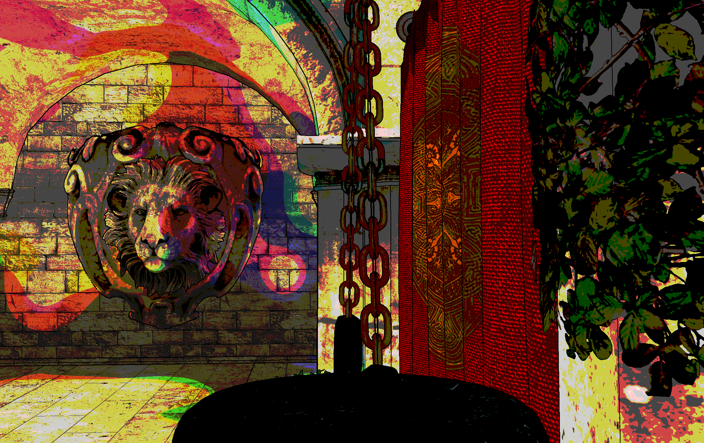
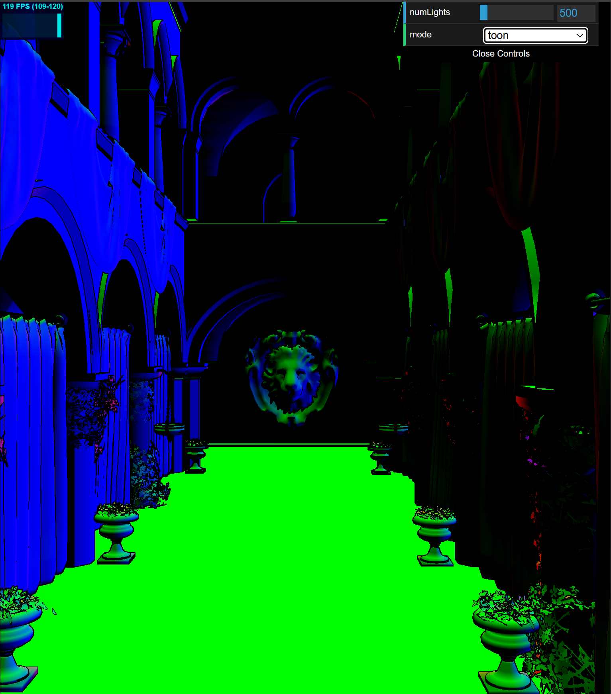

WebGL Forward+ & Clustered Deferred Shading
======================

### Yuhan Liu

[LinkedIn](https://www.linkedin.com/in/yuhan-liu-), [Personal Website](https://liuyuhan.me/), [Twitter](https://x.com/yuhanl_?lang=en)

**Tested on: Google Chrome 132 (Canary), Windows 11 Pro, Ultra 7 155H @ 1.40 GHz 32GB, RTX 4060 8192MB (Personal Laptop)**

### Live Demo: [Click me!](http://TODO.github.io/Project4-WebGPU-Forward-Plus-and-Clustered-Deferred)

## Forward+ & Clustering Deferred Shading Summary

This project implements two rendering techniques: Forward+ Shading and Clustered Deferred Shading, using WebGPU. 

These techniques optimize the handling of large numbers of lights in a 3D scene, specifically in the Sponza Atrium model with hundreds of dynamic point lights. 

The Forward+ method divides the screen into a grid and assigns lights to clusters, while the Clustered Deferred method stores geometric data for each pixel in a G-buffer, allowing for efficient lighting calculations in a second pass. Both methods improve rendering performance by limiting the number of lights processed for each fragment. Additionally, I analyzed and compared their performance, showing the trade-offs between flexibility and efficiency. 

## Performance Analysis

### Naive

Concise overview and explanation of the feature.

What is the best case scenario for your performance improvement? What is the worst? Explain briefly.

Are there tradeoffs to this performance feature? Explain briefly.

How do parameters (such as number of lights, number of tiles, etc.) affect performance? Show data with graphs.
Show timing in milliseconds, not FPS.

Show debug views when possible.
If the debug view correlates with performance, explain how.

### Clustered Forward+

Concise overview and explanation of the feature.

Detailed performance improvement analysis of adding the feature.

What is the best case scenario for your performance improvement? What is the worst? Explain briefly.

Are there tradeoffs to this performance feature? Explain briefly.

How do parameters (such as number of lights, number of tiles, etc.) affect performance? Show data with graphs.
Show timing in milliseconds, not FPS.

Show debug views when possible.
If the debug view correlates with performance, explain how.

### Clustered Deferred

| Position | Albedo | Normal |
| :------------------------------: |:------------------------------: | :------------------------------: |
| |   |   |
| Added outlines from toon shader for clarity |  Diffuse color from Sponza texture  |  Black normals are normal?  |

Concise overview and explanation of the feature.

Detailed performance improvement analysis of adding the feature.

What is the best case scenario for your performance improvement? What is the worst? Explain briefly.

Are there tradeoffs to this performance feature? Explain briefly.

How do parameters (such as number of lights, number of tiles, etc.) affect performance? Show data with graphs.
Show timing in milliseconds, not FPS.

Show debug views when possible.
If the debug view correlates with performance, explain how.

### Comparison: Forward+ vs. Deferred

Is one of them faster?

Is one of them better at certain types of workloads?

What are the benefits and tradeoffs of using one over the other?

For any differences in performance, briefly explain what may be causing the difference.

### Artsy Postprocess Shader

| Quantization of Albedo |  Quantization of Lights  |
| :------------------------------: |:------------------------------: |
|                             |                           |

Concise overview and explanation of the feature.

Performance change due to adding the feature.

If applicable, how do parameters (such as number of lights, number of tiles, etc.) affect performance? Show data with graphs.
Show timing in milliseconds, not FPS.

If you did something to accelerate the feature, what did you do and why?

How might this feature be optimized beyond your current implementation?

### Credits

- [Vite](https://vitejs.dev/)
- [loaders.gl](https://loaders.gl/)
- [dat.GUI](https://github.com/dataarts/dat.gui)
- [stats.js](https://github.com/mrdoob/stats.js)
- [wgpu-matrix](https://github.com/greggman/wgpu-matrix)
