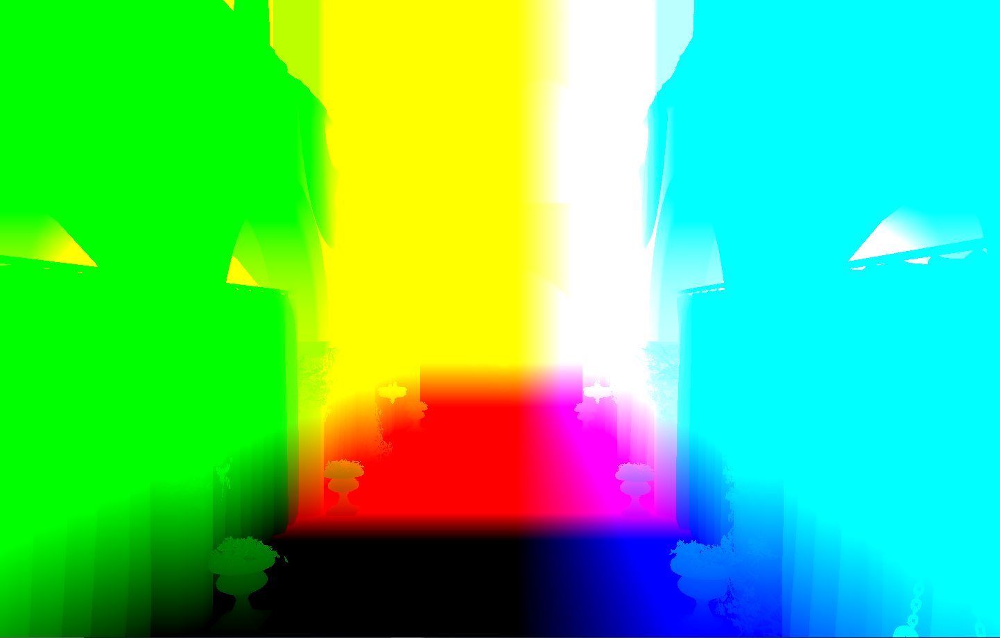

WebGPU Forward+ and Clustered Deferred Shading
======================

**University of Pennsylvania, CIS 565: GPU Programming and Architecture, Project 4**

- Dineth Meegoda
  - [LinkedIn](https://www.linkedin.com/in/dinethmeegoda/), [Personal Website](https://www.dinethmeegoda.com).
- Tested on: Windows 10 Pro, Ryzen 9 5900X 12 Core @ 3.7GHz 32GB, RTX 3070 8GB

## Sponza Party

[Live Demo!](https://dinethmeegoda.github.io/WebGPU-Forward-Plus-and-Clustered-Deferred/)

## Summary

This project was done over the course of about a week to get familiar with working with WebGPU's rendering and compute pipelines, as well as understanding real time rendering methods with a large amount of dynamic lights.

The project uses a GLTF loader set to the "Sponza" scene with a variable amount of moving randomly colored point lights.

## Rendering Methods

### **Naive:** 
Normal Forward Shading which checks every fragment with every single light, and suffers from overdraw since it still computes occluded fragments.

### **Forward+ Tiled Shading:** 

This method splits the screen upto into tiles and uses a compute shader to determine which lights influence which tiles. These lights are placed into "clusters" corresponding to each tile and when each fragment is shaded, it only checks against the lights within its tile.

    

Visualization of light clustering from [this blog](https://www.aortiz.me/2018/12/21/CG.html).

As shown in the image above, clusters are also split along the depth, or z axis to allow for more precise clusters that are not just confined to 2D space. These clusters are scaled exponentially based on the camera's near and far planes, so that smaller and more precise clusters are closer to the camera.

<table>
  <tr>
    <td>
      
      
Uniform Clusters

    </td>
    <td>
      
      
Exponential Clusters

    </td>
  </tr>
</table>

[From this deep-dive on clustered shading.](https://github.com/DaveH355/clustered-shading)

Within my scene, I went for a 16 x 9 x 24 cluster size by default since it was the one chosen in 2016's DOOM game.

<table>
  <tr>
    <td>
      
      
2D Screen Space Tiles

    </td>
    <td>
      
      
Exponential Depth Tiles

    </td>
  </tr>
</table>

### **Clustered Deferred Shading:**

Clustered Deferred Shading is very similar to Tiled Forward+, however, instead of forward shading each fragment based on its tile's light cluster, we first render position, albedo, and normal data onto a "Geometry-Buffer" and then use that data to compute the shading for each fragment on a fullscreen pass.

<table>
  <tr>
    <td>
      
      
Position Buffer

    </td>
    <td>
      
      
Normal Buffer

    </td>
  </tr>
  <tr>
    <td>
      
      
Albedo Buffer

    </td>
    <td>
      
      
Rendered Image

    </td>
  </tr>
</table>

In addition to the benefits from clustering we already recieve, we are also able to prevent overdraw by only computing lighting (the most expensive part of rendering) on visible fragments, which is ensured by the various buffers in our previous pass.

## Performance Analysis

All tests are done using stat.js FPS counter on a monitor with a refresh rate of 144 FPS @ 2560 x 1440 resolution.

### Rendering Method Analysis:

  

As expected, the deferred clustered method performed better than the other methods consistently. As the number of lights increases, each technique's performance falls as each fragment must be checked with more and more lights. Deferred Clustered shading consistently beats Forward+ Shading due to the very occluded and complex geometry of the Sponza scene. There are a lot of pieces of geometry occluded by the banners, pillars, and corridor archways of the scene, and using a G-Buffer to focus on the visible fragments causes a considerable speedup.

### Cluster Size Analysis:

  

The Number of Clusters, or Tile Dimensions impacts performance for both Forward+ and Deferred Similarly. Performance peaks at 24x24x24 clusters and falls off afterwards. As the cluster dimensions increase, the geometry within the clusters will surpass the warp sizes and will eventually become less efficient as threads are waiting for more work due to warp divergence. Theoretically, if there was a separate tile for each fragment, it would also cause the rendering to be less accurate since less lights affect the fragment. Likewise, smaller tile dimensions will lead to more lights per tile, which causes more calculations per fragment. However, the correct number of dimensions will depend on the scene.

### Cluster Compute Workgroup Analysis:

  

The Workgroup size is the amount of workgroups that get launched to compute the light clusters within the computer shader for each frame. The workgroup size performance peaks at [3, 3, 3], although this may be specfic to the cluster size. Using a workgroup of 1 doesn't seem to use the parallelization of the GPU effectively but using too much leads to warp divergence.

### Credits

- [Vite](https://vitejs.dev/)
- [loaders.gl](https://loaders.gl/)
- [dat.GUI](https://github.com/dataarts/dat.gui)
- [stats.js](https://github.com/mrdoob/stats.js)
- [wgpu-matrix](https://github.com/greggman/wgpu-matrix)
- [Clustered Shading Guide](https://www.aortiz.me/2018/12/21/CG.html)
- [Clustered Shading Deep Dive](https://github.com/DaveH355/clustered-shading)
- [WebGPU Deferred Shading Example](https://webgpu.github.io/webgpu-samples/?sample=deferredRendering)
